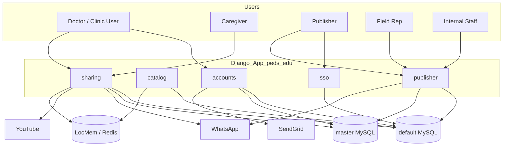
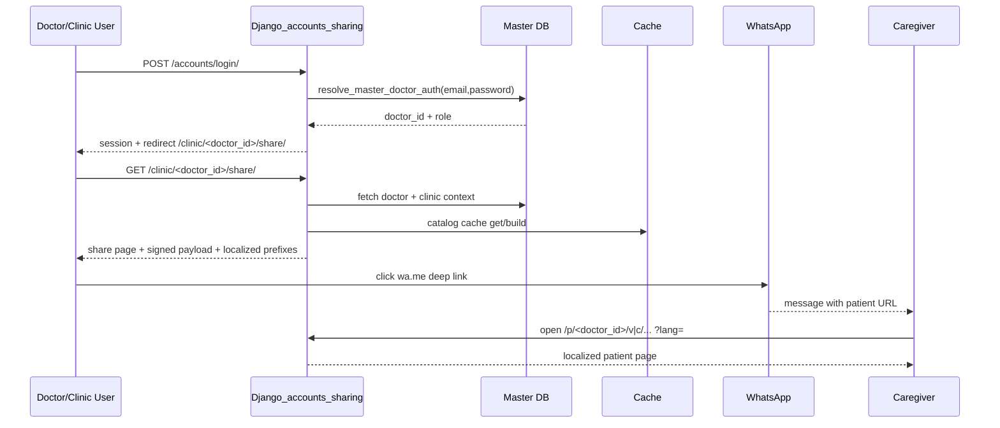

# PedsEdu System Documentation

**Revision date:** April 10, 2026
**Scope:** Current repository implementation (`/workspace/peds_edu_app`)

This document is a full technical reference for engineers and AI agents maintaining/extending PedsEdu.

---

## Table of Contents

1. [Product and Scope](#1-product-and-scope)
2. [High-Level Architecture](#2-high-level-architecture)
3. [Codebase and Module Boundaries](#3-codebase-and-module-boundaries)
4. [Configuration and Environment](#4-configuration-and-environment)
5. [Data Model](#5-data-model)
6. [Request Routing and Endpoint Surface](#6-request-routing-and-endpoint-surface)
7. [Indexed End-to-End Workflows](#7-indexed-end-to-end-workflows)
8. [Service and Integration Details](#8-service-and-integration-details)
9. [Setup and Operational Runbook](#9-setup-and-operational-runbook)
10. [Caching, Performance, and Consistency](#10-caching-performance-and-consistency)
11. [Security Posture and Known Risks](#11-security-posture-and-known-risks)
12. [Support Chat and Help Center Integration](#12-support-chat-and-help-center-integration)
13. [Extension Guidance](#13-extension-guidance)
14. [Command and Troubleshooting Appendix](#14-command-and-troubleshooting-appendix)

---

## 1) Product and Scope

PedsEdu is a Django monolith that combines:

- doctor/clinic onboarding + login,
- pediatric education catalog management,
- doctor-to-patient content sharing via WhatsApp deep links,
- patient-facing multilingual pages,
- campaign publishing flows via SSO,
- field-rep assisted enrollment,
- sharing/playback analytics.

The same deployment hosts both:

- **clinical sharing experience** (doctor + caregiver), and
- **publisher campaign experience** (publisher + field rep + internal staff).

---

## 2) High-Level Architecture

### 2.1 Component diagram



### 2.2 Sequence: doctor share flow



---

## 3) Codebase and Module Boundaries

### 3.1 Top-level layout

- `peds_edu/`: settings, root URLs, shared DB integration helpers.
- `accounts/`: custom user model + doctor registration/login/reset + master DB write/read helpers.
- `catalog/`: taxonomy/content models + importer + cache invalidation signals.
- `sharing/`: share page, patient pages, telemetry models/APIs, tracking dashboard.
- `publisher/`: campaign module + field rep landing + staff catalog CRUD.
- `sso/`: SSO consume endpoint + JWT validation.
- `templates/`, `static/`, `CSV/`, `deploy/`.

### 3.2 Boundary contracts

- `sharing` depends on `catalog` for content payload.
- `accounts` and `sharing` depend on master DB helpers for doctor identity.
- `publisher` campaign flows bridge `catalog`, master DB utilities, and SSO session state.
- `sso` is entrypoint for publisher campaign sessions.

---

## 4) Configuration and Environment

### 4.1 Settings behavior

- `.env` loaded from `/var/www/secrets/.env`.
- Environment helper exists but is mixed with hardcoded values.

### 4.2 Current implementation reality

- `default` and `master` DB credentials/hosts are currently hardcoded in `settings.py`.
- `SSO_USE_ENV = False` means SSO defaults are in-code unless edited.
- SendGrid key can come from env or AWS Secrets fallback helper.

### 4.3 Cache mode

- `REDIS_URL` set → Redis cache backend.
- else LocMem cache backend.

---

## 5) Data Model

## 5.1 Accounts and identity

- `accounts.User` (custom auth model, email login).
- `accounts.Clinic`.
- `accounts.DoctorProfile`.
- `accounts.RedflagsDoctor` unmanaged mapping for master table `redflags_doctor`.

## 5.2 Catalog content model

- `TherapyArea`
- `TriggerCluster`
- `Trigger`
- `Video`
- `VideoLanguage`
- `VideoCluster`
- `VideoClusterLanguage`
- `VideoClusterVideo`
- `VideoTriggerMap`

### Language strategy

Eight supported language codes are persisted in language tables and used for UI/title/message selection.

## 5.3 Campaign model

- `publisher.Campaign` maps to `publisher_campaign` (`managed=False`).
- Stores campaign metadata, uploaded banners, selected content JSON, one linked created cluster, and communication templates.

## 5.4 Analytics model

- `DoctorShareSummary`
- `ShareActivity`
- `SharePlaybackEvent`
- `ShareBannerClickEvent`

Recipient references are anonymized via HMAC digest keyed by Django `SECRET_KEY`.

---

## 6) Request Routing and Endpoint Surface

### 6.1 Root URL include order

1. `/admin/`
2. `/sso/`
3. campaign publisher include at root
4. sharing include at root
5. `/accounts/`
6. `/publisher/`

### 6.2 Endpoint groups

#### Accounts

- `/accounts/register/`
- `/accounts/modify/<doctor_id>/`
- `/accounts/login/`
- `/accounts/logout/`
- `/accounts/request-password-reset/`
- `/accounts/reset/<uidb64>/<token>/`

#### Sharing + patient + tracking

- `/clinic/<doctor_id>/share/`
- `/p/<doctor_id>/v/<video_code>/`
- `/p/<doctor_id>/c/<cluster_code>/`
- `/api/share-activity/`
- `/api/playback-event/`
- `/api/banner-click/`
- `/tracking/login/`, `/tracking/logout/`, `/tracking/`

#### Campaign/SSO

- `/sso/consume/`
- `/publisher-landing-page/`
- `/add-campaign-details/`
- `/campaigns/`
- `/campaigns/<campaign_id>/edit/`
- `/publisher-api/search/`
- `/publisher-api/expand-selection/`
- `/field-rep-landing-page/`

#### Staff-only content CRUD

- `/publisher/therapy-areas/...`
- `/publisher/trigger-clusters/...`
- `/publisher/triggers/...`
- `/publisher/videos/...`
- `/publisher/bundles/...`
- `/publisher/trigger-maps/...`

---

## 7) Indexed End-to-End Workflows

## Flow-01: Doctor Registration

1. GET `/accounts/register/` initializes form; supports aliased params (`campaign-id`).
2. POST validates form and normalizes WhatsApp fallback values.
3. Master DB row is created/updated for doctor data.
4. Optional campaign enrollment is ensured (if campaign context supplied).
5. Doctor receives portal access email (campaign template or fallback text).

## Flow-02: Master-Backed Login

1. User submits email/password at `/accounts/login/`.
2. `resolve_master_doctor_auth` identifies role: doctor / clinic_user1 / clinic_user2.
3. Session keys are set (`master_doctor_id`, role, etc.).
4. Redirect to share page `/clinic/<doctor_id>/share/`.

## Flow-03: Doctor Share Page Rendering

1. Request must be authenticated and match session doctor id.
2. Master doctor/clinic context is fetched.
3. Catalog JSON is generated/fetched from cache.
4. Payload is enriched with signed doctor payload and localized prefixes.
5. If doctor has campaign constraints, bundles/videos are filtered accordingly.

## Flow-04: WhatsApp Share and Activity Logging

1. Front-end prepares WhatsApp text using language prefix + item title + patient URL.
2. Deep link opens `wa.me` URL.
3. Front-end posts share event to `/api/share-activity/`.
4. Playback milestones and banner clicks post to corresponding APIs.

## Flow-05: Patient Video/Bundle Viewing

1. Patient opens link from WhatsApp.
2. App validates signed doctor payload and language param.
3. Renders single video or bundle page with localized labels and URLs.
4. Playback events can be captured via API calls.

## Flow-06: Publisher SSO Entry

1. External system redirects to `/sso/consume/` with token + campaign id.
2. JWT verification checks:
   - HS256 signature,
   - `iss`, `aud`,
   - `exp` (and basic `iat` guard),
   - required claims (`sub`, `username`, `roles`).
3. Session stores identity and campaign context.
4. Redirect to safe `next` URL (host-validated).

## Flow-07: Campaign Authoring

1. Publisher lands on campaign pages after SSO.
2. Catalog search APIs support selection construction.
3. Save flow creates/updates campaign-linked bundle and `publisher_campaign` row.
4. Edit flow updates metadata while preserving integration expectations.

## Flow-08: Field Rep Assisted Onboarding

1. Rep opens landing URL with campaign + rep identifiers.
2. System validates rep-campaign mapping in master DB (with multiple candidate lookups).
3. Rep enters doctor WhatsApp number.
4. Existing doctor path: ensure enrollment, generate communication route.
5. New doctor path: redirect into registration with campaign prefill params.

---

## 8) Service and Integration Details

### 8.1 Master DB helper layers

Two helper modules are used:

- `peds_edu.master_db`: doctor identity/auth resolution, signed payload tools, doctor context conversion, campaign support lookup.
- `accounts.master_db`: publisher authorization checks, enrollment helpers, field-rep related master DB utilities.

### 8.2 Email integration

- Default mode is SMTP backend using SendGrid settings.
- Email sending is wrapped and logged; templates can be campaign-specific.

### 8.3 Catalog import integration

`import_master_data` is idempotent and expects five exact filenames. It seeds baseline clusters, then upserts therapies, triggers, videos/languages, bundles/languages, and mappings.

Optional transliteration (`ai4bharat-transliteration`) generates localized titles when installed.

### 8.4 Pincode integration

`build_pincode_directory` builds a PIN→state JSON map used for state inference during registration/context rendering.

---

## 9) Setup and Operational Runbook

### 9.1 Bootstrap

```bash
python3 -m venv .venv
source .venv/bin/activate
pip install -r requirements.txt
pip install -r requirements-dev.txt  # optional
cp .env.example .env
set -a && source .env && set +a
```

### 9.2 DB prep and startup

```bash
python manage.py migrate
python manage.py createsuperuser
python manage.py import_master_data --path ./CSV
python manage.py runserver 0.0.0.0:8000
```

### 9.3 Production shape

- Gunicorn app server,
- Nginx reverse proxy,
- static collection via `collectstatic`,
- persistent media storage for banners/photos,
- Redis cache recommended for distributed deployments.

---

## 10) Caching, Performance, and Consistency

- Catalog payload key: `clinic_catalog_payload_v7`.
- Default TTL: 1 hour.
- Catalog change signals clear cache to prevent stale share payloads.
- Campaign filtering is applied dynamically at share-page render time.

---

## 11) Security Posture and Known Risks

1. **Hardcoded sensitive values** in settings require immediate hardening.
2. **Unmanaged DB table dependencies** increase schema drift risk.
3. **Large integration-heavy views** raise regression risk without dedicated tests.
4. **Mixed config strategy** (hardcoded + env + fallback) complicates deterministic deploys.

Recommended hardening plan:

- move all secrets/DB endpoints to managed secret store/env,
- standardize master table name/column config,
- add integration tests for SSO + enrollment + sharing paths,
- introduce service layer abstraction for large views.

---


## 12) Support Chat and Help Center Integration

PedsEdu includes a context-aware help experience backed by **https://help.cpdinclinic.co.in**.

### 12.1 Configuration source

`sharing/support_widget.py` is the central configuration module:

- `HELP_CENTER_BASE_URL = "https://help.cpdinclinic.co.in"`
- `SOURCE_SYSTEM = "Patient Education"`
- `_SUPPORT_PAGES` defines role/flow/page slug metadata.
- `_ROUTE_TO_SUPPORT_PAGE` maps Django view names to support pages.

### 12.2 Route mappings currently implemented

| Django view name | Support page key | User type | Flow | Page slug |
|---|---|---|---|---|
| `accounts:login` | `doctor_login` | doctor | `Flow1 / Doctor` | `patient-education-flow1-doctor-doctor-login-page` |
| `sharing:doctor_share` | `doctor_clinic_sharing` | doctor | `Flow1 / Doctor` | `patient-education-flow1-doctor-doctor-clinic-sharing-page` |
| `sharing:patient_video` | `patient_page` | patient | `Flow2 / Patient` | `patient-education-flow2-patient-patient-page` |
| `sharing:patient_cluster` | `patient_page` | patient | `Flow2 / Patient` | `patient-education-flow2-patient-patient-page` |

Additional key:

- `doctor_credentials_email` (used in outbound credential email generation).

### 12.3 URL variants generated by code

For each support page key, helper logic generates:

- `page_url`
- `widget_url`
- `embed_url` (iframe mode, includes `embed=1`)
- `api_url`

These always carry query parameters:

- `system=Patient Education`
- `flow=<configured source flow>`

### 12.4 Rendering path in templates

1. `sharing.context_processors.clinic_branding` injects `support_widget` context when the current route is mapped.
2. `templates/base.html` includes preconnect to help center and conditionally includes `templates/includes/support_widget.html`.
3. `templates/includes/support_widget.html` renders floating launcher + panel + iframe embed + loading/error/retry UX.

### 12.5 Email integration

`accounts/views.py` (`_send_doctor_links_email`) appends support links to doctor credential emails and also supports placeholders in campaign template text:

- `<support_link>` / `{{support_link}}`
- `<doctor_support_link>` / `{{doctor_support_link}}`

### 12.6 Automated checks in repository

`sharing/tests.py` includes support widget mapping tests for:

- login route
- doctor share route
- patient routes
- doctor credentials email support link generation

---

## 13) Extension Guidance


When implementing changes:

- Preserve backward compatibility for URL/query param aliases used by external systems (`campaign-id`, token aliases).
- Keep dual-DB read/write boundaries explicit.
- Add cache invalidation behavior for any new catalog-affecting writes.
- Treat SSO consume and field-rep landing as contract-critical integration points.
- Document any schema change for unmanaged tables in migration notes/ops runbook.

---

## 14) Command and Troubleshooting Appendix

### 14.1 Command index

```bash
python manage.py import_master_data --path ./CSV
python manage.py build_pincode_directory --input /path/to/pincode.csv
python manage.py ensure_campaign_enrollment --doctor-id DRXXXXX --campaign-id <uuid>
python manage.py collectstatic
```

### 14.2 Quick troubleshooting checklist

- Login failing for valid user:
  - verify master DB connectivity and password column format.
- Share page forbidden:
  - confirm session `master_doctor_id` equals URL doctor id.
- No catalog items:
  - confirm import executed and `is_active` data exists.
- Campaign pages inaccessible:
  - validate SSO token claims and session creation path.
- Field rep flow mismatch:
  - verify master campaign-fieldrep mapping table/columns in settings.
