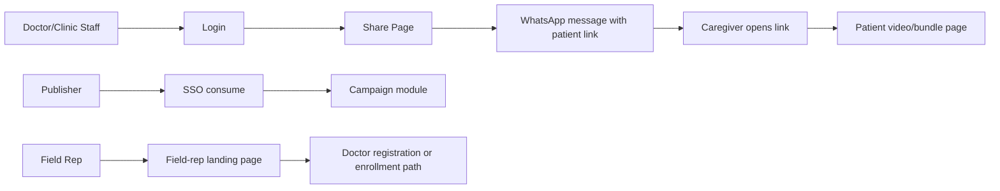
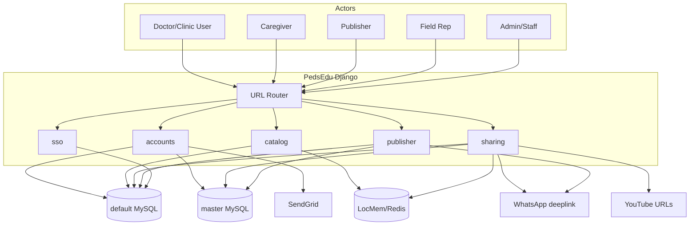
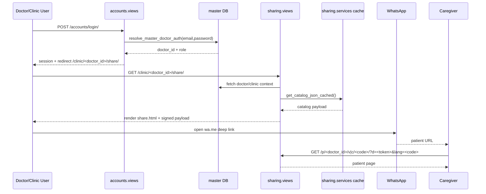
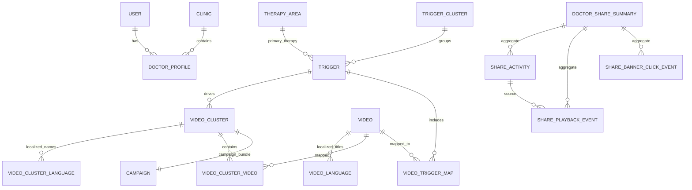

# PedsEdu (CPD in Clinic Portal) — Unified Technical Documentation

> **Single source of truth:** This README consolidates and replaces prior split documentation (`README.md` + `PedsEdu_System_Documentation.md`) based on the current codebase.

---

## Table of Contents

1. [Product Overview](#1-product-overview)
2. [System Architecture](#2-system-architecture)
3. [Codebase Structure](#3-codebase-structure)
4. [Core System Components](#4-core-system-components)
5. [Database Design](#5-database-design)
6. [Feature-Level Documentation](#6-feature-level-documentation)
7. [API / Service Layer](#7-api--service-layer)
8. [Application Flow (End-to-End)](#8-application-flow-end-to-end)
9. [Developer Onboarding Guide](#9-developer-onboarding-guide)
10. [Deployment and Operations](#10-deployment-and-operations)
11. [Security and Known Risks](#11-security-and-known-risks)
12. [Support Chat and Help Center Integration](#12-support-chat-and-help-center-integration)
13. [AI-Optimized System Summary](#13-ai-optimized-system-summary)

---

## 1) Product Overview

### 1.1 What the system does

PedsEdu is a Django monolith for pediatric patient education delivery in clinics. It enables:

- **Doctor/clinic staff authentication** using a master database.
- **Content discovery and sharing** of pediatric education videos/bundles.
- **Multilingual patient viewing pages** (single video or bundle).
- **Campaign publishing workflows** for publisher users via SSO.
- **Field representative onboarding flow** for doctor enrollment into campaigns.
- **Analytics logging** for shares, playback events, and banner clicks.

### 1.2 Problem it solves

- Standardizes post-consultation caregiver education.
- Reduces repeat counseling burden on clinicians.
- Supports multilingual communication via WhatsApp links.
- Enables campaign-scale enrollment and content distribution workflows across external systems.

### 1.3 Key features

| Area | Capability |
|---|---|
| Auth & Identity | Doctor/staff login via master DB, local admin/staff auth, password reset flows |
| Content | Therapy/trigger/video/bundle taxonomy with multilingual titles and URLs |
| Sharing | Doctor share page + WhatsApp deep-link generation |
| Patient Experience | Public patient pages for video/bundle playback with language selector |
| Campaigns | SSO-based publisher module for adding/editing campaign details and cluster composition |
| Field Rep Flow | Campaign-aware onboarding path for known/new doctors |
| Analytics | Share activity + playback milestones + banner click events + dashboard |
| Support | Context-aware embedded support widget and help center deep links (`help.cpdinclinic.co.in`) |

### 1.4 Target users

- **Doctor / Clinic staff**: discover and share education content.
- **Caregiver (patient-side viewer)**: receive and consume shared video content.
- **Publisher**: configure campaign content and metadata.
- **Field rep**: onboard doctors to campaigns.
- **Portal admin/staff**: manage catalog content and mappings.

### 1.5 High-level user journey



---

## 2) System Architecture

### 2.1 Overall architecture

PedsEdu is a server-rendered Django application with selective JSON APIs and dual-database integration.

- **App type:** Django monolith (multi-app modularization)
- **Primary DB:** MySQL (`default`)
- **External/master DB:** MySQL (`master` alias)
- **Cache:** LocMem or Redis (`REDIS_URL`)
- **Email:** SendGrid via SMTP backend
- **Static:** WhiteNoise

### 2.2 Architecture diagram



### 2.3 Component interaction diagram



### 2.4 Application layers

| Layer | Implementation | Purpose |
|---|---|---|
| Presentation | Django templates + static JS/CSS | UI rendering for doctors/patients/publishers/admin |
| Routing/Controller | Django URLConfs + view functions | Request handling and orchestration |
| Service | Helper modules (`sharing.services`, `master_db` modules) | Catalog payload building, DB integration, signing, auth resolution |
| Persistence | Django ORM + direct SQL where needed | Model CRUD and cross-system table access |
| Integration | SendGrid, SSO JWT, WhatsApp deeplink, YouTube URLs | External system communication |

### 2.5 Data flow

1. Request hits root URL router.
2. Matching app view validates auth/session/context.
3. View pulls data via ORM/service/helper modules.
4. View renders template or returns JSON.
5. Client-side actions can call analytics APIs.
6. Optional external integrations (SendGrid/WhatsApp/SSO) are triggered.

---

## 3) Codebase Structure

### 3.1 Folder structure

```text
.
├── accounts/
├── catalog/
├── sharing/
├── publisher/
├── sso/
├── peds_edu/
├── templates/
├── static/
├── CSV/
├── deploy/
├── manage.py
├── requirements.txt
└── requirements-dev.txt
```

### 3.2 Purpose of major directories

| Directory | Purpose |
|---|---|
| `peds_edu/` | Project settings, root URL config, WSGI/ASGI, shared master DB helpers, AWS secrets helper |
| `accounts/` | Custom user model, doctor registration/login/reset, master DB write/read helpers, pincode mapping |
| `catalog/` | Domain models for therapy/triggers/videos/bundles + import command |
| `sharing/` | Doctor share page, patient pages, analytics models/endpoints, tracking dashboard |
| `publisher/` | Campaign SSO module + field-rep flow + staff CRUD for catalog |
| `sso/` | SSO consume endpoint and HS256 JWT verification logic |
| `templates/` | Server-rendered UI templates |
| `static/` | CSS/JS/icons |
| `CSV/` | Seed/import CSV files |
| `deploy/` | Deployment examples (`nginx.conf`, `gunicorn.service`, SQL scripts) |

### 3.3 Key modules and files

- `peds_edu/settings.py`: settings, database config, cache/email/SSO settings.
- `peds_edu/urls.py`: top-level URL include order.
- `peds_edu/master_db.py`: master doctor auth, context mapping, payload signing.
- `accounts/views.py`: registration, login, password reset.
- `accounts/master_db.py`: publisher/field-rep/enrollment related master DB helpers.
- `catalog/models.py`: core content data model.
- `catalog/management/commands/import_master_data.py`: CSV importer.
- `sharing/services.py`: cached catalog payload + message prefixes.
- `sharing/views.py`: doctor share, patient pages, analytics endpoints.
- `publisher/campaign_views.py`: campaign pages/APIs + field rep landing.
- `sso/views.py` + `sso/jwt.py`: SSO token consume/verify.

### 3.4 Dependency relationships

- `sharing` depends on `catalog` for catalog data.
- `accounts` and `sharing` use `peds_edu.master_db` for master doctor identity/auth.
- `publisher` uses `accounts.master_db` for external/master campaign checks and enrollment helpers.
- `sso` creates session context consumed by `publisher.campaign_views`.

### 3.5 Architectural patterns

- **Monolith with app modularization**.
- **Service-helper pattern** for integration-heavy logic.
- **Server-rendered pages + JSON side endpoints**.
- **Dual database access pattern** using Django alias routing + targeted SQL.
- **Cache-aside** for share catalog payload.

---

## 4) Core System Components

## 4.1 Controllers (Views)

### Accounts controllers (`accounts/views.py`)

- **Purpose:** identity, registration, credential management.
- **Responsibilities:**
  - `register_doctor`
  - `doctor_login` / `doctor_logout`
  - `request_password_reset` / `password_reset`
  - clinic profile modification
- **Interactions:** master DB helpers, local `User/DoctorProfile/Clinic`, SendGrid utility.

### Sharing controllers (`sharing/views.py`)

- **Purpose:** doctor share UI + patient pages + analytics.
- **Responsibilities:**
  - `doctor_share`
  - `patient_video`, `patient_cluster`
  - `create_share_activity`, `log_playback_event`, `log_banner_click`
  - `tracking_login`, `tracking_dashboard`
- **Interactions:** catalog service payload, master DB context, sharing models.

### Publisher controllers (`publisher/views.py`, `publisher/campaign_views.py`)

- **Purpose:** catalog CRUD + campaign module + field-rep flow.
- **Responsibilities:**
  - staff CRUD for therapy/triggers/videos/bundles/maps
  - campaign add/edit/list
  - catalog search/selection APIs
  - field rep landing and branching
- **Interactions:** campaign model, catalog models, SSO session claims, master DB checks.

### SSO controller (`sso/views.py`)

- **Purpose:** consume and validate external SSO token.
- **Responsibilities:** verify JWT and seed session identity/campaign context.

## 4.2 Services and utilities

| Module | Purpose | Key logic |
|---|---|---|
| `sharing/services.py` | Share payload builder + cache | builds therapy/trigger/video/bundle graph + localized metadata |
| `peds_edu/master_db.py` | Master doctor auth/context/signed payload | role-aware password verification and patient-link payload signing |
| `accounts/master_db.py` | Enrollment/publisher/field-rep DB operations | master table lookups and enrollment helper routines |
| `sso/jwt.py` | JWT verification | HS256 signature, issuer, audience, exp/iat checks |
| `accounts/sendgrid_utils.py` | Email sending | SendGrid SMTP/API utility wrapper |
| `accounts/pincode_directory.py` | PIN lookup | state/district lookup helpers from local JSON map |

## 4.3 Middleware and framework stack

Configured middleware includes security/session/auth/CSRF/message/clickjacking plus WhiteNoise for static assets.

---

## 5) Database Design

## 5.1 Database topology

- **`default` DB:** Django and portal-owned models.
- **`master` DB:** external operational system tables (doctors/campaign join/field-rep/publisher).

## 5.2 Core entities (inferred from models)

### Accounts

- `accounts_user` (custom auth)
- `accounts_clinic`
- `accounts_doctorprofile`
- `accounts_redflagsdoctor` (unmanaged; mapped to `redflags_doctor` in master)

### Catalog

- `catalog_therapyarea`
- `catalog_triggercluster`
- `catalog_trigger`
- `catalog_video`
- `catalog_videolanguage`
- `catalog_videocluster`
- `catalog_videoclusterlanguage`
- `catalog_videoclustervideo`
- `catalog_videotriggermap`

### Publisher

- `publisher_campaign` (unmanaged)

### Sharing analytics

- `sharing_doctorsharesummary`
- `sharing_shareactivity`
- `sharing_shareplaybackevent`
- `sharing_sharebannerclickevent`

## 5.3 Relationships and constraints

- `DoctorProfile.user` → `User` (one-to-one)
- `DoctorProfile.clinic` → `Clinic` (many-to-one)
- `Trigger.primary_therapy` → `TherapyArea`
- `Trigger.cluster` → `TriggerCluster`
- `Video.primary_therapy` / `Video.primary_trigger`
- `Video` ↔ `VideoCluster` via `VideoClusterVideo`
- `VideoLanguage` unique `(video, language_code)`
- `VideoClusterLanguage` unique `(video_cluster, language_code)`
- `VideoClusterVideo` unique `(video_cluster, video)`
- `Campaign.video_cluster` one-to-one with `VideoCluster`

## 5.4 ER diagram (logical)



---

## 6) Feature-Level Documentation

## 6.1 Doctor registration and login

### Purpose
Create/validate doctor identities and establish clinic sharing sessions.

### User flow
1. Doctor/field-rep path opens registration form.
2. Registration writes to master DB and optionally ensures campaign enrollment.
3. Doctor receives email with links.
4. Login validates credentials against master DB.
5. Session routes to `/clinic/<doctor_id>/share/`.

### Backend logic
- Role-aware identity resolution (`doctor`, `clinic_user1`, `clinic_user2`).
- Password validation supports hashed/plaintext compatibility checks.
- Session carries `master_doctor_id`, role, login email.

### Data interactions
- Reads/writes master doctor table and enrollment tables.
- Syncs/uses local user/profile models for portal session behaviors.

## 6.2 Catalog management

### Purpose
Maintain structured therapy→trigger→video/bundle metadata.

### User flow
- Staff edits catalog via `/publisher/...` CRUD pages.
- Bulk import via `import_master_data` command.

### Backend logic
- Model-level relationships enforce taxonomy integrity.
- Signals clear cached catalog payload after updates.

### Data interactions
- ORM updates catalog tables.
- Import command performs idempotent upserts from CSV files.

## 6.3 Doctor sharing + patient pages

### Purpose
Allow clinical teams to share localized educational content over WhatsApp.

### User flow
1. Doctor opens share page.
2. Filters/selects video or bundle and language.
3. Shares generated message/link to caregiver.
4. Caregiver opens patient page and consumes content.

### Backend logic
- Share page payload built from cached catalog + signed doctor payload.
- Patient pages validate signed payload and resolve language fallback.
- Campaign restrictions can filter visible bundles/videos.

### Data interactions
- Reads catalog and master doctor context.
- Writes share/playback/banner click analytics.

## 6.4 Publisher campaign module (SSO)

### Purpose
Enable external publisher users to define campaign-specific bundle configuration.

### User flow
1. External platform redirects with SSO token.
2. Publisher lands in campaign pages.
3. Adds/edits campaign details and selected videos/clusters.
4. Campaign entry persists with linked bundle cluster.

### Backend logic
- SSO session required via decorator.
- Campaign create path generates unique cluster code and English cluster language row.
- Edit path rewrites cluster-video mapping.
- Search and expand APIs support front-end selection UX.

### Data interactions
- Reads master campaign metadata when available.
- Writes `publisher_campaign` + `catalog_videocluster*` rows.

## 6.5 Field rep onboarding flow

### Purpose
Allow reps to onboard doctors into campaigns and route to registration/sharing path.

### User flow
1. Rep opens campaign link with rep identifiers.
2. System validates rep/campaign relation.
3. Rep enters doctor WhatsApp.
4. Existing doctor path ensures enrollment.
5. New doctor path redirects to registration with preserved campaign context.

### Backend logic
- Robust identifier normalization and fallback lookups.
- Optional debug mode for troubleshooting.

### Data interactions
- Master DB join validations and enrollment writes.

## 6.6 Tracking dashboard

### Purpose
Give superuser visibility into sharing and engagement events.

### User flow
1. Superuser logs into tracking page.
2. Dashboard shows aggregate counts and recent event tables.

### Backend logic
- Access restricted to superuser.
- Pulls summary, share, playback, banner click records.

---

## 7) API / Service Layer

> Most routes are template-rendering pages; APIs below are JSON endpoints used by front-end interactions.

## 7.1 Sharing APIs

### `POST /api/share-activity/`

- **Purpose:** create idempotent share activity row.
- **Auth:** login required.
- **Request body (JSON):**
  - `share_public_id` (UUID, required)
  - `shared_item_type` (`video` or `cluster`, required)
  - `shared_item_code` (required)
  - `recipient_identifier` (required; hashed server-side)
  - `language_code` (optional; defaults/fallback)
- **Response:**
  - `200`: `{ ok, created, share_public_id, shared_item_name }`
  - `4xx`: `{ ok: false, error }`
- **Modules:** `sharing/views.py`, `sharing/models.py`.

### `POST /api/playback-event/`

- **Purpose:** log playback/play-progress event.
- **Auth:** not required (supports patient-side calls); validates payload.
- **Request body (JSON):**
  - `share_public_id` (optional UUID)
  - `page_item_type` (`video`/`cluster`, required)
  - `event_type` (`play`/`progress`, required)
  - `video_code` (required)
  - `video_name` (optional)
  - `milestone_percent` (optional int 0..100)
  - fallback doctor fields if share not found (`doctor_id`, etc.)
- **Response:** `200 { ok: true }` or validation errors.
- **Modules:** `sharing/views.py`, `sharing/models.py`.

### `POST /api/banner-click/`

- **Purpose:** log doctor-page banner click.
- **Auth:** login required; doctor session check enforced.
- **Request body (JSON):**
  - `doctor_id` (optional cross-check)
  - `page_type` (`doctor` or `clinic`, required)
  - `banner_id` or `banner_name` (one required)
  - `banner_target_url`, `doctor_name`, `clinic_name` (optional)
- **Response:** `200 { ok: true, click_id }` or 4xx error.
- **Modules:** `sharing/views.py`, `sharing/models.py`.

## 7.2 Publisher APIs

### `GET /publisher-api/search/?q=<text>`

- **Purpose:** search videos and clusters for campaign selection.
- **Auth:** publisher session required.
- **Params:** `q` (min length 2).
- **Response:** `{ results: [{ type, id, code, title }, ...] }`.
- **Modules:** `publisher/campaign_views.py`.

### `POST /publisher-api/expand-selection/`

- **Purpose:** expand mixed selection items into video list.
- **Auth:** publisher session required.
- **Request body:** `{ items: [{ type: "video"|"cluster", id: <int> }, ...] }`.
- **Response:** `{ videos: [{ id, code, title }, ...] }`.
- **Modules:** `publisher/campaign_views.py`.

## 7.3 SSO endpoint

### `GET /sso/consume/`

- **Purpose:** validate external JWT and initialize publisher session.
- **Required params:**
  - token aliases accepted: `token` / `sso_token` / `jwt` / `access_token`
  - `campaign_id` or `campaign-id`
- **Optional:** `next` redirect target (host-validated).
- **Validation:** HS256 signature + `iss` + `aud` + `exp` + required claims.
- **Response:** redirect on success/failure with message handling.
- **Modules:** `sso/views.py`, `sso/jwt.py`.

---

## 8) Application Flow (End-to-End)

### 8.1 Generic request-response chain

User → UI Route → Django View (Controller) → Service/Helper → ORM/DB/External Integration → Response (HTML/JSON) → UI

### 8.2 Real flow A: Doctor share

1. UI: `/accounts/login/` form submit.
2. Controller: `accounts.views.doctor_login`.
3. Service: `peds_edu.master_db.resolve_master_doctor_auth`.
4. DB: master doctor table read.
5. Response: session + redirect.
6. UI: `/clinic/<doctor_id>/share/`.
7. Controller: `sharing.views.doctor_share`.
8. Service: `sharing.services.get_catalog_json_cached` + master context + payload signing.
9. DB/cache: catalog tables + cache + master DB.
10. Response: rendered share page with catalog JSON.

### 8.3 Real flow B: Patient playback event

1. UI: patient page loaded (`/p/...`).
2. Controller: `sharing.views.patient_video|patient_cluster` renders page.
3. UI JS posts to `/api/playback-event/`.
4. Controller validates payload and resolves share/doctor summary.
5. DB write: `SharePlaybackEvent` row.
6. Response: `{ ok: true }`.

### 8.4 Real flow C: Publisher campaign creation

1. External app sends user to `/sso/consume/`.
2. SSO controller verifies JWT and sets session.
3. Publisher opens `/add-campaign-details/`.
4. Controller validates form + selection JSON.
5. DB writes:
   - new `VideoCluster` + `VideoClusterLanguage` + `VideoClusterVideo`
   - new `publisher_campaign` record.
6. Response: success redirect to publisher landing.

### 8.5 Real flow D: Field rep assisted doctor onboarding

1. Rep opens `/field-rep-landing-page/` with campaign and rep parameters.
2. Controller resolves rep/campaign validity from master DB.
3. Rep submits doctor WhatsApp.
4. Branch:
   - existing doctor → ensure campaign enrollment + share message path,
   - new doctor → redirect to registration with campaign context.

---

## 9) Developer Onboarding Guide

## 9.1 Environment setup

### Required tools

- Python 3.10+
- MySQL-compatible environment (or access to configured DB hosts)
- Build dependencies for `mysqlclient`

### Frameworks/libraries

- Django 4.2
- mysqlclient
- WhiteNoise
- SendGrid SDK
- boto3
- optional Redis (`django-redis`)
- optional transliteration package (`ai4bharat-transliteration` via `requirements-dev.txt`)

## 9.2 Installation

```bash
python3 -m venv .venv
source .venv/bin/activate
pip install -r requirements.txt
# optional
pip install -r requirements-dev.txt
cp .env.example .env
set -a && source .env && set +a
```

## 9.3 Environment variables (effective)

Important variables used in settings include:

- `DJANGO_SECRET_KEY`, `DJANGO_DEBUG`, `ALLOWED_HOSTS`
- `APP_BASE_URL`, `SITE_BASE_URL`
- `SENDGRID_API_KEY`, `SENDGRID_FROM_EMAIL`, SMTP vars
- `REDIS_URL`
- cookie/SSL flags

> **Important current-state note:** DB credentials for both `default` and `master` are currently hardcoded in `peds_edu/settings.py`, so `.env` DB values are not the source of truth unless settings are refactored.

## 9.4 Running the project (development)

```bash
python manage.py migrate
python manage.py createsuperuser
python manage.py import_master_data --path ./CSV
python manage.py runserver 0.0.0.0:8000
```

## 9.5 Build/production steps

```bash
python manage.py collectstatic
gunicorn peds_edu.wsgi:application --bind 0.0.0.0:8000 --workers 3
```

Use `deploy/nginx.conf` and `deploy/gunicorn.service` as references.

---

## 10) Deployment and Operations

### 10.1 Management commands

| Command | Purpose |
|---|---|
| `python manage.py import_master_data --path <dir>` | Import trigger/video/cluster/mapping CSVs |
| `python manage.py build_pincode_directory --input <csv> [--output <json>]` | Build PIN→state directory JSON |
| `python manage.py ensure_campaign_enrollment --doctor-id <id>|--email <email> --campaign-id <id> [--registered-by <id>]` | Ensure master DB campaign enrollment |

### 10.2 Required CSV names for import

- `trigger_master.csv`
- `video_master.csv`
- `video_cluster_master.csv`
- `video_cluster_video_master.csv`
- `video_trigger_map_master.csv`

### 10.3 Route map (quick reference)

- **Accounts:** `/accounts/register/`, `/accounts/login/`, `/accounts/request-password-reset/`
- **Sharing:** `/clinic/<doctor_id>/share/`, `/p/<doctor_id>/v/<video_code>/`, `/p/<doctor_id>/c/<cluster_code>/`
- **Analytics APIs:** `/api/share-activity/`, `/api/playback-event/`, `/api/banner-click/`
- **Tracking dashboard:** `/tracking/login/`, `/tracking/`
- **SSO/Campaign:** `/sso/consume/`, `/publisher-landing-page/`, `/add-campaign-details/`, `/campaigns/`, `/field-rep-landing-page/`
- **Staff CRUD:** `/publisher/...`

---

## 11) Security and Known Risks

1. **Hardcoded sensitive settings** in `peds_edu/settings.py` (DB credentials and static defaults) should be moved to env/secrets management.
2. **Unmanaged tables** (`publisher_campaign`, master-side tables) create schema synchronization risk.
3. **Mixed configuration pattern** (hardcoded + env + fallback) can cause environment drift.
4. **Complex integration views** (registration and field-rep flow) need stronger automated test coverage.
5. **SSO config defaults** (`SSO_USE_ENV = False`) can be risky if not explicitly hardened per environment.

---


## 12) Support Chat and Help Center Integration

PedsEdu has a page-aware support system backed by **https://help.cpdinclinic.co.in** and rendered as an embedded floating support widget in the base layout.

### 12.1 How support config is resolved

- `sharing/support_widget.py` defines:
  - help center base URL (`HELP_CENTER_BASE_URL`)
  - source-system label (`SOURCE_SYSTEM = "Patient Education"`)
  - page metadata map (`_SUPPORT_PAGES`)
  - route-to-page map (`_ROUTE_TO_SUPPORT_PAGE`)
- `sharing/context_processors.py` injects `support_widget` into template context for mapped routes.
- `templates/base.html` conditionally preconnects to help center and includes `templates/includes/support_widget.html`.

### 12.2 Page-to-support mapping

| App route (`view_name`) | Support page key | User type | Flow label | Page slug |
|---|---|---|---|---|
| `accounts:login` | `doctor_login` | doctor | `Flow1 / Doctor` | `patient-education-flow1-doctor-doctor-login-page` |
| `sharing:doctor_share` | `doctor_clinic_sharing` | doctor | `Flow1 / Doctor` | `patient-education-flow1-doctor-doctor-clinic-sharing-page` |
| `sharing:patient_video` | `patient_page` | patient | `Flow2 / Patient` | `patient-education-flow2-patient-patient-page` |
| `sharing:patient_cluster` | `patient_page` | patient | `Flow2 / Patient` | `patient-education-flow2-patient-patient-page` |

There is also a dedicated `doctor_credentials_email` support page key used in credential emails sent from `accounts/views.py` (`_send_doctor_links_email`).

### 12.3 URLs generated per support page

For each mapped support page, the code generates:

- `page_url`: full help page
- `widget_url`: help widget page
- `embed_url`: widget URL with `embed=1` for iframe mode
- `api_url`: help page API endpoint

All URLs include query params:

- `system=Patient Education`
- `flow=<Flow label>`

### 12.4 Widget behavior in UI

`templates/includes/support_widget.html` implements:

- fixed-position floating launcher button
- open/close panel with embedded iframe
- loading state and retry/error state
- “Open support” fallback link in new tab
- accessibility affordances (`aria-*`, focus-visible styles)

### 12.5 Support in outbound communication

Doctor credential emails append a support link (widget URL) when available. Campaign email templates can include placeholders such as:

- `<support_link>` / `{{support_link}}`
- `<doctor_support_link>` / `{{doctor_support_link}}`

### 12.6 Test coverage for support mapping

`sharing/tests.py` validates:

- login page mapping
- doctor share mapping
- patient video/cluster mapping
- doctor-credentials email support link availability

---

## 13) AI-Optimized System Summary

### 13.1 Architecture

- Django monolith with app-level modularity.
- Dual database integration (`default` + `master`).
- Server-rendered front-end with selective JSON APIs.

### 13.2 Core modules

- `accounts`: identity, master auth, registration, reset.
- `catalog`: canonical content model.
- `sharing`: share/patient/analytics paths.
- `publisher`: campaign and staff management.
- `sso`: external token ingest and session creation.

### 13.3 Key services

- Catalog payload builder (`sharing.services`).
- Master doctor auth/context (`peds_edu.master_db`).
- Enrollment/publisher master lookups (`accounts.master_db`).
- JWT verification (`sso.jwt`).

### 13.4 Data model essentials

- Content graph: TherapyArea → Trigger → VideoCluster ↔ Video (+ language tables).
- Campaign records bind campaign metadata to one cluster (`publisher_campaign`).
- Analytics events attach to per-doctor summaries (`sharing_*` models).

### 13.5 Main flows

- Doctor login → share page → WhatsApp link → patient view.
- Patient playback events → analytics tables.
- Publisher SSO → campaign create/edit → campaign-bound cluster.
- Field-rep landing → doctor lookup → enroll or register path.

### 13.6 Fast mental model for agents

- If a bug is in **what doctors can share**, start in `sharing/views.py` + `sharing/services.py` + campaign filters.
- If a bug is in **who can log in**, start in `accounts/views.py` + `peds_edu/master_db.py`.
- If a bug is in **campaign onboarding/publisher behavior**, start in `publisher/campaign_views.py` + `sso/views.py` + `accounts/master_db.py`.
- If data looks wrong globally, inspect import pipeline (`catalog/management/commands/import_master_data.py`) and cache invalidation (`catalog/signals.py`).

---

## Appendix: Implementation Notes Worth Knowing

- `sharing.services` cache key is `clinic_catalog_payload_v7`.
- Doctor share authorization is tied to session `master_doctor_id` matching URL doctor ID.
- Tracking dashboard currently allows superuser access only.
- SSO consume endpoint supports multiple token parameter aliases.
- Transliteration for non-English titles is optional and enabled only if `ai4bharat-transliteration` is installed.
