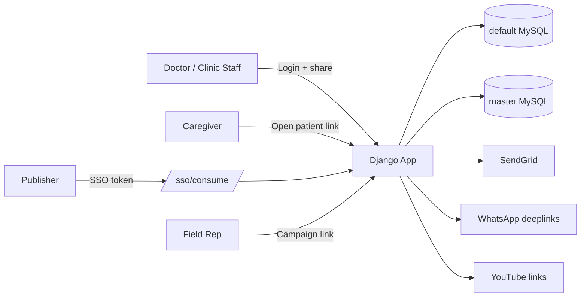

# PedsEdu (CPD in Clinic Portal)

Django-based Pediatric Patient Education platform with:

- doctor/clinic authentication against a master DB,
- multilingual video/bundle sharing over WhatsApp,
- patient-facing video pages,
- campaign/publisher workflows via SSO,
- field-rep assisted doctor onboarding,
- sharing/playback analytics.

---

## Table of Contents

1. [System Snapshot](#1-system-snapshot)
2. [Architecture](#2-architecture)
3. [Repository Structure](#3-repository-structure)
4. [Key Workflows (Indexed)](#4-key-workflows-indexed)
5. [Local Setup](#5-local-setup)
6. [Management Commands](#6-management-commands)
7. [URL Map](#7-url-map)
8. [Deployment Notes](#8-deployment-notes)
9. [Current Caveats / Risks](#9-current-caveats--risks)

---

## 1) System Snapshot

### Core apps

- `accounts`: registration/login/password reset + master DB doctor/staff integration.
- `catalog`: therapy/trigger/video/bundle models and import tooling.
- `sharing`: doctor share UI, patient pages, tracking APIs/dashboard.
- `publisher`: campaign module + staff-only catalog CRUD pages.
- `sso`: JWT consume endpoint for publisher-side SSO.

### Databases

- `default` (portal-owned tables)
- `master` (external master system data: doctors/enrollment/publisher allowlist/field reps)

### Runtime dependencies

- Django 4.2, MySQL, WhiteNoise, SendGrid SMTP, optional Redis cache.

---

## 2) Architecture



### URL include order at root

1. `/admin/`
2. `/sso/`
3. campaign routes at root (`publisher.campaign_urls`)
4. sharing routes at root (`sharing.urls`)
5. `/accounts/`
6. `/publisher/` (staff CRUD)

---

## 3) Repository Structure

```text
peds_edu/      project settings, URL config, shared master DB helpers
accounts/      doctor auth/onboarding, pincode utilities, SendGrid helpers
catalog/       taxonomy/content models + CSV importer
sharing/       share page, patient pages, analytics models/APIs
publisher/     campaign module + staff CRUD UI
sso/           HS256 JWT verification and session creation
templates/     HTML templates
static/        CSS/JS/icons
CSV/           import files
deploy/        deployment examples (nginx/gunicorn/sql)
```

---

## 4) Key Workflows (Indexed)

### Flow-01: Doctor login and content sharing

1. User logs in at `/accounts/login/`.
2. Credentials are verified against master DB (doctor or clinic user columns).
3. Session stores `master_doctor_id` and login role.
4. User opens `/clinic/<doctor_id>/share/`.
5. App builds/enriches catalog payload, injects signed doctor payload, and language-specific WhatsApp message prefixes.
6. User shares a WhatsApp link to patient video (`/p/<doctor_id>/v/<video_code>/`) or bundle (`/p/<doctor_id>/c/<cluster_code>/`).

### Flow-02: Patient link consumption

1. Caregiver opens shared link.
2. App validates signed payload and resolves language fallback.
3. Single video or bundle page is rendered using per-language titles/URLs.
4. Playback/banner/share tracking APIs capture telemetry events.

### Flow-03: Publisher SSO and campaign setup

1. External system redirects to `/sso/consume/?token=...&campaign_id=...`.
2. Token is verified (`HS256`, `iss`, `aud`, `exp`).
3. Session identity and campaign ID are stored.
4. Publisher uses campaign screens to create/edit campaign-linked bundle and metadata.

### Flow-04: Field rep onboarding

1. Rep opens `/field-rep-landing-page/?campaign-id=...&field_rep_id=...`.
2. App resolves and validates rep-campaign mapping via master DB.
3. Rep submits doctor WhatsApp.
4. Existing doctor: ensure enrollment + route toward sharing message.
5. New doctor: redirect to registration with campaign-prefilled context.

---

## 5) Local Setup

> **Important:** `peds_edu/settings.py` currently contains hardcoded DB credentials/hosts for both `default` and `master`. `.env` does not fully control DB connectivity in current code.

### Prerequisites

- Python 3.10+
- MySQL client/build dependencies

```bash
python3 -m venv .venv
source .venv/bin/activate
pip install -r requirements.txt
# optional transliteration engine
pip install -r requirements-dev.txt
cp .env.example .env
set -a && source .env && set +a
```

### Prepare DB and run

```bash
python manage.py migrate
python manage.py createsuperuser
python manage.py import_master_data --path ./CSV
python manage.py runserver 0.0.0.0:8000
```

---

## 6) Management Commands

- `python manage.py import_master_data --path <dir>`
  - Requires exact CSV names:
    - `trigger_master.csv`
    - `video_master.csv`
    - `video_cluster_master.csv`
    - `video_cluster_video_master.csv`
    - `video_trigger_map_master.csv`
- `python manage.py build_pincode_directory --input <csv> [--output <json>]`
- `python manage.py ensure_campaign_enrollment --doctor-id <id>|--email <email> --campaign-id <id> [--registered-by <id>]`

---

## 7) URL Map

### Accounts

- `/accounts/register/`
- `/accounts/login/`
- `/accounts/request-password-reset/`

### Sharing

- `/clinic/<doctor_id>/share/`
- `/p/<doctor_id>/v/<video_code>/`
- `/p/<doctor_id>/c/<cluster_code>/`
- `/api/share-activity/`
- `/api/playback-event/`
- `/api/banner-click/`
- `/tracking/login/`, `/tracking/`

### Campaign/Publisher

- `/sso/consume/`
- `/publisher-landing-page/`
- `/add-campaign-details/`
- `/campaigns/`
- `/campaigns/<campaign_id>/edit/`
- `/publisher-api/search/`
- `/publisher-api/expand-selection/`
- `/field-rep-landing-page/`

### Staff CRUD

- `/publisher/...` (therapy/triggers/videos/bundles/maps CRUD)

---

## 8) Deployment Notes

- Use Gunicorn + Nginx (`deploy/gunicorn.service`, `deploy/nginx.conf`).
- Collect static before deploy: `python manage.py collectstatic`.
- Ensure persistent media storage for doctor photos and campaign banners.
- Configure Redis via `REDIS_URL` for multi-worker cache consistency.

---

## 9) Current Caveats / Risks

1. Hardcoded credentials/secrets in `settings.py` should be moved to environment/secret manager.
2. `publisher_campaign` is unmanaged (`managed=False`): schema changes must be manual/coordinated.
3. `SSO_USE_ENV = False` means in-file defaults currently drive SSO config.
4. Automated test coverage is minimal relative to workflow complexity.
