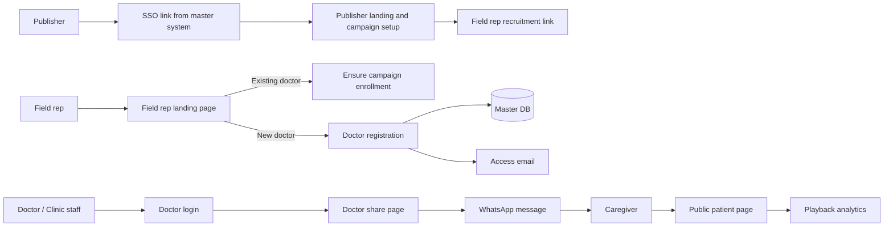
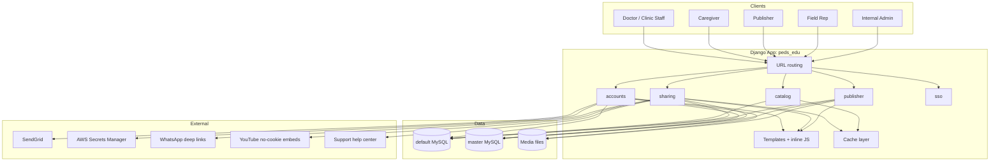
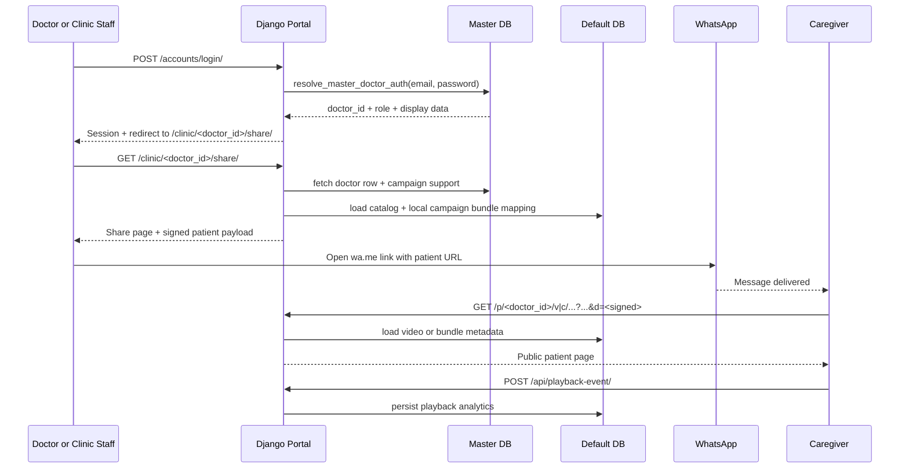
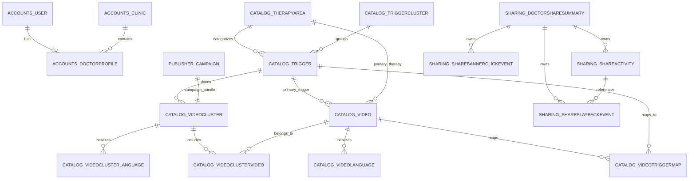
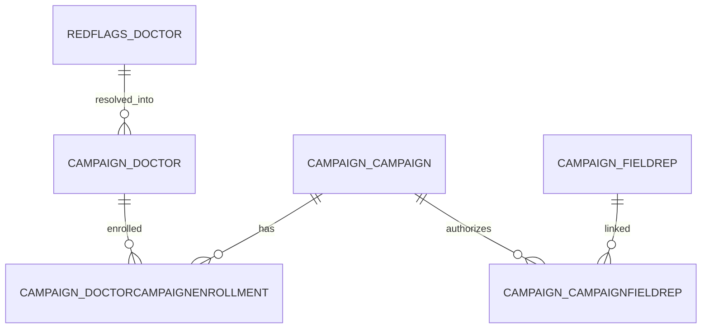
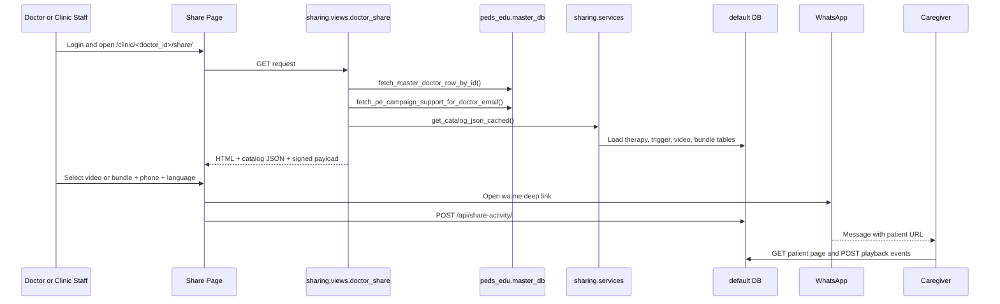
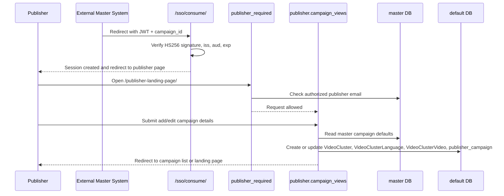
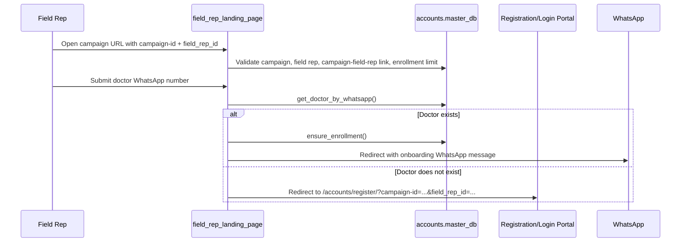

# CPD in Clinic Patient Education Portal (`peds_edu`)

This repository contains a Django monolith that powers two connected product surfaces:

1. A doctor and clinic-staff portal for sharing multilingual pediatric education videos with caregivers over WhatsApp.
2. An SSO-protected campaign publishing module used by publishers and field representatives to configure campaign-specific bundles and onboard doctors.

The codebase is the source of truth. This README consolidates and replaces the older `README.md` and `PedsEdu_System_Documentation.md`, and it is written so that a new developer or an AI agent can understand the system from the repository alone.

## Table of Contents

1. [Product Overview](#1-product-overview)
2. [System Architecture](#2-system-architecture)
3. [Codebase Structure](#3-codebase-structure)
4. [Core System Components](#4-core-system-components)
5. [Database Design](#5-database-design)
6. [Feature-Level Documentation](#6-feature-level-documentation)
7. [API / Service Layer](#7-api--service-layer)
8. [Application Flow](#8-application-flow)
9. [Developer Onboarding Guide](#9-developer-onboarding-guide)
10. [AI-Optimized System Summary](#10-ai-optimized-system-summary)

---

## 1. Product Overview

### What the system does

The Patient Education portal helps doctors and clinic staff send structured pediatric education content to caregivers in multiple Indian languages. A doctor logs in, filters a content catalog by therapy area and trigger, chooses either a single video or a bundle, and sends a WhatsApp deep link to the caregiver. The caregiver opens a branded public page and watches the content in the selected language.

The same repository also contains a publisher workflow used by campaign managers and field representatives:

- Publishers arrive through SSO from an external master publishing system.
- They create campaign-specific bundles and messaging templates.
- Field reps use campaign links to enroll existing doctors or redirect new doctors into registration.

### Problem it solves

The system addresses two linked operational problems:

- Clinical education: caregivers often leave a consultation without retaining all care instructions, red flags, or follow-up guidance.
- Campaign distribution: sponsored or program-based education campaigns need a controlled way to enroll doctors, attach campaign-specific content, and track downstream usage.

### Key features

| Area | Capability |
|---|---|
| Doctor experience | Master-DB-backed login for doctors and clinic staff |
| Content delivery | Multilingual video and bundle catalog across 8 languages |
| Sharing | WhatsApp deep links with signed patient context |
| Patient experience | Public single-video and multi-video bundle pages |
| Campaigns | SSO publisher workflow for campaign bundle creation |
| Enrollment | Field-rep flow for enrolling or registering doctors |
| Admin | Internal CRUD UI for therapy areas, triggers, videos, bundles, and record maintenance |
| Analytics | Share activity, playback milestones, and banner click tracking |
| Support | Route-aware embedded support widget configuration |

### Target users

| User type | Primary goal | Auth source | Main entry points |
|---|---|---|---|
| Doctor | Share relevant education content with caregivers | Master DB (`redflags_doctor`) | `/accounts/login/`, `/clinic/<doctor_id>/share/` |
| Clinic staff | Share the same content on behalf of the doctor | Master DB clinic user columns | `/accounts/login/`, `/clinic/<doctor_id>/share/` |
| Caregiver | Watch the shared video or bundle | No login; signed URL payload | `/p/<doctor_id>/v/<video_code>/`, `/p/<doctor_id>/c/<cluster_code>/` |
| Publisher | Configure campaign-specific bundles and messaging | SSO session + master allowlist | `/sso/consume/`, `/publisher-landing-page/`, `/add-campaign-details/` |
| Field rep | Onboard doctors into campaigns | Campaign URL + master field-rep validation | `/field-rep-landing-page/` |
| Internal admin | Manage catalog, campaigns, field reps, and doctor records | Local Django auth | `/admin/`, `/publisher/`, `/publisher/pe-system/` |

### High-level user journey


```mermaid
flowchart LR
  PUB["Publisher"] --> SSO["SSO link from master system"]
  SSO --> PLC["Publisher landing and campaign setup"]
  PLC --> FRL["Field rep recruitment link"]

  FR["Field rep"] --> FRL2["Field rep landing page"]
  FRL2 -->|Existing doctor| ENR["Ensure campaign enrollment"]
  FRL2 -->|New doctor| REG["Doctor registration"]

  REG --> MDB[(Master DB)]
  REG --> EMAIL["Access email"]

  DOC["Doctor / Clinic staff"] --> LOGIN["Doctor login"]
  LOGIN --> SHARE["Doctor share page"]
  SHARE --> WA["WhatsApp message"]
  WA --> CG["Caregiver"]
  CG --> PAGES["Public patient page"]
  PAGES --> ANALYTICS["Playback analytics"]
```

### High-level journey by role

1. Publisher creates or edits campaign details.
2. Field rep opens campaign-specific landing page.
3. Existing doctors are enrolled immediately; new doctors are redirected into registration.
4. Doctor or clinic staff logs in and opens the share page.
5. A caregiver receives a WhatsApp link and watches content on a public page.
6. Share activity and playback events are recorded for reporting.

---

## 2. System Architecture

### Architecture summary

This is a server-rendered Django application with a dual-database architecture:

- `default` database: portal-owned data such as catalog tables, local users, analytics, and the local campaign shadow table.
- `master` database: external campaign and doctor source-of-truth tables used for doctor auth, campaign metadata, field-rep validation, and enrollment.

The application is organized into five main apps plus the project package:

- `accounts`: doctor registration, doctor/staff login, password reset, email sending, pincode utilities, master DB write helpers.
- `catalog`: content taxonomy and multilingual content models.
- `sharing`: doctor share UI, public patient pages, analytics endpoints, support widget context.
- `publisher`: internal admin UI plus SSO-protected campaign workflow.
- `sso`: JWT verification and publisher session creation.
- `peds_edu`: settings, URL composition, AWS secrets helper, master DB auth/signing helper.

### Application layers

| Layer | Implementation | Notes |
|---|---|---|
| Presentation | Django templates in `templates/` and `publisher/templates/publisher/`, static CSS/JS in `static/` | Mostly server-rendered HTML with inline JavaScript for interactive flows |
| Controller | Django view functions in `accounts.views`, `sharing.views`, `publisher.views`, `publisher.campaign_views`, `sso.views` | No Django REST Framework; JSON APIs are plain Django views |
| Service / domain helper | `sharing.services`, `accounts.master_db`, `peds_edu.master_db`, `accounts.sendgrid_utils`, `sso.jwt` | Business logic is split across helper modules instead of a formal service layer package |
| Data access | Django ORM plus direct SQL on both `default` and `master` connections | Several master tables and `publisher_campaign` are unmanaged/manual |
| Infrastructure | WhiteNoise, optional Redis cache, SendGrid, AWS Secrets Manager, WhatsApp deep links, YouTube embeds | Media storage is filesystem-backed by default |

### High-level architecture diagram


```mermaid
flowchart TB
  subgraph Clients
    D["Doctor / Clinic Staff"]
    C["Caregiver"]
    P["Publisher"]
    F["Field Rep"]
    A["Internal Admin"]
  end

  subgraph Django["Django App: peds_edu"]
    U["URL routing"]
    ACC["accounts"]
    CAT["catalog"]
    SHR["sharing"]
    PUB["publisher"]
    SSO["sso"]
    TPL["Templates + inline JS"]
    CACHE["Cache layer"]
  end

  subgraph Data
    DB1[("default MySQL")]
    DB2[("master MySQL")]
    MEDIA[("Media files")]
  end

  subgraph External
    SG["SendGrid"]
    AWS["AWS Secrets Manager"]
    WA["WhatsApp deep links"]
    YT["YouTube no-cookie embeds"]
    HELP["Support help center"]
  end

  D --> U
  C --> U
  P --> U
  F --> U
  A --> U

  U --> ACC
  U --> CAT
  U --> SHR
  U --> PUB
  U --> SSO
  ACC --> TPL
  SHR --> TPL
  PUB --> TPL

  ACC --> DB1
  ACC --> DB2
  CAT --> DB1
  SHR --> DB1
  SHR --> DB2
  PUB --> DB1
  PUB --> DB2

  SHR --> CACHE
  CAT --> CACHE

  ACC --> SG
  ACC --> AWS
  ACC --> MEDIA
  PUB --> MEDIA
  SHR --> WA
  SHR --> YT
  SHR --> HELP
```

### Component interaction diagram


```mermaid
sequenceDiagram
  participant Doctor as Doctor or Clinic Staff
  participant Portal as Django Portal
  participant Master as Master DB
  participant DefaultDB as Default DB
  participant WhatsApp as WhatsApp
  participant Caregiver as Caregiver

  Doctor->>Portal: POST /accounts/login/
  Portal->>Master: resolve_master_doctor_auth(email, password)
  Master-->>Portal: doctor_id + role + display data
  Portal-->>Doctor: Session + redirect to /clinic/<doctor_id>/share/

  Doctor->>Portal: GET /clinic/<doctor_id>/share/
  Portal->>Master: fetch doctor row + campaign support
  Portal->>DefaultDB: load catalog + local campaign bundle mapping
  Portal-->>Doctor: Share page + signed patient payload

  Doctor->>WhatsApp: Open wa.me link with patient URL
  WhatsApp-->>Caregiver: Message delivered
  Caregiver->>Portal: GET /p/<doctor_id>/v|c/...?...&d=<signed>
  Portal->>DefaultDB: load video or bundle metadata
  Portal-->>Caregiver: Public patient page
  Caregiver->>Portal: POST /api/playback-event/
  Portal->>DefaultDB: persist playback analytics
```

### Data flow

1. Publisher and field-rep workflows depend on the external master system for identity, campaign validity, and enrollment limits.
2. Doctor login is checked against the master database first; a local Django `User` is then created or reused as a session anchor.
3. The doctor share page merges data from both databases:
   - doctor and clinic identity from the master database,
   - catalog and local campaign bundle mappings from the default database.
4. Patient links include a signed compact payload, so the public pages can render doctor/clinic context without reading protected master records.
5. Analytics writes stay in the default database via the `sharing_*` models.

---

## 3. Codebase Structure

### Top-level layout

```text
.
├── accounts/                  # Auth, registration, password reset, master DB integration
├── catalog/                   # Therapy / trigger / video / bundle models and import tooling
├── sharing/                   # Doctor share UI, patient pages, analytics
├── publisher/                 # Internal CRUD UI and campaign publisher workflow
├── sso/                       # HS256 JWT verification and session bootstrap
├── peds_edu/                  # Project settings, URL routing, shared helpers
├── templates/                 # Shared templates for accounts and sharing
├── publisher/templates/       # Publisher-specific templates
├── static/                    # CSS, JS, icons, support assets
├── CSV/                       # Seed catalog CSVs for import_master_data
├── deploy/                    # Nginx and systemd examples
├── docs/                      # Generated training/documentation artifacts
├── PESystem/                  # Workflow/training assets
├── output/                    # Generated documentation output
├── tmp/docs/                  # Utility scripts and generated doc tooling
├── deploy.sh                  # EC2-oriented deployment script
├── .env.example               # Partial local env template
├── PedsEdu_System_Documentation.md  # Legacy documentation
└── manage.py                  # Django entrypoint
```

### Major directories and files

| Path | Purpose |
|---|---|
| `manage.py` | Django CLI entrypoint |
| `peds_edu/settings.py` | Central configuration for databases, SSO, cache, static/media, email, and master schema mappings |
| `peds_edu/urls.py` | Root router; mounts campaign publisher URLs at the site root, sharing routes at root, accounts under `/accounts/`, internal publisher UI under `/publisher/`, and SSO under `/sso/` |
| `accounts/models.py` + `accounts/email_log.py` | Local auth and doctor-related models plus email log model |
| `accounts/views.py` | Registration, login, logout, password reset, clinic detail edit |
| `accounts/master_db.py` | Master DB writes and reads for campaigns, doctors, field reps, and enrollments |
| `catalog/models.py` | Therapy, trigger, video, bundle, localization, and mapping models |
| `catalog/management/commands/import_master_data.py` | CSV import and optional transliteration bootstrap |
| `sharing/views.py` | Doctor share UI, patient pages, analytics APIs, tracking dashboard |
| `sharing/services.py` | Catalog payload builder and localized WhatsApp prefixes |
| `publisher/views.py` | Internal content CRUD and PE/system records dashboards |
| `publisher/campaign_views.py` | Publisher SSO workflow, campaign create/edit, field-rep landing, publisher APIs |
| `publisher/campaign_auth.py` | Publisher session validation and SSO redirect helper |
| `sso/views.py` + `sso/jwt.py` | SSO JWT consume endpoint and HS256 verification |
| `templates/` and `publisher/templates/publisher/` | Server-rendered HTML templates |
| `deploy.sh`, `deploy/gunicorn.service`, `deploy/nginx.conf` | Deployment scaffolding for Ubuntu + Gunicorn + Nginx |

### Architectural patterns in use

- Django monolith with function-based views.
- Server-rendered templates with inline JavaScript for catalog filtering, WhatsApp deep-link creation, YouTube embed orchestration, and analytics logging.
- Dual-database integration using both Django ORM and direct SQL.
- Mixed model ownership:
  - managed portal models live in the default DB,
  - unmanaged external models and tables live in the master DB,
  - `publisher_campaign` is local but also unmanaged and must already exist.
- Session-based authentication for all authenticated flows.
- Thin views in some places, but significant business logic still lives inside view functions and helper modules.

### Dependency relationships

- `sharing.views` depends on both `sharing.services` and `peds_edu.master_db`.
- `publisher.campaign_views` depends on `publisher.campaign_auth`, `accounts.master_db`, and `catalog.models`.
- `accounts.views` depends on both `accounts.master_db` and `peds_edu.master_db`.
- `catalog.signals` invalidates sharing catalog cache when catalog models change.
- `sharing.context_processors` and `sharing.support_widget` inject cross-cutting UI state into templates.

### Runtime and non-runtime artifacts

The following directories exist in the repository but are not part of the core runtime:

- `docs/`, `PESystem/`, `output/`, `tmp/docs/`: generated documentation packs, screenshots, decks, and automation scripts.
- `.playwright-cli/`: browser automation traces.
- `.github/workflows/`: deployment workflow.

### Important implementation notes

- Publisher-facing campaign routes are mounted at the site root, not under `/publisher/`.
- The route previously described in older docs as `/accounts/forgot/` does not exist; the live password reset request route is `/accounts/request-password-reset/`.
- `settings.py` contains legacy duplicated configuration blocks; the later assignments in the file are the effective ones.
- The repository currently includes insecure-looking fallback/example secrets and connection defaults. Override everything via environment variables before using the project anywhere real.
- `doctor_share()` currently calls `get_catalog_json_cached(force_refresh=True)`, so the share page always rebuilds the catalog payload instead of reading the cached copy first.
- `catalog.signals` clears legacy cache keys (`v5`/`v6`), while the active payload key in `sharing.services` is `clinic_catalog_payload_v7`; content changes may therefore require manual cache attention unless this is corrected in code.

---

## 4. Core System Components

### Controllers

In Django terms, the controller layer is implemented as view functions.

| Module | Purpose | Key responsibilities | Main routes |
|---|---|---|---|
| `accounts.views` | Doctor onboarding and auth | Doctor registration, doctor/staff login, logout, password reset, clinic details edit | `/accounts/register/`, `/accounts/login/`, `/accounts/request-password-reset/` |
| `sharing.views` | Doctor sharing and patient consumption | Share page rendering, signed patient pages, share activity API, playback API, banner click API, tracking dashboard | `/clinic/<doctor_id>/share/`, `/p/<doctor_id>/...`, `/api/...`, `/tracking/...` |
| `publisher.campaign_views` | External campaign workflow | Publisher landing, campaign create/edit, catalog search/expand, field-rep onboarding | `/publisher-landing-page/`, `/add-campaign-details/`, `/field-rep-landing-page/` |
| `publisher.views` | Internal operations UI | Dashboard, content CRUD, PE records dashboard, system record maintenance | `/publisher/...` |
| `sso.views` | Publisher session bootstrap | Validate JWT and create publisher session | `/sso/consume/` |

### Service and helper modules

| Module | Purpose | Important logic |
|---|---|---|
| `sharing.services` | Builds the catalog payload used by the share page | Assembles therapy areas, triggers, bundles, videos, localized titles/URLs, and WhatsApp message prefixes |
| `accounts.master_db` | Master DB campaign and enrollment integration | Authorized publisher lookup, doctor lookup by email/WhatsApp, campaign enrollment creation, field rep lookup, campaign/doctor/field-rep record CRUD |
| `peds_edu.master_db` | Master DB auth and patient-link integration | Doctor/staff identity resolution, password verification, signed patient payloads, campaign banner support lookup |
| `accounts.sendgrid_utils` | Email dispatch and logging | Resolves SendGrid key from AWS/env/settings, renders plaintext/HTML email, writes `EmailLog` rows |
| `accounts.pincode_directory` | Postal-code enrichment | Loads `india_pincode_directory.json`, resolves state by PIN, optionally looks up district via India Post API |
| `sso.jwt` | JWT verification | Verifies HS256 signature, issuer, audience, expiry, and basic claim sanity |
| `catalog.signals` | Cache invalidation | Clears catalog cache keys when content models change |

### Core models by responsibility

| Responsibility | Models |
|---|---|
| Local identity and clinic data | `accounts.User`, `accounts.Clinic`, `accounts.DoctorProfile`, `accounts.EmailLog` |
| External doctor source-of-truth | `accounts.RedflagsDoctor` (unmanaged) |
| Catalog and localization | `catalog.TherapyArea`, `catalog.TriggerCluster`, `catalog.Trigger`, `catalog.Video`, `catalog.VideoLanguage`, `catalog.VideoCluster`, `catalog.VideoClusterLanguage`, `catalog.VideoClusterVideo`, `catalog.VideoTriggerMap` |
| Campaign shadow data | `publisher.Campaign` (unmanaged local table) |
| Analytics | `sharing.DoctorShareSummary`, `sharing.ShareActivity`, `sharing.SharePlaybackEvent`, `sharing.ShareBannerClickEvent` |

### Utilities and cross-cutting components

| Module | Role |
|---|---|
| `sharing.context_processors.clinic_branding` | Injects doctor/clinic branding and route-specific support widget config into authenticated pages |
| `sharing.support_widget` | Maps route names to help-center widget/embed URLs |
| `static/js/app.js` | Shared UI behavior for responsive navigation and phone/WhatsApp link normalization |
| `templates/sharing/share.html` | Contains most of the client-side catalog filtering and WhatsApp sharing logic inline |
| `templates/sharing/patient_video.html` and `templates/sharing/patient_cluster.html` | Extract YouTube IDs, render privacy-enhanced embeds, and log playback milestones |

### Middleware

There is no custom middleware class in the repository. The application relies on Django’s standard middleware stack plus WhiteNoise:

| Middleware | Why it matters |
|---|---|
| `SecurityMiddleware` | Base Django security headers and SSL-related support |
| `whitenoise.middleware.WhiteNoiseMiddleware` | Static file serving in production |
| `SessionMiddleware` | Required for doctor login, publisher SSO, and analytics tracking |
| `CommonMiddleware` | Standard Django request/response normalization |
| `CsrfViewMiddleware` | Protects POST endpoints, including authenticated share analytics |
| `AuthenticationMiddleware` | Makes session auth available in views and templates |
| `MessageMiddleware` | Powers flash messages across login, registration, and admin flows |
| `XFrameOptionsMiddleware` | Clickjacking protection |

---

## 5. Database Design

### Database topology

| Database | Role | Used by |
|---|---|---|
| `default` | Portal-owned schema | Local auth, catalog, analytics, local campaign shadow data |
| `master` | External master schema | Doctor auth, doctor registry, campaign source data, field reps, publisher allowlist, enrollments |

### Portal database entities

| Table / model | Purpose | Key fields | Relationships |
|---|---|---|---|
| `accounts_user` / `accounts.User` | Local Django identity | `email`, `full_name`, `is_staff`, `is_superuser`, `date_joined` | One-to-one with `accounts_doctorprofile`; also used by staff/admin flows |
| `accounts_clinic` / `accounts.Clinic` | Local clinic record | `clinic_code`, `display_name`, `clinic_phone`, `clinic_whatsapp_number`, `postal_code`, `state` | One clinic can have many doctor profiles |
| `accounts_doctorprofile` / `accounts.DoctorProfile` | Local doctor profile | `doctor_id`, `whatsapp_number`, `imc_number`, `photo`, `clinic_id`, timestamps | One-to-one with `accounts_user`, many-to-one to `accounts_clinic` |
| `accounts_emaillog` / `accounts.EmailLog` | Transactional email audit | `to_email`, `subject`, `provider`, `success`, `status_code`, `response_body`, `error` | Standalone audit log |
| `catalog_therapyarea` / `catalog.TherapyArea` | Top-level clinical grouping | `code`, `display_name`, `description`, `sort_order`, `is_active` | Parent for triggers and videos |
| `catalog_triggercluster` / `catalog.TriggerCluster` | Group of triggers | `code`, `display_name`, `description`, `language_code`, `sort_order`, `is_active` | Parent for triggers |
| `catalog_trigger` / `catalog.Trigger` | Clinical trigger / entry point | `code`, `display_name`, `doctor_trigger_label`, `cluster_id`, `primary_therapy_id` | Belongs to one cluster and one therapy area |
| `catalog_video` / `catalog.Video` | Atomic educational content item | `code`, `description`, `thumbnail_url`, `primary_trigger_id`, `primary_therapy_id`, `is_published`, `is_active` | Many-to-many to bundles through `catalog_videoclustervideo` |
| `catalog_videolanguage` / `catalog.VideoLanguage` | Per-language video metadata | `video_id`, `language_code`, `title`, `youtube_url` | Unique on `(video, language_code)` |
| `catalog_videocluster` / `catalog.VideoCluster` | Bundle of videos | `code`, `display_name`, `trigger_id`, `is_published`, `is_active` | One-to-one with local `publisher_campaign`; many-to-many with videos |
| `catalog_videoclusterlanguage` / `catalog.VideoClusterLanguage` | Per-language bundle name | `video_cluster_id`, `language_code`, `name` | Unique on `(video_cluster, language_code)` |
| `catalog_videoclustervideo` / `catalog.VideoClusterVideo` | Ordered bundle membership | `video_cluster_id`, `video_id`, `sort_order` | Unique on `(video_cluster, video)` |
| `catalog_videotriggermap` / `catalog.VideoTriggerMap` | Optional extra trigger linkage | `video_id`, `trigger_id`, `is_primary`, `sort_order` | Unique on `(video, trigger)` |
| `publisher_campaign` / `publisher.Campaign` | Local campaign shadow record | `campaign_id`, `new_video_cluster_name`, `selection_json`, `doctors_supported`, `video_cluster_id`, templates, banner fields, dates | One-to-one to `catalog_videocluster`; unmanaged/manual |
| `sharing_doctorsharesummary` / `sharing.DoctorShareSummary` | Per-doctor analytics aggregate | `doctor_id`, `doctor_name_snapshot`, `clinic_name_snapshot`, `total_shares`, `last_shared_at` | Parent for share, playback, and banner events |
| `sharing_shareactivity` / `sharing.ShareActivity` | Individual share event | `public_id`, `doctor_id`, `shared_item_type`, `shared_item_code`, `language_code`, `recipient_reference`, `shared_at` | Many-to-one to `DoctorShareSummary` |
| `sharing_shareplaybackevent` / `sharing.SharePlaybackEvent` | Video play and progress milestones | `share_public_id`, `doctor_id`, `page_item_type`, `event_type`, `video_code`, `milestone_percent`, `occurred_at` | Optional FK to `ShareActivity`, required FK to `DoctorShareSummary` |
| `sharing_sharebannerclickevent` / `sharing.ShareBannerClickEvent` | Campaign banner click log | `doctor_id`, `page_type`, `banner_id`, `banner_name`, `banner_target_url`, `clicked_at` | Many-to-one to `DoctorShareSummary` |

### Master database entities inferred from code

| Table | Purpose | Notes |
|---|---|---|
| `redflags_doctor` | Doctor and clinic registry plus login/password fields | Primary source for doctor/staff auth and display context |
| `campaign_campaign` | Master campaign record | Used for doctor limits, registration/addition templates, PE filtering, banners |
| `campaign_doctor` | Campaign-side doctor identity | Used when creating or resolving enrollment rows |
| `campaign_doctorcampaignenrollment` | Doctor-to-campaign enrollment join | Used for field-rep onboarding and campaign bundle visibility |
| `campaign_fieldrep` | Field rep master data | Stores IDs, phone numbers, state, active status |
| `campaign_campaignfieldrep` | Campaign-to-field-rep join | Validates whether a field rep can onboard into a campaign |
| `campaign_authorizedpublisher` | Publisher allowlist | Access control for the publisher module |
| `campaign_videocluster` | Optional master campaign-to-cluster mapping | Read on a best-effort basis if present |

### Portal ER diagram


```mermaid
erDiagram
  ACCOUNTS_USER ||--o| ACCOUNTS_DOCTORPROFILE : has
  ACCOUNTS_CLINIC ||--o{ ACCOUNTS_DOCTORPROFILE : contains

  CATALOG_THERAPYAREA ||--o{ CATALOG_TRIGGER : categorizes
  CATALOG_TRIGGERCLUSTER ||--o{ CATALOG_TRIGGER : groups
  CATALOG_TRIGGER ||--o{ CATALOG_VIDEOCLUSTER : drives
  CATALOG_TRIGGER ||--o{ CATALOG_VIDEO : primary_trigger
  CATALOG_THERAPYAREA ||--o{ CATALOG_VIDEO : primary_therapy

  CATALOG_VIDEO ||--o{ CATALOG_VIDEOLANGUAGE : localizes
  CATALOG_VIDEOCLUSTER ||--o{ CATALOG_VIDEOCLUSTERLANGUAGE : localizes
  CATALOG_VIDEOCLUSTER ||--o{ CATALOG_VIDEOCLUSTERVIDEO : includes
  CATALOG_VIDEO ||--o{ CATALOG_VIDEOCLUSTERVIDEO : belongs_to
  CATALOG_VIDEO ||--o{ CATALOG_VIDEOTRIGGERMAP : maps
  CATALOG_TRIGGER ||--o{ CATALOG_VIDEOTRIGGERMAP : maps_to

  PUBLISHER_CAMPAIGN ||--|| CATALOG_VIDEOCLUSTER : campaign_bundle

  SHARING_DOCTORSHARESUMMARY ||--o{ SHARING_SHAREACTIVITY : owns
  SHARING_DOCTORSHARESUMMARY ||--o{ SHARING_SHAREPLAYBACKEVENT : owns
  SHARING_DOCTORSHARESUMMARY ||--o{ SHARING_SHAREBANNERCLICKEVENT : owns
  SHARING_SHAREACTIVITY ||--o{ SHARING_SHAREPLAYBACKEVENT : references
```

### Master DB conceptual relationship diagram


```mermaid
erDiagram
  REDFLAGS_DOCTOR ||--o{ CAMPAIGN_DOCTOR : resolved_into
  CAMPAIGN_CAMPAIGN ||--o{ CAMPAIGN_DOCTORCAMPAIGNENROLLMENT : has
  CAMPAIGN_DOCTOR ||--o{ CAMPAIGN_DOCTORCAMPAIGNENROLLMENT : enrolled
  CAMPAIGN_CAMPAIGN ||--o{ CAMPAIGN_CAMPAIGNFIELDREP : authorizes
  CAMPAIGN_FIELDREP ||--o{ CAMPAIGN_CAMPAIGNFIELDREP : linked
```

### Constraints and data-model notes

- `accounts.User.email` is unique and is the local username.
- `DoctorProfile.whatsapp_number` and `DoctorProfile.doctor_id` are unique.
- `VideoLanguage` and `VideoClusterLanguage` enforce one row per language per content item.
- `ShareActivity.public_id` is a UUID and is used to correlate downstream playback events.
- Recipient identifiers are never stored raw in `ShareActivity`; they are HMAC-anonymized into `recipient_reference`.
- `publisher.Campaign` and `accounts.RedflagsDoctor` are unmanaged; migrations will not create those tables.

---

## 6. Feature-Level Documentation

### 6.1 Doctor registration

**Purpose**

Create or enrich a doctor record in the master database, optionally attach campaign enrollment, and deliver access details by email.

**Entry points**

- Direct: `/accounts/register/`
- Field-rep-driven redirect: `/field-rep-landing-page/` redirects here for doctors not found in master DB

**User flow**

1. User opens the registration page.
2. The form collects doctor name, email, clinic identity, phone numbers, pincode, IMC registration number, and doctor photo.
3. If the request came from field-rep flow, hidden `campaign_id` and `field_rep_id` values are preserved.
4. On submit, the system validates the pincode and infers state from the local pincode directory.
5. The system checks whether the doctor already exists in the master DB by email or WhatsApp.
6. If not present, the system inserts the doctor row in the master DB.
7. If a campaign is present, it ensures the doctor is enrolled in that campaign.
8. An access email is sent, and a success page is rendered.

**Backend logic**

- Form: `accounts.forms.DoctorRegistrationForm`
- Master DB write path: `accounts.master_db.insert_doctor_row()` + `accounts.master_db.ensure_enrollment()`
- Email path: `_send_master_doctor_access_email()` / `accounts.sendgrid_utils.send_email_via_sendgrid()`

**Data interactions**

- Reads: pincode directory JSON, master doctor lookup, optional campaign metadata
- Writes: `redflags_doctor`, `campaign_doctorcampaignenrollment`, `accounts_emaillog`

**Components involved**

- `accounts.views.register_doctor`
- `accounts.forms.DoctorRegistrationForm`
- `accounts.master_db`
- `accounts.pincode_directory`
- `accounts.sendgrid_utils`

### 6.2 Doctor and clinic-staff login

**Purpose**

Authenticate doctors or clinic staff using the master database while still using Django sessions locally.

**User flow**

1. User submits email and password on `/accounts/login/`.
2. The system first checks the master DB for:
   - doctor email,
   - `clinic_user1_email`,
   - `clinic_user2_email`.
3. If the password matches the relevant stored password column, the system creates or updates a local `accounts.User`.
4. The system stores `master_doctor_id`, `master_login_email`, and `master_login_role` in the session.
5. The user is redirected to `/clinic/<doctor_id>/share/`.
6. If master auth fails, Django local auth is attempted as a fallback for staff/admin users.

**Backend logic**

- Auth resolution: `peds_edu.master_db.resolve_master_doctor_auth()`
- Password verification supports Django hashes, bcrypt if available, and plaintext fallback.
- The local Django user acts as a session anchor; it is not the source of truth for doctor credentials.

**Data interactions**

- Reads: `redflags_doctor`
- Writes: local `accounts_user` row when needed, Django session table/cookies

**Components involved**

- `accounts.views.doctor_login`
- `peds_edu.master_db`
- `accounts.models.User`

### 6.3 Password reset

**Purpose**

Support both master-DB doctor/staff accounts and local Django admin accounts.

**Behavior**

- For master doctor/staff identities:
  - if the stored password is plaintext, the value may be emailed back directly;
  - if the stored password is hashed, a temporary password is generated, the master DB hash is updated, and the temporary password is emailed.
- For local Django users:
  - a tokenized password-reset link is generated using Django’s default token generator.

**Important note**

This mixed legacy behavior is visible in code and should be treated as a security debt item for future hardening.

### 6.4 Doctor share page

**Purpose**

Let a logged-in doctor or clinic staff member discover content and share it with a caregiver through WhatsApp.

**User flow**

1. User opens `/clinic/<doctor_id>/share/`.
2. The page loads the doctor and clinic context from the master DB.
3. The page loads catalog JSON containing therapy areas, triggers, bundles, videos, and localized titles.
4. The user filters by therapy area, trigger, bundle, or search term.
5. The user selects:
   - a single video, or
   - an entire bundle.
6. The user enters a 10-digit WhatsApp number and chooses a language.
7. The browser creates a patient link with:
   - `lang`,
   - signed doctor/clinic payload `d`,
   - share UUID `s`.
8. The browser opens a `wa.me` URL with a localized message prefix and the patient link.
9. In parallel, the page posts a share-activity event to the server.

**Backend logic**

- Auth guard: URL `doctor_id` must match `request.session["master_doctor_id"]`
- Doctor context: `fetch_master_doctor_row_by_id()` and `master_row_to_template_context()`
- Catalog: `sharing.services.get_catalog_json_cached()`
- Campaign support: `fetch_pe_campaign_support_for_doctor_email()` plus local bundle filtering using `publisher_campaign`

**Data interactions**

- Reads: `redflags_doctor`, local catalog tables, local campaign shadow table
- Writes: `sharing_doctorsharesummary`, `sharing_shareactivity`

**Components involved**

- `sharing.views.doctor_share`
- `sharing.services`
- `peds_edu.master_db`
- inline JS in `templates/sharing/share.html`

### 6.5 Patient single-video and bundle pages

**Purpose**

Render lightweight public pages that caregivers can open without authenticating.

**Single-video flow**

1. Caregiver opens `/p/<doctor_id>/v/<video_code>/?lang=<code>&d=<signed>&s=<uuid>`.
2. The signed payload is unsafely rejected if invalid; the page still renders with empty branding defaults.
3. The selected `Video` and best matching `VideoLanguage` row are loaded.
4. Client-side JS converts the YouTube URL into a privacy-enhanced `youtube-nocookie.com` embed.
5. Playback events are posted to `/api/playback-event/`.

**Bundle flow**

1. Caregiver opens `/p/<doctor_id>/c/<cluster_code>/?lang=<code>&d=<signed>&s=<uuid>`.
2. The `VideoCluster` and its localized name are loaded.
3. All bundle videos are listed with the requested language title and URL.
4. Each embedded player logs play and progress events separately.

**Analytics behavior**

- `play` is logged once when playback starts.
- `progress` is logged at 25, 50, 75, and 100 percent milestones.

### 6.6 Sharing analytics and tracking dashboard

**Purpose**

Provide a lightweight internal reporting layer over doctor shares, playback events, and banner clicks.

**Flow**

1. The share page posts share activity after opening the WhatsApp deep link.
2. Patient pages post playback events while the embedded video plays.
3. Campaign banners on the share page post click events when opened.
4. Internal users with local superuser credentials open `/tracking/login/` and `/tracking/`.

**Data model**

- `DoctorShareSummary`: aggregate counters by doctor ID
- `ShareActivity`: one row per share UUID
- `SharePlaybackEvent`: one row per play/progress milestone
- `ShareBannerClickEvent`: one row per banner click

### 6.7 Publisher SSO and campaign authoring

**Purpose**

Allow an external publisher to configure a Patient Education campaign after arriving from the master publishing system.

**User flow**

1. Publisher is redirected into `/sso/consume/?token=...&campaign_id=...&next=...`.
2. JWT is verified for signature, issuer, audience, and expiry.
3. Publisher identity is stored in session under `sso_identity`.
4. `publisher_required` checks that:
   - the identity has a `publisher` role,
   - the publisher email is present in the master allowlist.
5. Publisher opens `/publisher-landing-page/`.
6. Publisher opens `/add-campaign-details/` or `/campaigns/<campaign_id>/edit/`.
7. The form captures:
   - local bundle name,
   - selected videos and bundles,
   - start and end date,
   - registration email template,
   - WhatsApp addition template,
   - fallback banner target URL.
8. Saving creates or updates:
   - a `catalog.VideoCluster`,
   - English `VideoClusterLanguage`,
   - ordered `VideoClusterVideo` rows,
   - local `publisher_campaign` shadow record.

**Data interactions**

- Reads: master campaign metadata and publisher allowlist
- Writes: local catalog bundle records and local `publisher_campaign`

### 6.8 Field-rep onboarding

**Purpose**

Let field reps onboard doctors into a campaign while respecting doctor-count limits and campaign permissions.

**User flow**

1. Field rep opens `/field-rep-landing-page/?campaign-id=...&field_rep_id=...`.
2. The page validates:
   - the campaign exists in the master DB,
   - the field rep exists and is active,
   - the field rep is linked to the campaign,
   - the campaign has remaining doctor capacity.
3. Field rep submits a doctor WhatsApp number.
4. If the doctor already exists in master DB:
   - `ensure_enrollment()` is called,
   - a WhatsApp onboarding message is rendered from campaign template and sent via redirect to `wa.me`.
5. If the doctor does not exist:
   - the browser is redirected to `/accounts/register/` with campaign and field-rep query params.

### 6.9 Internal content and record administration

**Purpose**

Provide internal teams with a portal UI beyond raw Django admin.

**Subsystems**

- Staff-only catalog CRUD:
  - therapy areas,
  - trigger clusters,
  - triggers,
  - videos,
  - bundles,
  - bundle trigger maps.
- Superuser-only record maintenance:
  - `pe-system` dashboard for master PE campaigns and linked field reps/doctors,
  - `system-records` dashboard for broader local/master records.

**Important distinction**

`/publisher/pe-system/` and `/publisher/system-records/` are not the external publisher workflow. They are internal operational dashboards.

---

## 7. API / Service Layer

The application is primarily an HTML application, but it also exposes several JSON endpoints used by inline JavaScript and publisher tooling.

### 7.1 HTTP route inventory

#### Accounts routes

| Path | Methods | Purpose | Inputs | Returns | Auth | Module |
|---|---|---|---|---|---|---|
| `/accounts/register/` | GET, POST | Doctor registration | Query may include `campaign-id`, `campaign_id`, `field_rep_id`, `doctor_whatsapp_number`; POST uses `DoctorRegistrationForm` fields | HTML form or success page | Public | `accounts.views.register_doctor` |
| `/accounts/modify/<doctor_id>/` | GET, POST | Edit local clinic and doctor profile | `DoctorClinicDetailsForm` fields | HTML form / redirect | Logged-in doctor owning that profile | `accounts.views.modify_clinic_details` |
| `/accounts/login/` | GET, POST | Doctor/staff login with local fallback | POST `username`, `password` | HTML form or redirect | Public | `accounts.views.doctor_login` |
| `/accounts/logout/` | GET | Clear session | None | Redirect to login | Logged-in user | `accounts.views.doctor_logout` |
| `/accounts/request-password-reset/` | GET, POST | Forgot-password request | POST `email` | HTML form with generic success message | Public | `accounts.views.request_password_reset` |
| `/accounts/reset/<uidb64>/<token>/` | GET, POST | Local Django password reset completion | POST new password fields from `DoctorSetPasswordForm` | HTML form / redirect | Token-based | `accounts.views.password_reset` |

#### Sharing routes

| Path | Methods | Purpose | Inputs | Returns | Auth | Module |
|---|---|---|---|---|---|---|
| `/` | GET | Default entry | None | Redirect to login | Public | `sharing.views.home` |
| `/clinic/<doctor_id>/share/` | GET | Doctor share page | URL `doctor_id`; session values; no form POST on page load | HTML share page | Logged-in doctor or clinic staff with matching session | `sharing.views.doctor_share` |
| `/p/<doctor_id>/v/<video_code>/` | GET | Public patient single-video page | Query `lang`, `d`, `s` | HTML patient page | Public | `sharing.views.patient_video` |
| `/p/<doctor_id>/c/<cluster_code>/` | GET | Public patient bundle page | Query `lang`, `d`, `s` | HTML patient page | Public | `sharing.views.patient_cluster` |
| `/tracking/login/` | GET, POST | Tracking dashboard login | POST `email`, `password` | HTML form / redirect | Public entry, local superuser required to proceed | `sharing.views.tracking_login` |
| `/tracking/` | GET | Tracking dashboard | None | HTML dashboard | Local superuser | `sharing.views.tracking_dashboard` |
| `/tracking/logout/` | GET | End tracking session | None | Redirect | Logged-in user | `sharing.views.tracking_logout` |
| `/api/share-activity/` | POST | Persist share event | JSON body | JSON `{ok, created, share_public_id, shared_item_name}` | Logged-in doctor or clinic staff | `sharing.views.create_share_activity` |
| `/api/playback-event/` | POST | Persist video playback event | JSON body | JSON `{ok: true}` or error | Public page with CSRF cookie | `sharing.views.log_playback_event` |
| `/api/banner-click/` | POST | Persist banner click event | JSON body | JSON `{ok: true, click_id}` | Logged-in doctor or clinic staff | `sharing.views.log_banner_click` |

#### External publisher workflow routes

| Path | Methods | Purpose | Inputs | Returns | Auth | Module |
|---|---|---|---|---|---|---|
| `/sso/consume/` | GET | Verify publisher JWT and create session | Query `token` or alias, `campaign_id`, `next` | Redirect or plaintext debug response | Public entry | `sso.views.consume` |
| `/publisher-landing-page/` | GET | Publisher home page after SSO | Query/session `campaign-id` plus optional campaign metadata params | HTML page | Publisher SSO session + allowlist | `publisher.campaign_views.publisher_landing_page` |
| `/add-campaign-details/` | GET, POST | Create local PE campaign shadow data | `CampaignCreateForm` fields; session/query `campaign_id` | HTML form / redirect | Publisher SSO session + allowlist | `publisher.campaign_views.add_campaign_details` |
| `/campaigns/` | GET | List local campaign shadow records | Query `q` | HTML list | Publisher SSO session + allowlist | `publisher.campaign_views.campaign_list` |
| `/campaigns/<campaign_id>/edit/` | GET, POST | Edit local campaign shadow record | `CampaignEditForm` fields | HTML form / redirect | Publisher SSO session + allowlist | `publisher.campaign_views.edit_campaign_details` |
| `/field-rep-landing-page/` | GET, POST | Enroll or register doctor from field rep link | Query `campaign-id`, `field_rep_id`; POST `whatsapp_number` | HTML page or redirect to WhatsApp/registration | Public entry with master validation | `publisher.campaign_views.field_rep_landing_page` |
| `/publisher-api/search/` | GET | Search videos and bundles for publisher UI | Query `q` (minimum length 2) | JSON `{results:[...]}` | Publisher SSO session + allowlist | `publisher.campaign_views.api_search_catalog` |
| `/publisher-api/expand-selection/` | POST | Expand selected videos/bundles into concrete video list | JSON body with `items` | JSON `{videos:[...]}` | Publisher SSO session + allowlist | `publisher.campaign_views.api_expand_selection` |

#### Internal publisher and admin routes

| Path | Methods | Purpose | Returns | Auth | Module |
|---|---|---|---|---|---|
| `/publisher/` | GET | Staff dashboard | HTML page | Django staff | `publisher.views.dashboard` |
| `/publisher/pe-system/login/` | GET, POST | Open PE records session | HTML form / redirect | Public entry, superuser required to proceed | `publisher.views.pe_records_login` |
| `/publisher/pe-system/logout/` | GET | End PE records session | Redirect | PE records session | `publisher.views.pe_records_logout` |
| `/publisher/pe-system/` | GET | PE records dashboard | HTML page | PE records session | `publisher.views.pe_records_dashboard` |
| `/publisher/pe-system/campaigns/<campaign_id>/` | GET, POST | Edit master PE campaign record | HTML form / redirect | PE records session | `publisher.views.pe_campaign_record_edit` |
| `/publisher/pe-system/campaigns/<campaign_id>/delete/` | POST | Delete master PE campaign and local shadow data | Redirect | PE records session | `publisher.views.pe_campaign_record_delete` |
| `/publisher/pe-system/field-reps/<field_rep_id>/` | GET, POST | Edit field rep tied to PE campaigns | HTML form / redirect | PE records session | `publisher.views.pe_field_rep_record_edit` |
| `/publisher/pe-system/field-reps/<field_rep_id>/delete/` | POST | Delete PE-linked field rep | Redirect | PE records session | `publisher.views.pe_field_rep_record_delete` |
| `/publisher/pe-system/doctors/<doctor_id>/` | GET, POST | Edit doctor tied to PE campaigns | HTML form / redirect | PE records session | `publisher.views.pe_doctor_record_edit` |
| `/publisher/pe-system/doctors/<doctor_id>/delete/` | POST | Delete PE-linked doctor | Redirect | PE records session | `publisher.views.pe_doctor_record_delete` |
| `/publisher/system-records/` | GET | Broader system records dashboard | HTML page | Local superuser | `publisher.views.system_records` |
| `/publisher/system-records/campaigns/<campaign_id>/delete/` | POST | Delete local campaign shadow record | Redirect | Local superuser | `publisher.views.campaign_record_delete` |
| `/publisher/system-records/field-reps/<field_rep_id>/` | GET, POST | Edit master field rep record | HTML form / redirect | Local superuser | `publisher.views.field_rep_record_edit` |
| `/publisher/system-records/field-reps/<field_rep_id>/delete/` | POST | Delete master field rep record | Redirect | Local superuser | `publisher.views.field_rep_record_delete` |
| `/publisher/system-records/doctors/<doctor_id>/` | GET, POST | Edit master doctor record and sync local profile when present | HTML form / redirect | Local superuser | `publisher.views.doctor_record_edit` |
| `/publisher/system-records/doctors/<doctor_id>/delete/` | POST | Delete master doctor record and local profile when present | Redirect | Local superuser | `publisher.views.doctor_record_delete` |
| `/publisher/therapy-areas/`, `/publisher/therapy-areas/new/`, `/publisher/therapy-areas/<pk>/` | GET, POST | List/create/edit therapy areas | HTML page / redirect | Django staff | `publisher.views.therapy_list`, `therapy_create`, `therapy_edit` |
| `/publisher/trigger-clusters/`, `/publisher/trigger-clusters/new/`, `/publisher/trigger-clusters/<pk>/` | GET, POST | List/create/edit trigger clusters | HTML page / redirect | Django staff | `publisher.views.trigger_cluster_list`, `trigger_cluster_create`, `trigger_cluster_edit` |
| `/publisher/triggers/`, `/publisher/triggers/new/`, `/publisher/triggers/<pk>/` | GET, POST | List/create/edit triggers | HTML page / redirect | Django staff | `publisher.views.trigger_list`, `trigger_create`, `trigger_edit` |
| `/publisher/videos/`, `/publisher/videos/new/`, `/publisher/videos/<pk>/` | GET, POST | List/create/edit videos and language rows | HTML page / redirect | Django staff | `publisher.views.video_list`, `video_create`, `video_edit` |
| `/publisher/bundles/`, `/publisher/bundles/new/`, `/publisher/bundles/<pk>/` | GET, POST | List/create/edit bundles and bundle members | HTML page / redirect | Django staff | `publisher.views.cluster_list`, `cluster_create`, `cluster_edit` |
| `/publisher/trigger-maps/`, `/publisher/trigger-maps/new/`, `/publisher/trigger-maps/<pk>/` | GET, POST | List/create/edit bundle-trigger mapping | HTML page / redirect | Django staff | `publisher.views.map_list`, `map_create`, `map_edit` |

### 7.2 JSON contract details

#### `POST /api/share-activity/`

**Request body**

```json
{
  "share_public_id": "uuid",
  "shared_item_type": "video | cluster",
  "shared_item_code": "VID123 or CLUSTER123",
  "recipient_identifier": "10 digit phone or other identifier",
  "language_code": "en"
}
```

**Behavior**

- Validates session doctor ID.
- Resolves a display name for the item.
- HMAC-anonymizes the recipient identifier.
- Creates `ShareActivity` idempotently by `public_id`.
- Increments `DoctorShareSummary.total_shares` on first creation.

**Response**

```json
{
  "ok": true,
  "created": true,
  "share_public_id": "uuid",
  "shared_item_name": "Localized title"
}
```

#### `POST /api/playback-event/`

**Request body**

```json
{
  "share_public_id": "uuid or empty",
  "page_item_type": "video | cluster",
  "event_type": "play | progress",
  "video_code": "VID123",
  "video_name": "Localized title",
  "milestone_percent": 25,
  "doctor_id": "required if share_public_id is unknown",
  "doctor_name": "optional fallback",
  "clinic_name": "optional fallback"
}
```

**Behavior**

- If `share_public_id` maps to a known `ShareActivity`, the doctor context is inherited.
- Otherwise a fallback doctor summary is created or reused from provided identifiers.

**Response**

```json
{ "ok": true }
```

#### `POST /api/banner-click/`

**Request body**

```json
{
  "doctor_id": "must match session doctor if present",
  "doctor_name": "Doctor Name",
  "clinic_name": "Clinic Name",
  "page_type": "doctor | clinic",
  "banner_id": "campaign id or synthetic id",
  "banner_name": "Brand name",
  "banner_target_url": "https://example.com"
}
```

**Response**

```json
{
  "ok": true,
  "click_id": 123
}
```

#### `GET /publisher-api/search/?q=...`

**Response shape**

```json
{
  "results": [
    {
      "type": "video",
      "id": 1,
      "code": "VID001",
      "title": "English title"
    },
    {
      "type": "cluster",
      "id": 2,
      "code": "ASTHMA_PACK",
      "title": "Bundle title"
    }
  ]
}
```

#### `POST /publisher-api/expand-selection/`

**Request body**

```json
{
  "items": [
    { "type": "video", "id": 1 },
    { "type": "cluster", "id": 2 }
  ]
}
```

**Response shape**

```json
{
  "videos": [
    { "id": 1, "code": "VID001", "title": "English title" }
  ]
}
```

### 7.3 Non-HTTP service layer

| Service function | Module | What it does |
|---|---|---|
| `resolve_master_doctor_auth()` | `peds_edu.master_db` | Authenticates doctors or clinic staff against master DB password columns |
| `resolve_master_doctor_identity()` | `peds_edu.master_db` | Resolves doctor/staff role without checking password |
| `master_row_to_template_context()` | `peds_edu.master_db` | Converts a master doctor row into the nested doctor/clinic context expected by templates |
| `sign_patient_payload()` / `unsign_patient_payload()` | `peds_edu.master_db` | Produces compact signed payloads for public patient links |
| `fetch_pe_campaign_support_for_doctor_email()` | `peds_edu.master_db` | Resolves PE campaign banners and bundles available to a doctor/clinic user |
| `ensure_enrollment()` | `accounts.master_db` | Ensures master campaign enrollment rows exist for a doctor |
| `build_whatsapp_deeplink()` | `accounts.master_db` | Builds a `wa.me` link with normalized Indian phone number handling |
| `get_catalog_json_cached()` | `sharing.services` | Builds and caches the share-page catalog payload |
| `build_whatsapp_message_prefixes()` | `sharing.services` | Returns per-language doctor-to-caregiver intro text |
| `send_email_via_sendgrid()` | `accounts.sendgrid_utils` | Sends email and stores email audit rows |

---

## 8. Application Flow

### 8.1 Doctor share flow


```mermaid
sequenceDiagram
  participant User as Doctor or Clinic Staff
  participant UI as Share Page
  participant View as sharing.views.doctor_share
  participant Master as peds_edu.master_db
  participant Catalog as sharing.services
  participant DB as default DB
  participant WA as WhatsApp
  participant Patient as Caregiver

  User->>UI: Login and open /clinic/<doctor_id>/share/
  UI->>View: GET request
  View->>Master: fetch_master_doctor_row_by_id()
  View->>Master: fetch_pe_campaign_support_for_doctor_email()
  View->>Catalog: get_catalog_json_cached()
  Catalog->>DB: Load therapy, trigger, video, bundle tables
  View-->>UI: HTML + catalog JSON + signed payload
  User->>UI: Select video or bundle + phone + language
  UI->>WA: Open wa.me deep link
  UI->>DB: POST /api/share-activity/
  WA-->>Patient: Message with patient URL
  Patient->>DB: GET patient page and POST playback events
```

### 8.2 Publisher campaign flow


```mermaid
sequenceDiagram
  participant Publisher as Publisher
  participant MasterSystem as External Master System
  participant SSO as /sso/consume/
  participant Auth as publisher_required
  participant Campaign as publisher.campaign_views
  participant MasterDB as master DB
  participant DefaultDB as default DB

  MasterSystem->>SSO: Redirect with JWT + campaign_id
  SSO->>SSO: Verify HS256 signature, iss, aud, exp
  SSO-->>Publisher: Session created and redirect to publisher page
  Publisher->>Auth: Open /publisher-landing-page/
  Auth->>MasterDB: Check authorized publisher email
  Auth-->>Campaign: Request allowed
  Publisher->>Campaign: Submit add/edit campaign details
  Campaign->>MasterDB: Read master campaign defaults
  Campaign->>DefaultDB: Create or update VideoCluster, VideoClusterLanguage, VideoClusterVideo, publisher_campaign
  Campaign-->>Publisher: Redirect to campaign list or landing page
```

### 8.3 Field-rep enrollment flow


```mermaid
sequenceDiagram
  participant FR as Field Rep
  participant FRView as field_rep_landing_page
  participant MasterDB as accounts.master_db
  participant Portal as Registration/Login Portal
  participant WA as WhatsApp

  FR->>FRView: Open campaign URL with campaign-id + field_rep_id
  FRView->>MasterDB: Validate campaign, field rep, campaign-field-rep link, enrollment limit
  FR->>FRView: Submit doctor WhatsApp number
  FRView->>MasterDB: get_doctor_by_whatsapp()
  alt Doctor exists
    FRView->>MasterDB: ensure_enrollment()
    FRView->>WA: Redirect with onboarding WhatsApp message
  else Doctor does not exist
    FRView->>Portal: Redirect to /accounts/register/?campaign-id=...&field_rep_id=...
  end
```

### 8.4 Request path anatomy

For most interactive flows, the request chain follows this pattern:

1. User action in template or inline JavaScript.
2. Django route resolution in `peds_edu/urls.py` plus app-specific `urls.py`.
3. Controller logic in a view function.
4. Service/helper calls for master DB auth, catalog assembly, or outbound messaging.
5. ORM and direct SQL reads/writes.
6. HTML render or JSON response.
7. Optional follow-up browser-side API calls for analytics.

---

## 9. Developer Onboarding Guide

### 9.1 Prerequisites

- Python 3.9 or newer
- MySQL 8.x or compatible
- `mysqlclient` system dependencies
- Optional Redis for cache
- Optional AWS credentials if you want Secrets Manager-backed configuration
- Optional `ai4bharat-transliteration` if you want transliterated localized content on import

Ubuntu package baseline:

```bash
sudo apt update
sudo apt install -y python3 python3-venv python3-pip build-essential default-libmysqlclient-dev pkg-config
```

### 9.2 Local setup

```bash
python3 -m venv .venv
source .venv/bin/activate
pip install --upgrade pip
pip install -r requirements.txt

# Optional: transliteration support during content import
pip install -r requirements-dev.txt
```

Copy the example env file:

```bash
cp .env.example .env
```

### 9.3 Required environment and configuration

`.env.example` is incomplete for the full system. At minimum, review and set the following values.

| Variable | Required for | Notes |
|---|---|---|
| `DJANGO_SECRET_KEY` | All environments | Replace immediately |
| `DJANGO_DEBUG` | Local/dev | `1` for local, `0` for production |
| `ALLOWED_HOSTS` | All environments | Comma-separated |
| `DB_NAME`, `DB_USER`, `DB_PASSWORD`, `DB_HOST`, `DB_PORT` | Default DB | Portal-owned schema |
| `APP_BASE_URL` | Email and link generation | Used for absolute links in emails and WhatsApp |
| `PUBLIC_BASE_URL` | Field-rep and campaign-generated links | Defaults to `APP_BASE_URL` later in settings |
| `MEDIA_ROOT`, `MEDIA_URL` | Photo and banner uploads | Default media path is filesystem-based |
| `SENDGRID_API_KEY`, `SENDGRID_FROM_EMAIL` | Email | Or use Secrets Manager-backed resolution |
| `EMAIL_BACKEND_MODE` | Email | `smtp` or `console` |
| `REDIS_URL` | Optional cache | If unset, local memory cache is used |
| `MASTER_DB_ALIAS`, `MASTER_DB_ENGINE`, `MASTER_DB_NAME`, `MASTER_DB_USER`, `MASTER_DB_PASSWORD`, `MASTER_DB_HOST`, `MASTER_DB_PORT` | Master DB integration | Required for doctor login, registration, field reps, publisher allowlist, campaign metadata |
| `MASTER_DB_SECRET_NAME`, `MASTER_DB_REGION` | Optional master DB secret loading | Used as a fallback source for DB credentials |
| `MASTER_DOCTOR_TABLE` | Master DB doctor auth | Defaults to `redflags_doctor` |
| `SSO_USE_ENV`, `SSO_EXPECTED_ISSUER`, `SSO_EXPECTED_AUDIENCE`, `SSO_SHARED_SECRET`, `SSO_SESSION_AGE_SECONDS` | Publisher SSO | Required for `/sso/consume/` |

Advanced schema override variables also exist in `settings.py` for publisher allowlist, campaign tables, field rep tables, and doctor field mappings. Use them only when your master schema differs from the defaults baked into the code.

### 9.4 Database bootstrap

Create the default portal database and user first, for example:

```sql
CREATE DATABASE peds_edu CHARACTER SET utf8mb4 COLLATE utf8mb4_unicode_ci;
CREATE USER 'peds_edu'@'%' IDENTIFIED BY 'change-me';
GRANT ALL PRIVILEGES ON peds_edu.* TO 'peds_edu'@'%';
FLUSH PRIVILEGES;
```

Then run migrations:

```bash
python manage.py migrate --noinput
```

Important schema notes:

- `accounts.RedflagsDoctor` lives in the master DB and is unmanaged.
- `publisher.Campaign` maps to `publisher_campaign` and is also unmanaged.
- If you want the publisher workflow locally, `publisher_campaign` must already exist in the default DB or be created manually from the model definition.

### 9.5 Required content and pincode bootstrap

The registration flow expects a pincode directory JSON file at `accounts/data/india_pincode_directory.json`.

Build it from a CSV:

```bash
python manage.py build_pincode_directory --input /path/to/all_india_pincode.csv
```

The repository already includes catalog CSVs under `CSV/`. Import them with:

```bash
python manage.py import_master_data --path ./CSV
```

This command:

- seeds trigger clusters,
- upserts therapy areas,
- imports triggers,
- imports videos and per-language metadata,
- imports bundles and bundle language rows,
- imports bundle-video mappings,
- imports optional video-trigger mappings.

### 9.6 Create an admin user

```bash
python manage.py createsuperuser
```

### 9.7 Running the project

Development server:

```bash
python manage.py runserver 0.0.0.0:8000
```

Useful entry points:

- Doctor login: `http://localhost:8000/accounts/login/`
- Doctor registration: `http://localhost:8000/accounts/register/`
- Django admin: `http://localhost:8000/admin/`
- Internal publisher UI: `http://localhost:8000/publisher/`

### 9.8 Tests and checks

The repository has a small automated test suite focused on publisher form validation and support widget routing.

Run it with:

```bash
python manage.py test sharing publisher
```

Basic Django system check:

```bash
python manage.py check
```

### 9.9 Production deployment

The repository contains deployment scaffolding for Ubuntu + Gunicorn + Nginx:

- `deploy.sh`
- `deploy/gunicorn.service`
- `deploy/nginx.conf`
- `.github/workflows/deploy.yml`

Typical production steps:

```bash
python manage.py migrate --noinput --fake-initial
python manage.py collectstatic --noinput
gunicorn peds_edu.wsgi:application --bind 127.0.0.1:8000 --workers 3 --timeout 60
```

`deploy.sh` also:

- rebuilds the pincode directory JSON if a CSV is available,
- preserves `.env.prod` if present,
- validates the generated pincode JSON,
- restarts the configured systemd service.

### 9.10 Local development limitations

If you do not have a working master DB clone, the following features will not be fully testable:

- doctor login,
- doctor registration,
- password reset for doctor/staff accounts,
- field-rep validation and enrollment,
- publisher allowlist validation,
- master campaign defaults and PE support banners.

Even without the master DB, you can still work on:

- internal catalog CRUD,
- template and static UI work,
- analytics models,
- support widget configuration,
- general Django/admin plumbing.

### 9.11 Security and maintenance warnings

- Do not trust the committed fallback credentials or API keys in the repo; rotate and replace them.
- `settings.py` contains layered legacy defaults. Verify the final effective values before debugging configuration issues.
- Password-reset behavior for master doctor accounts still supports plaintext legacy passwords. Harden this before production reuse.

---

## 10. AI-Optimized System Summary

### Quick narrative summary

This is a Django monolith for pediatric patient education sharing. Doctors and clinic staff authenticate against an external master database, but the app uses local Django sessions and local `User` rows to maintain authenticated state. Content lives in local catalog tables, while campaign enrollment and publisher identity live in the external master DB. Publishers arrive through JWT SSO, create campaign-specific bundles locally, and field reps use campaign links to enroll doctors. Caregivers consume public signed links that render multilingual video or bundle pages and log playback analytics.

### Structured summary

```yaml
system_type: "Django monolith with server-rendered templates"

primary_apps:
  accounts:
    role: "doctor registration, doctor/staff auth, password reset, email, pincode enrichment"
    important_files:
      - "accounts/views.py"
      - "accounts/forms.py"
      - "accounts/master_db.py"
      - "accounts/sendgrid_utils.py"
  catalog:
    role: "multilingual content taxonomy and import tooling"
    important_files:
      - "catalog/models.py"
      - "catalog/constants.py"
      - "catalog/management/commands/import_master_data.py"
  sharing:
    role: "doctor share UI, public patient pages, analytics"
    important_files:
      - "sharing/views.py"
      - "sharing/services.py"
      - "sharing/models.py"
  publisher:
    role: "internal admin UI plus external campaign builder"
    important_files:
      - "publisher/views.py"
      - "publisher/campaign_views.py"
      - "publisher/campaign_auth.py"
      - "publisher/forms.py"
      - "publisher/campaign_forms.py"
  sso:
    role: "publisher JWT verification and session bootstrap"
    important_files:
      - "sso/views.py"
      - "sso/jwt.py"
  project:
    role: "settings, URL routing, master auth/signing helper"
    important_files:
      - "peds_edu/settings.py"
      - "peds_edu/urls.py"
      - "peds_edu/master_db.py"

databases:
  default:
    owns:
      - "catalog_*"
      - "sharing_*"
      - "accounts_user"
      - "accounts_clinic"
      - "accounts_doctorprofile"
      - "accounts_emaillog"
      - "publisher_campaign (manual unmanaged table)"
  master:
    owns:
      - "redflags_doctor"
      - "campaign_campaign"
      - "campaign_doctor"
      - "campaign_doctorcampaignenrollment"
      - "campaign_fieldrep"
      - "campaign_campaignfieldrep"
      - "campaign_authorizedpublisher"

critical_services:
  - "peds_edu.master_db.resolve_master_doctor_auth"
  - "peds_edu.master_db.sign_patient_payload"
  - "peds_edu.master_db.fetch_pe_campaign_support_for_doctor_email"
  - "accounts.master_db.ensure_enrollment"
  - "sharing.services.get_catalog_json_cached"
  - "accounts.sendgrid_utils.send_email_via_sendgrid"

main_flows:
  - "doctor login -> doctor share page -> WhatsApp message -> patient page -> playback analytics"
  - "publisher SSO -> campaign create/edit -> local bundle creation -> field rep link generation"
  - "field rep landing -> validate campaign and rep -> existing doctor enrollment or new doctor registration"

important_auth_rules:
  - "doctor share page requires session master_doctor_id to match URL doctor_id"
  - "publisher pages require SSO session plus master allowlist check"
  - "tracking dashboard requires local Django superuser"
  - "internal /publisher/ CRUD requires local staff or superuser depending on route"

important_quirks:
  - "local User rows are session anchors for master-authenticated doctors, not the source of truth for doctor credentials"
  - "settings.py contains duplicate legacy config blocks; later definitions win"
  - "publisher routes are mounted at root while internal admin routes live under /publisher/"
  - "publisher_campaign and master DB tables are unmanaged and must already exist"
  - "catalog cache invalidation and cache usage are currently inconsistent"
```

### If you need to reason about the system quickly

1. Start at `peds_edu/urls.py` to see the route composition.
2. Read `accounts/views.py`, `sharing/views.py`, and `publisher/campaign_views.py` for the main user-facing flows.
3. Read `accounts/master_db.py` and `peds_edu/master_db.py` together; they jointly explain most of the external DB behavior.
4. Read `catalog/models.py` and `sharing/services.py` to understand how the share page catalog is assembled.
5. Read `peds_edu/settings.py` last, carefully, because effective configuration is layered and partially duplicated.
