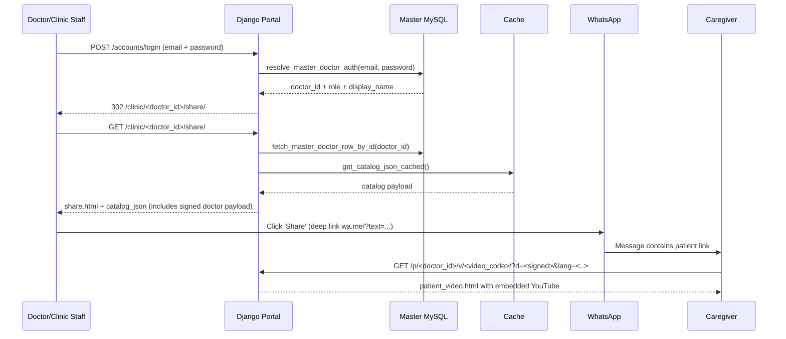
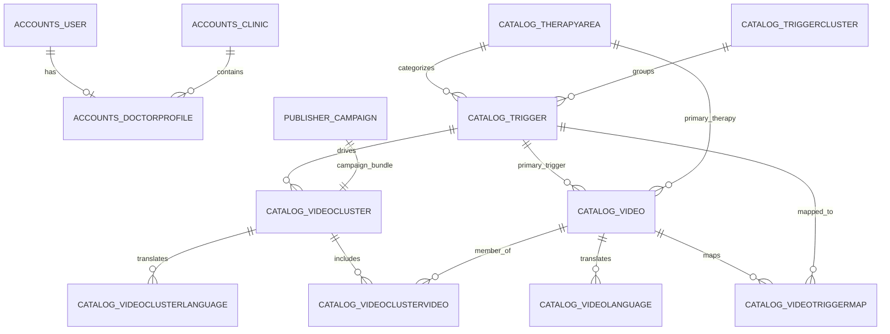

# CPD in Clinic Portal – Patient Education System (PedsEdu) – System Documentation


This document is a **complete system knowledge base** for the Patient Education (PE) web application deployed at `portal.cpdinclinic.co.in`.

It is written so that another AI agent or developer can understand, maintain, and extend the system using only:
- the GitHub repository (codebase exported as `PedsEdu0503.txt`), and
- the testing / flow documentation (provided as `PE_TestingDoc.pdf`).

> Note: The codebase contains both a **doctor-facing sharing portal** and an **SSO-protected campaign publishing module** that integrates with an external “Master Publishing System”.

---

## Table of contents

- 1. [Product overview](#product-overview)
- 2. [System architecture](#system-architecture)
- 3. [Codebase structure](#codebase-structure)
- 4. [Core system components](#core-system-components)
- 5. [Database design](#database-design)
- 6. [Feature-level documentation](#feature-level-documentation)
- 7. [API and service layer](#api-and-service-layer)
- 8. [Screen and UI flow](#screen-and-ui-flow)
- 9. [Testing documentation](#testing-documentation)
- 10. [End-to-end system flows](#end-to-end-system-flows)
- 11. [Developer onboarding guide](#developer-onboarding-guide)
- 12. [AI-friendly summary](#ai-friendly-summary)
- 13. [Appendices](#appendices)

---

## Product overview

### What the system does

The Patient Education (PE) system is a Django-based web application that enables doctors and clinic staff to:

- search and select short, pre-curated pediatric patient education videos or bundles (clusters) from a structured catalog (therapy → trigger → bundle/video),
- choose the patient’s preferred language (English + 7 Indian languages),
- generate a WhatsApp message that contains an educational context + the selected video/bundle title + a secure patient link,
- send the message to the caregiver’s WhatsApp number, and
- allow the caregiver to open a lightweight patient page to watch the video(s) in their chosen language.

In addition, the system includes a **campaign publishing module** used by “Publishers” (brand/campaign managers) coming from an external “Master Publishing System” via SSO. This module allows publishers to:

- configure campaign-specific video clusters (“bundles”) by selecting videos/clusters,
- persist campaign metadata locally (banners, dates, doctor limits, messaging templates), and
- generate a **Field Rep recruitment link** that field reps use to enroll doctors into campaigns.

### Problem it solves

**Clinical adherence problem:** After a consultation, caregivers often forget instructions, misunderstand red flags, or fail to execute home-care steps. Doctors also have limited time to repeatedly provide standardized counseling in multiple languages.

**Operational/campaign problem:** For sponsored or programmatic “patient education campaigns”, the system needs a scalable workflow to onboard doctors (often via field reps), and to deliver campaign-specific bundles and banners to enrolled doctors without affecting the default catalog for everyone.

### Core features

Doctor/clinic staff features
- Master-DB-backed login (doctor + clinic user roles)
- Clinic registration (creates/updates doctor record in Master DB; optional campaign enrollment)
- Password reset / temporary password issuance (Master DB)
- Share page: filter/search catalog; pick video or bundle; language selection; WhatsApp sharing
- Patient pages: video and bundle views; language switch; YouTube embed (privacy-enhanced domain)

Publisher/campaign features
- SSO consume endpoint to establish publisher session
- Publisher landing page and campaign list
- Add campaign details (creates campaign-specific video cluster and stores campaign record)
- Edit campaign details (updates cluster + selection; retains read-only fields from Master when present)
- Field rep landing page (validate field rep and campaign; enroll doctor; redirect to WhatsApp or to registration)
- Publisher APIs: catalog search and selection expansion

Admin/content features
- Django admin and staff-only “publisher” UI to manage Therapy Areas, Trigger Clusters, Triggers, Videos, Bundles (Video Clusters), and mapping
- Management command to import master content from CSV with optional transliteration

### Key user personas

| Persona | Who they are | Primary goals | Main UI | Auth source |
|---|---|---|---|---|
| Doctor | Pediatrician using PE for caregivers | Quickly send relevant education and red-flags | Doctor share page | Master DB (redflags_doctor) |
| Clinic staff | Receptionist/assistant supporting doctor | Send same education link to caregivers | Doctor share page | Master DB clinic_user1/2 |
| Caregiver (patient page) | Parent/guardian receiving WhatsApp link | Understand instructions and watch in local language | Patient video/bundle pages | Signed link payload; no login |
| Publisher | Campaign manager in Master Publishing System | Configure campaign bundles, messaging templates, and banners | Campaign publisher pages | SSO JWT + master allowlist |
| Field rep | On-ground staff onboarding doctors | Enroll doctors and trigger registration if needed | Field rep landing | Master DB join validation |
| Portal admin | Internal ops | Manage catalog content and mappings | Django admin + staff publisher UI | Django admin staff |

### High-level user journeys

#### A. Doctor shares a video to a caregiver
1. Doctor logs in with email/password (validated against Master DB).
2. Doctor lands on the clinic share page for their Doctor ID.
3. Doctor selects language, filters/searches the catalog, and selects a video or bundle.
4. Doctor enters patient WhatsApp number and clicks share.
5. WhatsApp opens with a pre-filled message that includes a secure patient link.
6. Caregiver opens the link and watches the video(s).

#### B. Publisher configures a campaign (cross-system)
1. Publisher logs in to the Master Publishing System.
2. Publisher creates a campaign and selects “PE System”.
3. Master system provides an “External System” link that opens this portal’s publisher landing page (SSO).
4. Publisher adds campaign details, selects videos/clusters, and saves.
5. Publisher returns to the Master system to obtain a field rep recruitment link.

#### C. Field rep onboards a doctor into a campaign
1. Field rep opens campaign recruitment link.
2. Field rep enters doctor WhatsApp number.
3. If doctor already exists in Master DB: the system enrolls them and redirects to WhatsApp with campaign-specific message.
4. If doctor does not exist: the system redirects to doctor registration, prefilled with campaign metadata.

---

## System architecture

### High-level architecture

The system is a **single Django application** (monolith) with multiple Django apps:

- `accounts`: doctor + clinic staff auth, registration, password reset, SendGrid email, Master DB integration
- `catalog`: content taxonomy and multilingual video/bundle models
- `sharing`: doctor share page + patient-facing pages, catalog payload and signing
- `publisher`: (a) internal staff catalog editor, and (b) campaign publisher module + field rep landing
- `sso`: HS256 JWT verification + session creation for publishers
- `peds_edu`: project config, settings, WSGI entrypoint, Master DB helper module, AWS secrets helper

The portal uses **two MySQL databases**:

- `default` DB: portal data (catalog tables, portal users, publisher campaign table, etc.)
- `master` DB: “Master Publishing / forms” database (doctor registry, campaign master tables, field rep tables, publisher allowlist)

### External integrations

- **Master Publishing System (Project1):** initiates publisher SSO, owns campaign master tables and field rep lists (manual testing doc).
- **WhatsApp deep links:** for sharing to patient and for field rep flows (link opens WhatsApp with pre-filled text).
- **YouTube:** patient pages embed YouTube videos using the `youtube-nocookie.com` privacy-enhanced domain.
- **SendGrid:** transactional email (doctor access emails, password reset) via SMTP or API depending on configuration.
- **AWS Secrets Manager:** optional secret retrieval helper for SendGrid key and other secrets.
- **Redis (optional):** caching backend. If not configured, uses in-memory cache.

### Deployment structure

The settings indicate AWS Ubuntu deployment with MySQL, static file serving via WhiteNoise middleware, and media serving via Django (for uploaded doctor photos and campaign banners).

- Static assets: collected + served by WhiteNoise
- Media assets: `MEDIA_ROOT` configured to `/home/ubuntu/patient-portal-media` (as per settings comments in code export)
- CSRF trusted origins include the portal domain and a public IP (used during testing/deployment)

### Architecture diagram (Mermaid)

```mermaid
flowchart LR
  subgraph Users
    D[Doctor/Clinic staff]:::user
    P[Caregiver]:::user
    Pub[Publisher]:::user
    FR[Field Rep]:::user
  end

  subgraph Master[Master Publishing System / Master DB]
    MS[Master Publishing UI]
    MDB[(Master MySQL DB)]
  end

  subgraph Portal[CPD in Clinic Portal (Django: peds_edu)]
    W[Web Server / Django]
    A[accounts]
    C[catalog]
    S[sharing]
    PB[publisher]
    SSO[sso]
    PDB[(Portal MySQL DB)]
    Cache[(Redis/LocMem Cache)]
    Media[(Media files)]
  end

  D -->|Login, Share| W
  Pub -->|SSO link| W
  FR -->|Recruitment link| W
  P -->|Patient link| W

  W --> A
  W --> C
  W --> S
  W --> PB
  W --> SSO

  A -->|read/write| MDB
  PB -->|read| MDB
  S -->|read| MDB

  A -->|read/write| PDB
  C -->|read/write| PDB
  S -->|read| PDB
  PB -->|read/write| PDB

  S --> Cache
  C --> Cache

  PB --> Media
  A --> Media

  MS --> MDB
  MS -->|SSO JWT link| SSO

  classDef user fill:#eef,stroke:#88a;
```

### Component interaction diagram (Mermaid)



---

## Codebase structure

The repository is a Django project whose key top-level elements (as exported) include:

- `manage.py` – Django entrypoint
- `peds_edu/` – Django project package (settings, urls, wsgi, master DB helpers, AWS secrets)
- `accounts/` – doctor registration, login, password reset, master-db integration
- `catalog/` – content taxonomy models + import tooling
- `sharing/` – doctor share and patient pages + catalog JSON builder
- `publisher/` – staff content editor + campaign module + field rep landing
- `sso/` – JWT decode/verify + consume endpoint
- `templates/` – Django templates (doctor login/registration, share page, patient pages, publisher UIs)
- `staticfiles/` – collected admin/static assets
- `CSV/` – master content CSV files (videos, clusters, mappings)

### Dependency and module relationships

**Important directional dependencies** (keep these in mind when refactoring):

- `peds_edu.settings` defines both DBs and SSO settings and is used by all apps.
- `peds_edu.master_db` is a *central integration module* used by `accounts` and `sharing` to read/write Master DB records and campaign enrollment.
- `accounts.master_db` is a second integration helper used heavily by campaign publisher and recruitment logic (publisher allowlist, enrollments, field rep resolution).
- `sharing.services` depends on `catalog.models` to build the catalog JSON payload.
- `sharing.views` depends on `peds_edu.master_db` for doctor display context and signed patient payload.
- `publisher.campaign_auth` depends on `sso` and master allowlist checks to protect publisher/campaign routes.
- `publisher.campaign_views` depends on `catalog.models` to create campaign-specific video clusters and to search/expand selections.

### Folder-level responsibilities

| Path | Responsibility |
|---|---|
| `peds_edu/` | global config, settings, URL routing, shared master-db helper module, AWS secrets helper |
| `accounts/` | local user model + clinic model + doctor profile, doctor registration, master-db auth, email sending, pincode utilities |
| `catalog/` | therapy/trigger/video/bundle data model, admin registrations, import command, cache invalidation signals |
| `sharing/` | catalog JSON builder + cache, doctor share page, patient pages, WhatsApp message prefix builder, branding context processor |
| `publisher/` | staff-only catalog CRUD UI, campaign publisher module (SSO-protected), campaign APIs, field-rep landing |
| `sso/` | verifies HS256 JWT and creates portal session for publisher/campaign module |
| `templates/` | server-rendered UI for all pages |
| `CSV/` | seeded content (videos, bundles, mappings) for import command |

---

## Core system components

### 1) `accounts` app

#### Purpose
Provides the authentication and onboarding layer for doctors and clinic staff.

#### Key responsibilities
- Custom Django User model (email as username)
- Clinic model (display name, phone, address, state/district/postal code)
- Doctor profile model (doctor_id, WhatsApp, IMC number, photo)
- Integration with Master DB doctor registry table (`redflags_doctor`) through unmanaged model `RedflagsDoctor`
- Doctor registration workflow that writes to Master DB and optionally enrolls into a campaign
- Login workflow that authenticates against Master DB and creates a local Django session
- Password reset / temporary password issuance backed by Master DB password columns
- Transactional email sending via SendGrid + email logging
- PIN → State/District resolution via local JSON directory + build command

#### Key models

**User** (`accounts.User`): custom user model. Email is unique; `full_name` is stored for display. The model is registered in `AUTH_USER_MODEL`.

**Clinic** (`accounts.Clinic`): stores clinic display info, phone and WhatsApp, and location data. Generates a `clinic_code` if missing.

**DoctorProfile** (`accounts.DoctorProfile`): one-to-one with User; stores `doctor_id` (random default), `whatsapp_number` (unique), IMC number, optional photo, and FK to Clinic.

**EmailLog** (`accounts.EmailLog`): stores email sends (to, subject, success, status_code, provider, response body and error).

**RedflagsDoctor** (`accounts.RedflagsDoctor`, unmanaged): maps to Master DB table `redflags_doctor` and includes doctor, clinic, location, and password fields, plus clinic user accounts (user1/user2).

#### Key views / flows

- `register_doctor`: renders/validates doctor registration form; resolves state/district via PIN; writes to Master DB; optionally ensures enrollment; sends access email; renders success screen.
- `doctor_login`: first attempts Master DB auth (doctor/clinic user roles), creates/updates a local user, logs in, stores session values including `master_doctor_id`, and redirects to doctor share page; otherwise falls back to normal Django auth for staff users.
- `request_password_reset`: reads stored password/ hash from Master DB. If hashed, generates temp password and updates hash; emails instructions and/or temp password; always returns generic success message to avoid account enumeration.
- `password_reset`: standard token-based password set for local Django users (mainly publisher/staff users) via Django’s default token generator.
- `modify_clinic_details`: allows a logged-in doctor (portal DB doctor_profile) to modify details; includes PIN validation and uniqueness checks.

#### Security notes (accounts)

- Doctor share authorization is enforced by session variable `master_doctor_id` set at login; requests must match the doctor_id in URL.
- Password reset for Master DB is implemented in a way that may email plaintext password if stored that way; treat this as a risk and migrate to hashes only.
- Some settings and DB credentials are hard-coded in the code export; treat those as insecure defaults and replace with environment variables / secrets in production.

### 2) `catalog` app

#### Purpose
Defines the patient education content taxonomy and multilingual video/bundle model.

#### Data model overview

- **TherapyArea**: top-level grouping (e.g., Respiratory, Diarrhea, Vaccines)
- **TriggerCluster**: conceptual grouping of triggers (e.g., Acute diagnosed, Chronic condition). Mostly used as organizing metadata.
- **Trigger**: clinical condition/event (e.g., Acute asthma attack), linked to a TriggerCluster and primary TherapyArea.
- **Video**: atomic content item, can be tagged to a primary therapy and trigger; many-to-many with bundles via through table.
- **VideoLanguage**: per-video language record with localized title + YouTube URL.
- **VideoCluster**: bundle of videos. Each bundle has a trigger and can be published/unpublished. 
- **VideoClusterLanguage**: per-bundle localized name.
- **VideoClusterVideo**: through table adding ordering of videos inside a bundle.
- **VideoTriggerMap**: optional map enabling a video to appear under multiple triggers.

#### Catalog constants and languages

Supported languages are configured as a fixed list of 8 languages and used across catalog, share page, and patient pages.

#### Catalog payload + cache invalidation

The `catalog` app registers Django signals for post-save and post-delete on all major catalog models to clear the catalog cache key used by `sharing.services.get_catalog_json_cached()`.

#### Import tooling

`catalog/management/commands/import_master_data.py` imports:

- Therapy areas and trigger clusters (seeded clusters list inside the command)
- Triggers (from CSV)
- Videos and VideoLanguage rows (from CSV, optionally transliterated for non-English titles using AI4Bharat)
- Video clusters and VideoClusterLanguage rows (from CSV, similarly transliterated for localized names)
- VideoClusterVideo mapping rows (from CSV)
- VideoTriggerMap rows (from CSV)

This makes the catalog idempotent and safe to re-run for updates.

### 3) `sharing` app

#### Purpose
Implements the doctor share page and patient-facing pages.

#### Key responsibilities
- Builds and caches a complete catalog JSON payload for browser-side filtering/search.
- Provides localized WhatsApp message prefixes per language.
- Enforces doctor authorization on share page using session values set at login.
- Creates signed and compact patient payload tokens embedded into patient links so patient pages do not need DB access to render doctor/clinic branding.
- Displays single video pages and bundle pages with language switching.

#### Catalog JSON payload

The catalog payload built in `sharing.services._build_catalog_payload()` includes:

- therapy areas list
- triggers list (with cluster and therapy labels)
- bundles list (video clusters; includes localized names, trigger and therapy association, video_codes)
- videos list (video code as `id`, localized titles, per-language URLs, search text, trigger codes, therapy codes, bundle codes)
- message_prefixes (generic default; overridden per-request on share page)

The payload is cached under a key like `clinic_catalog_payload_v7` for 1 hour by default, configurable via `CATALOG_CACHE_SECONDS`.

#### Patient link payload signing

Patient links include a query param `d=<token>` where `token` is created by signing a compact list representation of doctor and clinic display fields. The token is verified and expanded on patient page rendering. This approach:

- avoids fetching doctor/clinic display info from DB on patient page hits,
- keeps links short enough for WhatsApp sharing, and
- prevents tampering (signature).

#### Campaign-based bundle filtering

When a doctor belongs to one or more PE campaigns (resolved from Master DB via campaign enrollment tables), the share page can:

- display campaign banners and acknowledgements, and
- restrict availability of campaign-specific bundles to only those campaigns the doctor is enrolled in.

This is implemented by:
- identifying all bundles that are campaign bundles (via local `publisher_campaign.video_cluster_id` joins), and
- keeping only those campaign bundles that match the doctor’s enrolled campaign IDs, while leaving default bundles untouched.

### 4) `publisher` app

This app has **two distinct sub-systems** that share a name but serve different user groups.

#### 4A. Staff catalog editor (internal)

Purpose: a simple CRUD UI for internal admins (Django staff) to manage catalog objects without raw Django Admin.

Protected by: `@staff_member_required`.

Main routes (under `/publisher/`):
- Dashboard
- Therapy areas list/create/edit
- Trigger clusters list/create/edit
- Triggers list/create/edit
- Videos list/create/edit (with per-language formset and bundle membership)
- Bundles (video clusters) list/create/edit (with language and video formsets)
- Bundle trigger mapping list/create/edit (maps bundle.trigger)

#### 4B. Campaign publisher module (external, SSO-protected)

Purpose: allow campaign managers (publishers) coming from the Master Publishing System to configure campaign content for the PE system.

Protected by: `publisher_required` decorator which depends on:
- SSO session established by `/sso/consume/`, and
- master allowlist check for publisher email in Master DB (`authorized_publisher_exists`).

Key concepts:
- Campaign metadata originates in Master DB. The portal stores a local shadow record in `publisher_campaign` for PE-specific configuration.
- Each campaign creates (or updates) a dedicated `catalog.VideoCluster` to represent its bundle.
- Publisher config includes two templates: `email_registration` and `wa_addition` used for doctor onboarding messaging.
- A field rep landing page is exposed for doctor recruitment into the campaign.

#### Publisher APIs

- `GET /publisher-api/search/?q=...`: returns up to 20 matching videos and 20 matching clusters (type/id/code/title).
- `POST /publisher-api/expand-selection/`: given a list of {type,id} items, expands clusters to contained videos and returns the final video list (code/title).

### 5) `sso` app

#### Purpose
Creates a portal session for publisher/campaign users based on a HS256 JWT passed from the Master Publishing System.

#### Key responsibilities
- `decode_and_verify_hs256_jwt` validates header.alg=HS256, signature, issuer, audience, and expiration.
- `consume` endpoint reads token and campaign_id, validates, and stores identity in session under configurable keys.
- A safe redirect (`next`) is enforced using Django host validation to prevent open redirects.

---

## Database design

### Overview: two databases

The system is configured to use:

1. `default` (Portal DB): the portal’s own MySQL schema containing Django auth tables, catalog tables, local campaign table, etc.
2. `master` (Master DB): external MySQL schema containing doctor registry and campaign master tables.

#### Portal DB (`default`) key tables (application-owned)

**Accounts**
- `accounts_user`
- `accounts_clinic`
- `accounts_doctorprofile`
- `accounts_emaillog`

**Catalog**
- `catalog_therapyarea`
- `catalog_triggercluster`
- `catalog_trigger`
- `catalog_video`
- `catalog_videolanguage`
- `catalog_videocluster`
- `catalog_videoclusterlanguage`
- `catalog_videoclustervideo`
- `catalog_videotriggermap`

**Publisher (campaign shadow table)**
- `publisher_campaign` (explicitly `managed = False` and must exist in DB; stores campaign-specific config and references a `catalog_videocluster` row)

#### Master DB (`master`) key tables (external)

- `redflags_doctor` (doctor and clinic registry + password columns; mapped as unmanaged model `RedflagsDoctor`)
- `campaign_doctor` (campaign doctor identity table keyed by numeric id; matched by email/phone)
- `campaign_doctorcampaignenrollment` (doctor↔campaign enrollment join)
- `campaign_campaign` (campaign master table; includes `system_pe` flag and banner URLs)
- `campaign_brand` (brand table for campaigns)
- `campaign_fieldrep` (field rep master table)
- `campaign_campaignfieldrep` (campaign↔field rep join)
- `campaign_authorizedpublisher` (publisher allowlist; table name may be overridden)

### Portal DB ER diagram (Mermaid)



### Table-by-table details (Portal DB)

#### accounts_user
- `email` (unique) – username field
- `full_name` – header display name
- `is_active`, `is_staff`
- `date_joined`

#### accounts_clinic
- `clinic_code` (unique; auto-generated if missing)
- `display_name`
- `clinic_phone`
- `clinic_whatsapp_number`
- `address_text`
- `postal_code`
- `state` (choice)
- `district` (present in some variants of code; confirm your DB schema if needed)

#### accounts_doctorprofile
- `user_id` (one-to-one to accounts_user)
- `doctor_id` (unique) – doctor identifier used in share URLs
- `whatsapp_number` (unique)
- `imc_number`
- `postal_code`
- `photo` (ImageField; stored under `doctor_photos/`)
- `clinic_id` (FK to accounts_clinic)
- `created_at`, `updated_at`

#### accounts_emaillog
- `to_email`, `subject`, `provider`
- `success`, `status_code`
- `response_body`, `error`
- `created_at`

#### catalog_* tables

The catalog tables are directly derived from models (see `catalog/models.py`). Key constraints:

- `code` fields are unique for `TherapyArea`, `TriggerCluster`, `Trigger`, `VideoCluster`, `Video`.
- `(video_id, language_code)` unique for `VideoLanguage`.
- `(video_cluster_id, language_code)` unique for `VideoClusterLanguage`.
- `(video_cluster_id, video_id)` unique for `VideoClusterVideo`.
- `(video_id, trigger_id)` unique for `VideoTriggerMap`.

#### publisher_campaign

This table is a **manually created** MySQL table and is marked `managed = False` in the model. It stores:

- `campaign_id` (unique, indexed)
- `new_video_cluster_name`
- `selection_json` (JSON string from UI)
- `doctors_supported`
- `banner_small`, `banner_large` (file fields, stored under campaign_banners/<campaign_id>/...)
- `banner_target_url`
- `start_date`, `end_date`
- `video_cluster_id` (one-to-one FK to catalog_videocluster)
- `publisher_*` fields from JWT
- `email_registration`, `wa_addition` templates
- `created_at`, `updated_at`

### Master DB enrollment logic (why these tables exist)

The portal itself does not “own” campaign master records; instead it reads and writes to the Master DB where the official campaign tables live.

- `campaign_doctor` exists to provide a campaign-agnostic identity record keyed by numeric PK; the portal ensures a row exists when enrolling.
- `campaign_doctorcampaignenrollment` links doctors to campaigns; the portal ensures an enrollment exists when a doctor is recruited.
- `campaign_campaign` contains campaign attributes including a `system_pe` flag; the portal uses this to fetch only PE campaigns for banner display.
- `campaign_fieldrep` and `campaign_campaignfieldrep` ensure a field rep is authorized for a specific campaign before allowing doctor enrollment.
- `campaign_authorizedpublisher` provides a publisher allowlist to control access to the campaign publisher module.

---

## Feature-level documentation

This section documents each product feature end-to-end: purpose, user flow, backend logic, DB interaction, APIs, and UI screens.

### Feature 1: Doctor registration (self or field rep-driven)

**Purpose:** Create a doctor/clinic record in Master DB (and optionally enroll into a campaign), then send access details by email.

**Entry points:**
- Direct: `/accounts/register/`
- Field rep: from `/field-rep-landing-page/` when doctor not registered; redirects with `campaign_id` and prefilled WhatsApp number

**User flow (UI):**
1. Fill in doctor name, email, clinic details, PIN code, IMC number, WhatsApp numbers, and optional photo.
2. Submit.
3. On success, a “Registration complete” screen is shown and email is sent with login link + clinic sharing link.

**Backend logic (high-level):**
- Validate PIN and resolve state/district via local PIN directory (and block on invalid PIN).
- Normalize/validate email and WhatsApp number; enforce uniqueness where applicable.
- Create doctor row in Master DB `redflags_doctor` (possibly generating doctor_id and initial password hash).
- If campaign_id is present, ensure enrollment exists in Master DB enrollment table.
- Send email using campaign-specific email template if available; otherwise fallback content.

**Database interactions:**
- Master DB insert/update into `redflags_doctor`
- Master DB insert into enrollment table (`campaign_doctorcampaignenrollment` or configured equivalent) when campaign_id is provided
- Portal DB write: EmailLog row when email send attempted

**Screens involved:**
- `templates/accounts/register.html`
- `templates/accounts/pincode_invalid.html` (if PIN invalid)
- `templates/accounts/register_success.html`

### Feature 2: Doctor/clinic staff login (Master DB auth)

**Purpose:** Allow doctor or clinic staff to authenticate and access the share page.

**Endpoint:** `/accounts/login/`

**Backend logic:**
- Attempt Master DB authentication first:
  - Resolve identity by email and role (doctor vs clinic_user1 vs clinic_user2) using configured column mapping.
  - Verify password: supports hashed passwords; may also allow plaintext in legacy situations.
- Create or update a local Django `accounts.User` (email + display name).
- Log in the Django user explicitly using ModelBackend.
- Store session keys:
  - `master_doctor_id` (authorizes access to share page)
  - `master_login_email` and `master_login_role` (for debugging/auditing)
- Redirect to `/clinic/<doctor_id>/share/`.

**Fallback auth path:** If Master auth fails, it falls back to normal Django `AuthenticationForm` for staff/publisher users, and redirects accordingly.

**Screens involved:** `templates/accounts/login.html`.

### Feature 3: Password reset / Forgot password

**Purpose:** Help doctors/staff regain access when password is unknown.

**Endpoint:** `/accounts/request-password-reset/`

**Backend logic:**
- Queries Master DB for the doctor record by email.
- Determines whether stored password is plaintext vs hashed:
  - If plaintext: emails it as-is (legacy; insecure; should be eliminated).
  - If hashed: generates a temporary password, updates the Master DB password hash column, and emails the temporary password.
- Returns a generic UI success message regardless of existence to avoid account enumeration.

**Screens involved:** `templates/accounts/password_request.html`.

### Feature 4: Doctor share page (search/filter + WhatsApp share)

**Purpose:** Provide a fast UI to select education content and share to a caregiver.

**Endpoint:** `/clinic/<doctor_id>/share/`

**Authorization:** Requires that `request.session['master_doctor_id'] == doctor_id`. If not, returns 403.

**Backend logic:**
- Fetch doctor/clinic display fields from Master DB using doctor_id.
- Fetch campaign support list for doctor email (PE campaigns only).
- Load cached catalog payload and inject doctor-specific fields:
  - `doctor_id`
  - `message_prefixes` rendered with doctor name (per-language)
  - `doctor_payload` signed token to embed in patient links
- Apply campaign-specific bundle filtering if needed.
- Render share template with catalog_json embedded as a JSON script tag.

**Front-end logic:**
- JS parses catalog_json.
- Provides drop-down filters for therapy area, trigger, bundle.
- Provides a search box for keyword search (against precomputed `search_text`).
- Provides language selection; affects WhatsApp message prefix and the titles used in the share message.
- When a video or bundle is selected, JS constructs a patient link including:
  - path `/p/<doctor_id>/v/<video_code>/` or `/p/<doctor_id>/c/<cluster_code>/`
  - query params: `lang=<selected_lang>` and `d=<signed_doctor_payload>`
- JS constructs WhatsApp deep link: `https://wa.me/91<patient_number>?text=<encoded message>` (exact country code usage may vary in templates).

**Screens involved:**
- `templates/sharing/share.html` (doctor UI)

### Feature 5: Patient page (single video)

**Purpose:** Render a simple page where a caregiver watches a video with clinic branding and can switch language.

**Endpoint:** `/p/<doctor_id>/v/<video_code>/?d=<signed>&lang=<code>`

**Backend logic:**
- Verify and expand `d` token via `unsign_patient_payload()`; derive doctor/clinic dict.
- Validate `lang` (fallback to `en`).
- Fetch `catalog.Video` by `code` and `VideoLanguage` row for requested language (fallback to English).
- Render patient video template.

**Front-end logic:**
- Extract YouTube video ID and embed using `youtube-nocookie.com` with parameters to reduce related videos and branding.
- On embed failure, show a fallback “Open on YouTube” link.

**Screens involved:** `templates/sharing/patient_video.html`.

### Feature 6: Patient page (bundle)

**Purpose:** Render a page showing a stacked list of videos (each with title and embed) within a bundle.

**Endpoint:** `/p/<doctor_id>/c/<cluster_code>/?d=<signed>&lang=<code>`

**Backend logic:**
- Verify `d` token to recover doctor/clinic display context.
- Resolve cluster by code, or by numeric PK if cluster_code is digits.
- Resolve localized bundle title via `VideoClusterLanguage` for requested language (fallback to English).
- Fetch all videos in the cluster via M2M, ordered by `sort_order` when possible.
- For each video, choose `VideoLanguage` for requested language (fallback to English).
- Render patient cluster template.

**Screens involved:** `templates/sharing/patient_cluster.html`.

### Feature 7: Staff content management (publisher internal UI)

**Purpose:** Allow internal admins to manage catalog objects without direct DB access.

**Protected by:** Django staff login and `@staff_member_required` decorators.

**Key screens:**
- `/publisher/` dashboard
- therapy areas list/create/edit
- trigger clusters list/create/edit
- triggers list/create/edit
- videos list/create/edit
- bundles list/create/edit
- bundle trigger mapping

**Key backend logic:** CRUD views operate on Django ORM models; language formsets handle creation of language rows; cluster-video formset handles through-table rows.

### Feature 8: Campaign publishing (publisher SSO module)

**Purpose:** Configure a campaign’s PE bundle and messaging templates, and persist local campaign configuration.

**Key screens/routes:**
- `/publisher-landing-page/?campaign-id=<id>&token=<jwt>`
- `/add-campaign-details/?campaign-id=<id>`
- `/campaigns/` and `/campaigns/<campaign_id>/edit/`
- `/publisher-api/search/` and `/publisher-api/expand-selection/`

**SSO flow:**
1. Publisher opens portal with token and campaign-id.
2. `publisher_required` detects token and redirects to `/sso/consume/?token=...&campaign_id=...&next=<original>`.
3. `/sso/consume/` verifies HS256 JWT and stores identity in session.
4. Publisher is returned to the campaign pages, now authorized.

**Add campaign details backend logic:**
- Loads campaign meta from Master DB when available.
- Validates user-provided form (new cluster name, selection JSON, dates, doctors_supported, banners, messaging templates).
- Expands selection into final set of video IDs (clusters expanded to contained videos).
- Creates a dedicated `VideoCluster` under a “brand campaign” trigger, and adds videos into it via `VideoClusterVideo` with sort order.
- Creates a `publisher_campaign` record pointing to the created cluster. The table is unmanaged; assumes it exists in DB.
- Redirects back to publisher landing page.

**Edit campaign details backend logic:**
- Updates the cluster name and English cluster language record.
- Rebuilds cluster videos (delete + re-create cluster videos) based on selection.
- Updates campaign record; enforces some read-only fields from Master campaign data when present (doctors_supported, banner_target_url) with fallback to local form values if needed.

### Feature 9: Field rep landing page (doctor recruitment)

**Purpose:** Allow a field rep to enroll a doctor into a specific campaign and trigger appropriate onboarding.

**Endpoint:** `/field-rep-landing-page/?campaign-id=<id>&field_rep_id=<...>`

**Backend logic (key steps):**
- Normalize campaign_id (hyphenated vs non-hyphenated).
- Resolve field_rep_id: can be either `campaign_fieldrep.id` or the join table PK (`campaign_campaignfieldrep.id`) and is resolved to a field rep.
- Verify field rep is linked to the campaign via `campaign_campaignfieldrep` and active.
- Fetch campaign record and enforce limit (`doctors_supported`) by counting enrollments; block if limit reached.
- On POST (doctor WhatsApp number):
  - check if doctor exists in Master DB by WhatsApp.
  - if exists: ensure enrollment exists; redirect to WhatsApp with `wa_addition` message template and clinic share link.
  - if not exists: redirect to `/accounts/register/` with campaign-id, field_rep_id, and WhatsApp prefill.

---

## API and service layer

### Route map

#### Core portal routes
| Path | Method(s) | Auth | Purpose |
|---|---|---|---|
| `/` | GET | none | Redirects to login |
| `/accounts/register/` | GET/POST | none | Doctor registration |
| `/accounts/login/` | GET/POST | none | Doctor/clinic staff login |
| `/accounts/logout/` | GET | logged-in | Logout |
| `/accounts/request-password-reset/` | GET/POST | none | Forgot password |
| `/accounts/reset/<uidb64>/<token>/` | GET/POST | token | Password reset (portal users) |
| `/clinic/<doctor_id>/share/` | GET | session + master_doctor_id match | Doctor share page |
| `/p/<doctor_id>/v/<video_code>/` | GET | signed payload in query | Patient video page |
| `/p/<doctor_id>/c/<cluster_code>/` | GET | signed payload in query | Patient bundle page |

#### Campaign publisher routes (root-level)
| Path | Method(s) | Auth | Purpose |
|---|---|---|---|
| `/publisher-landing-page/` | GET | publisher_required | Landing page for campaign publisher |
| `/add-campaign-details/` | GET/POST | publisher_required | Add campaign details + create campaign cluster |
| `/campaigns/` | GET | publisher_required | List local campaign records |
| `/campaigns/<campaign_id>/edit/` | GET/POST | publisher_required | Edit local campaign record + cluster |
| `/publisher-api/search/` | GET | publisher_required | Search catalog videos/clusters for selection |
| `/publisher-api/expand-selection/` | POST | publisher_required | Expand selection list into videos |
| `/field-rep-landing-page/` | GET/POST | none (validated via master DB) | Field rep flow to enroll/redirect |

#### SSO route
| Path | Method(s) | Auth | Purpose |
|---|---|---|---|
| `/sso/consume/` | GET | none | Verify JWT + create session for publisher module |

### Request/response schemas (JSON APIs)

#### `GET /publisher-api/search/?q=<string>`
- Requirements: q length >= 2
- Response:
```json
{
  "results": [
    {"type":"video","id":123,"code":"VID_...","title":"English title"},
    {"type":"cluster","id":45,"code":"CLUST_...","title":"Bundle name"}
  ]
}
```

#### `POST /publisher-api/expand-selection/`
- Content-Type: application/json
- Body:
```json
{
  "items": [{"type":"video","id":123},{"type":"cluster","id":45}]
}
```
- Response:
```json
{
  "videos": [{"code":"VID_...","title":"English title"}, {"code":"VID_...","title":"..."}]
}
```

### Authentication model

There are three auth planes:

1. **Doctor/Clinic Staff (Master DB)**
   - Auth check is against Master DB doctor record and password columns.
   - Session state includes `master_doctor_id` and is required for share access.

2. **Internal Admin/Staff (Django staff)**
   - Standard Django admin login and `@staff_member_required` protect internal catalog CRUD.

3. **Publisher/Campaign User (SSO)**
   - JWT is verified via HS256; issuer/audience/exp are validated.
   - Identity and roles are stored in session under configured keys.
   - Additional allowlist check in Master DB verifies publisher email exists in an AuthorizedPublisher table.

---

## Screen and UI flow

This section lists all screens and explains navigation and backend connection.

### Doctor/clinic staff screens

1. **Doctor Login** – `/accounts/login/`
   - Form: email + password.
   - Backend: tries Master DB auth first, otherwise Django auth.
   - Next: share page or publisher dashboard depending on user.

2. **Doctor Registration** – `/accounts/register/`
   - Form: doctor and clinic details + PIN + optional photo.
   - Backend: Master DB insert; optional enrollment; email send.
   - Next: registration success.

3. **Forgot Password** – `/accounts/request-password-reset/`
   - Form: email.
   - Backend: Master DB password retrieval/update; email send.
   - Next: login.

4. **Doctor Share Patient Education** – `/clinic/<doctor_id>/share/`
   - Filter UI: Therapy, Trigger, Bundle, Search, Language.
   - Action: choose video/bundle and WhatsApp share.
   - Backend: catalog JSON + signed payload injection.

### Patient screens

5. **Patient Video Page** – `/p/<doctor_id>/v/<video_code>/?d=...&lang=...`
   - Shows clinic branding, language selector, embedded YouTube video.

6. **Patient Bundle Page** – `/p/<doctor_id>/c/<cluster_code>/?d=...&lang=...`
   - Shows bundle title and stacked videos with titles in selected language.

### Publisher/campaign screens

7. **Publisher Landing Page** – `/publisher-landing-page/?campaign-id=...`
   - Shows publisher identity and campaign metadata from Master system.
   - Primary CTA: Add campaign details for this campaign.

8. **Add Campaign Details** – `/add-campaign-details/?campaign-id=...`
   - Form: new video cluster name, selection builder, doctor limits, banners, date range, email/WA templates.
   - Uses AJAX search and selection expansion APIs.
   - Saves: creates campaign cluster and local campaign record.

9. **Campaign List / Edit** – `/campaigns/` and `/campaigns/<id>/edit/`
   - List and edit local campaign shadow records.

10. **Field Rep Landing** – `/field-rep-landing-page/?campaign-id=...&field_rep_id=...`
    - Form: doctor WhatsApp number.
    - Output: redirect to WhatsApp or to doctor registration.

### How this matches the testing doc flow

The provided testing flow describes:

1. Publisher logs into Master Publishing System, creates a campaign and selects PE system.
2. Publisher follows external link to configure campaign in this portal.
3. Field rep recruitment link is used for doctor registration.
4. Doctor then logs in and shares videos; language selection is applied on both doctor page and patient page.

---

## Testing documentation

### What exists in the repository

The code export does not include automated test suites (no dedicated unit/integration test modules were found in the exported text). Therefore, the **primary test strategy is manual, flow-based testing** as documented in `PE_TestingDoc.pdf`.

### Manual test plan (based on PE_TestingDoc)

Below is a structured version of the steps in the testing document with explicit expected results.

#### Test 1: Master publishing login and campaign creation
Steps:
1. Login to Master Publishing System (URL in testing doc).
2. Create a new campaign; select the PE System checkbox; upload field rep CSV; continue.

Expected:
- Campaign is created in master system and marked as PE-enabled (`system_pe=1`).
- Master system shows “External System” link and field rep recruitment link.

#### Test 2: Configure campaign in external system (portal)
Steps:
1. Click the external system link from master system.
2. Click “Add details for this campaign.”
3. If required, create a new video cluster specific to this campaign.
4. Click Save.

Expected:
- SSO works: publisher lands on portal publisher landing page.
- Saving campaign creates:
  - a new `catalog.VideoCluster` bundle, and
  - a `publisher_campaign` record referencing it.

#### Test 3: Field rep recruitment flow
Steps:
1. In master system, locate field rep recruitment link.
2. Open link, enter doctor WhatsApp number.
3. If doctor is not registered, complete doctor registration.

Expected:
- If doctor exists: enrollment is ensured; user is redirected to WhatsApp message.
- If doctor does not exist: registration form opens and completes; doctor receives access email.

#### Test 4: Doctor login and share
Steps:
1. Doctor logs in using credentials received by email.
2. Doctor searches/selects a video title and shares.

Expected:
- Doctor lands on share page with catalog filters.
- WhatsApp message contains correct prefix (language-specific) and correct patient link.

#### Test 5: Language selection
Steps:
1. Select a language on doctor share page.
2. Share link; open patient page; change language on patient page.

Expected:
- Doctor-side selected language changes message prefix and title used in WhatsApp.
- Patient-side language switch shows localized title and uses localized YouTube URL if present (fallback to English).

---

## End-to-end system flows

### Flow A: Doctor share → patient watch (single video)

1. `POST /accounts/login/`
   - Portal verifies credentials against Master DB.
   - Portal logs in local Django user and sets `session['master_doctor_id']=doctor_id`.
2. `GET /clinic/<doctor_id>/share/`
   - Portal fetches doctor/clinic display info from Master DB.
   - Portal builds/loads cached catalog JSON, injects signed `doctor_payload` token.
   - Portal renders share page.
3. Browser-side share action
   - JS builds patient URL `/p/<doctor_id>/v/<video_code>/?lang=<L>&d=<token>`.
   - JS opens WhatsApp deep link with message text.
4. Patient opens link
   - Portal verifies token signature, reconstructs doctor/clinic dict.
   - Portal queries Video + VideoLanguage and renders patient page.

### Flow B: Campaign configuration (publisher) → campaign bundle visible to enrolled doctors

1. Publisher comes from Master system with JWT and campaign-id.
2. `GET /publisher-landing-page/?token=...&campaign-id=...`
   - Publisher_required redirects to `/sso/consume/` to verify token and store session.
3. `GET /add-campaign-details/?campaign-id=...` and `POST` save
   - Portal creates campaign video cluster + local `publisher_campaign` record.
4. Doctor enrollment in master DB
   - Field rep landing ensures `campaign_doctorcampaignenrollment` exists for doctor.
5. Doctor share page
   - Portal fetches enrolled PE campaigns via Master DB join tables.
   - Portal filters campaign bundles to those doctor is enrolled in; displays banners.

### Flow C: Field rep recruits a doctor

1. Field rep opens `/field-rep-landing-page/?campaign-id=...&field_rep_id=...`.
2. Portal validates field rep and campaign in Master DB join tables.
3. If doctor exists:
   - Ensure enrollment in Master DB.
   - Build WhatsApp message using campaign template and redirect.
4. If doctor does not exist:
   - Redirect to `/accounts/register/?campaign-id=...&field_rep_id=...&doctor_whatsapp_number=...`.
   - Registration writes Master DB and ensures enrollment.

---

## Developer onboarding guide

### 1) Local setup prerequisites

- Python 3.x
- MySQL client libraries (e.g., `mysqlclient` for Django MySQL backend)
- Access credentials for:
  - Portal DB (`default`) MySQL schema, and
  - Master DB (`master`) MySQL schema.

The settings show MySQL is required (`ENGINE = django.db.backends.mysql`) and WhiteNoise is in middleware.

### 2) Environment configuration

The project uses environment variables for many settings (see settings helper `env()` in `peds_edu/settings.py`). Common env vars include:

- `DJANGO_SECRET_KEY` (recommended; otherwise unsafe default may be used)
- `DJANGO_DEBUG` (boolean)
- `DB_NAME`, `DB_USER`, `DB_PASSWORD`, `DB_HOST`, `DB_PORT`
- `MASTER_DB_NAME`, `MASTER_DB_USER`, `MASTER_DB_PASSWORD`, `MASTER_DB_HOST`, `MASTER_DB_PORT` (if master DB is enabled via env)
- `REDIS_URL` (optional)
- SendGrid: `SENDGRID_API_KEY`, `SENDGRID_FROM_EMAIL`, and SMTP overrides if needed
- SSO: `SSO_SHARED_SECRET`, `SSO_EXPECTED_ISSUER`, `SSO_EXPECTED_AUDIENCE` (if enabling env-based SSO settings)

⚠️ Security: The code export includes hard-coded secrets and DB credentials in settings. Treat those as placeholders and replace with real secrets management.

### 3) Database setup

Portal DB (`default`):
- Run Django migrations for managed models (accounts, catalog, Django contrib apps).
- Ensure `publisher_campaign` table exists (model is `managed = False`, so migrations will not create it).

Master DB (`master`):
- Must contain `redflags_doctor` and the campaign tables used by `peds_edu.master_db` and `accounts.master_db`.
- Ensure permissions allow required operations:
  - doctor registration inserts into `redflags_doctor`
  - enrollments insert into campaign enrollment tables
  - password reset updates password hash columns

### 4) Load/refresh catalog content

If you are seeding content from CSVs (recommended for initial setup):

```bash
python manage.py import_master_data --path ./CSV
```

Optional: install AI4Bharat transliteration to auto-generate localized titles/names during import:

```bash
pip install ai4bharat-transliteration
```

### 5) Build PIN directory

The system expects a JSON mapping file at `accounts/data/india_pincode_directory.json` for PIN-to-state resolution.

Use the provided management command:

```bash
python manage.py build_pincode_directory --input /path/to/all_india_pincode.csv
```

### 6) Run locally

```bash
python manage.py migrate
python manage.py runserver 0.0.0.0:8000
```

### 7) Deployment checklist (high-level)

- Configure environment variables in the deployment environment.
- Set `DEBUG=0`, configure `ALLOWED_HOSTS` and `CSRF_TRUSTED_ORIGINS` correctly.
- Configure static file collection (`collectstatic`) and WhiteNoise.
- Configure media storage and ensure it is backed up (doctor photos, campaign banners).
- Configure a production WSGI server (Gunicorn/uWSGI) and reverse proxy (Nginx) as per standard Django deployment.
- Validate SSO secret and issuer/audience alignment with Master system.

---

## AI-friendly summary

This section is designed for coding agents to quickly reason about the system.

### System identity

- **Framework:** Django monolith (MySQL + optional Redis)
- **Core goal:** doctor → WhatsApp → caregiver video education in multiple languages
- **Secondary goal:** campaign publishing and doctor recruitment integrated with Master system via SSO

### Modules

```text
peds_edu/
  settings.py   - DBs, cache, email, SSO config
  urls.py       - mounts sso/, campaign publisher routes, sharing/, accounts/, publisher/
  master_db.py  - Master DB auth + campaign banner support + patient payload signing

accounts/
  models.py     - User, Clinic, DoctorProfile, EmailLog, RedflagsDoctor (unmanaged master table)
  views.py      - register/login/logout/forgot/reset/modify
  master_db.py  - Master DB utility (publisher allowlist, enrollment, doctor lookup/insert)
  pincode_directory.py + build_pincode_directory command

catalog/
  models.py     - TherapyArea, TriggerCluster, Trigger, Video, VideoLanguage, VideoCluster, VideoClusterLanguage, VideoClusterVideo, VideoTriggerMap
  management/commands/import_master_data.py - CSV import + transliteration
  signals.py    - clears catalog cache on model changes

sharing/
  services.py   - build catalog JSON payload + WhatsApp message prefixes + caching
  views.py      - doctor_share, patient_video, patient_cluster
  context_processors.py - clinic branding in templates

publisher/
  views.py      - staff CRUD for catalog
  campaign_views.py - publisher landing/add/edit/list + field rep landing + APIs
  campaign_auth.py  - publisher_required decorator (SSO + master allowlist)
  campaign_forms.py - campaign create/edit forms
  models.py     - Campaign (unmanaged publisher_campaign table)

sso/
  jwt.py        - HS256 JWT verification
  views.py      - /sso/consume/ creates session with identity
```

### Key DB tables

Portal DB (`default`):
- accounts_user, accounts_clinic, accounts_doctorprofile, accounts_emaillog
- catalog_* (therapy/trigger/video/bundle and language/mapping tables)
- publisher_campaign (unmanaged; stores PE campaign config)

Master DB (`master`):
- redflags_doctor
- campaign_doctor, campaign_doctorcampaignenrollment, campaign_campaign, campaign_brand
- campaign_fieldrep, campaign_campaignfieldrep, campaign_authorizedpublisher

### Key endpoints

Doctor/Patient:
- POST/GET /accounts/login/
- GET/POST /accounts/register/
- GET/POST /accounts/request-password-reset/
- GET /clinic/<doctor_id>/share/
- GET /p/<doctor_id>/v/<video_code>/?lang=<L>&d=<token>
- GET /p/<doctor_id>/c/<cluster_code>/?lang=<L>&d=<token>

Publisher/SSO:
- GET /sso/consume/?token=<jwt>&campaign_id=<id>&next=<path>
- GET /publisher-landing-page/?campaign-id=<id>&token=<jwt>
- GET/POST /add-campaign-details/?campaign-id=<id>
- GET/POST /campaigns/<campaign_id>/edit/
- GET /publisher-api/search/?q=..
- POST /publisher-api/expand-selection/
- GET/POST /field-rep-landing-page/?campaign-id=<id>&field_rep_id=<...>

### Main flows (compressed)

```text
Doctor share flow:
  /accounts/login -> session.master_doctor_id set
  /clinic/<doctor_id>/share -> catalog_json + doctor_payload
  JS builds wa.me deep link + /p/... patient link
  Patient link renders /p/... by verifying doctor_payload token

Campaign flow:
  Master system -> external link (token+campaign-id) -> /sso/consume -> session sso_identity
  /add-campaign-details creates catalog.VideoCluster + publisher_campaign
  Field rep link enrolls doctors into master campaign tables
  Doctor share page filters campaign bundles to those campaigns
```

---

## Appendices

### Appendix A: Supported languages

The system supports 8 languages and uses the same set across catalog, doctor share, WhatsApp prefixes, and patient pages:
- en (English)
- hi (Hindi)
- te (Telugu)
- ml (Malayalam)
- mr (Marathi)
- kn (Kannada)
- ta (Tamil)
- bn (Bengali)

### Appendix B: CSV content files

The `CSV/` directory contains the seed data used by `import_master_data`:
- `video_master.csv` – videos
- `video_cluster_master.csv` – bundles
- `video_cluster_video_master.csv` – bundle → video mappings + sort order
- (optional) trigger and mapping CSVs (depending on your export)

### Appendix C: Known risks and recommended hardening

1. **Hard-coded secrets/DB credentials:** move to environment variables and/or secrets manager.
2. **Plaintext passwords in Master DB:** eliminate; store only hashed passwords. Remove emailing passwords in plaintext.
3. **Publisher allowlist table name drift:** settings allow fallbacks; document and standardize the master schema to prevent authorization surprises.
4. **Unmanaged tables:** `publisher_campaign` is unmanaged and must be created/maintained manually. Consider migrating it to managed schema or providing explicit SQL migration.
5. **Audit logging:** currently prints JSON logs to stdout in places. Consider structured logging to a centralized log store.
