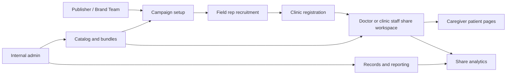

# 01. Platform Overview and Role Map

## 1. Title

Platform Overview and Role Map

## 2. Document Purpose

Explain what the product does, which roles participate in the end-to-end journey, where each operational workflow starts, and how internal oversight surfaces support rollout.

## 3. Primary User

Trainers, implementation leads, client stakeholders, and internal onboarding teams

## 4. Entry Point

This overview spans the four main entry points: publisher SSO campaign links, field rep campaign links, clinic login at `/accounts/login/`, and the internal operations surfaces at `/publisher/`, `/publisher/pe-system/`, `/publisher/system-records/`, and `/tracking/`.

## 5. Workflow Summary

- Publishers configure campaign-specific bundles, outreach copy, and activation windows from an authenticated landing page.
- Field reps recruit clinics into a campaign by checking a doctor's WhatsApp number against the master database.
- Doctors and clinic staff use the same clinic workspace to share a single video or a full bundle with caregivers over WhatsApp.
- Caregivers open secure patient pages without logging in and can switch languages directly on the page.
- Internal admins maintain the reusable catalog of videos, bundles, triggers, and therapy areas that power all downstream sharing.
- Superusers also monitor share analytics and govern PE-only or system-wide records through separate internal dashboards.

### Role Map

- **Publisher:** Creates campaign detail records, bundle selection, and outbound templates.
- **Field rep:** Registers clinics into the correct campaign and handles existing-versus-new clinic routing.
- **Doctor:** Selects a single video or bundle and shares it with caregivers.
- **Clinic staff:** Uses the same clinic workspace for bundle sharing and caregiver follow-up.
- **Caregiver:** Consumes multilingual content through secure patient links without logging in.
- **Internal admin:** Maintains the master catalog, monitors sharing activity, and governs PE or system records.

### Where Each Workflow Starts

- **Publisher campaign setup:** `/publisher-landing-page/?campaign-id=...&token=...`
- **Field rep recruitment:** `/field-rep-landing-page/?campaign-id=...&field_rep_id=...`
- **Doctor and clinic staff sharing:** `/accounts/login/`
- **Doctor self-registration:** `/accounts/register/`
- **Caregiver single-video playback:** `/p/<doctor_id>/v/<video_code>/?lang=<code>&d=<signed-payload>`
- **Caregiver bundle playback:** `/p/<doctor_id>/c/<cluster_code>/?lang=<code>&d=<signed-payload>`
- **Internal content management:** `/admin/login/?next=/publisher/` then `/publisher/`
- **Share tracking dashboard:** `/tracking/login/` then `/tracking/`
- **PE records dashboard:** `/publisher/pe-system/login/` then `/publisher/pe-system/`
- **System records hub:** `/admin/login/?next=/publisher/system-records/` then `/publisher/system-records/`

### End-To-End Flow

## 6. Step-By-Step Instructions

### Step 1. Identify the shared entry surfaces

**What the user does**

Reviews the main product entry points for publishers, field reps, clinic users, caregivers, and internal admins.

**What the user sees**

Distinct role-specific URLs: external campaign links for publishers and field reps, a shared clinic login page, and staff-only publishing pages.

**Why the step matters**

Most support questions come from role confusion, so training starts by making each entry point explicit.

**Expected result**

Trainees can say which URL each role uses and which workflows require authentication.

**Common issues or trainer notes**

Doctors and clinic staff share the same login page. Caregivers do not log in at all.

**Screenshot Placeholder**

- Suggested file path: `assets/01-platform-overview-role-map/01-login-entry.png`
- Screenshot caption: Shared clinic login entry for registered doctors and clinic staff.
- What the screenshot should show: The `/accounts/login/` page with the Login and Forgot password actions.

### Step 2. Map campaign setup to campaign activation

**What the user does**

Traces how a publisher receives an SSO-backed campaign link and adds campaign details before clinics can use that campaign.

**What the user sees**

A publisher landing page that exposes the campaign context and a launch action for Add details for this campaign.

**Why the step matters**

Campaign setup controls which bundles are available downstream and what enrollment messaging is sent.

**Expected result**

Stakeholders understand that publisher work happens before field reps or clinics start sharing content.

**Common issues or trainer notes**

If campaign details already exist, the product redirects publishers into the edit flow rather than duplicating the record.

**Screenshot Placeholder**

- Suggested file path: `assets/02-publisher-campaign-setup/01-publisher-landing.png`
- Screenshot caption: Publisher campaign landing page.
- What the screenshot should show: Campaign metadata, the Add details action, and the route into campaign management.

### Step 3. Trace clinic enrollment from the field rep workflow

**What the user does**

Follows the field rep handoff that checks a doctor's WhatsApp number and decides whether to enroll an existing clinic or redirect a new clinic to registration.

**What the user sees**

A campaign-aware field rep page with the campaign ID, enrollment counts, and a doctor WhatsApp input.

**Why the step matters**

This is the operational bridge between campaign setup and clinic activation.

**Expected result**

Trainees understand the existing-versus-new doctor decision point and the downstream handoff.

**Common issues or trainer notes**

Existing clinics are enrolled and sent a WhatsApp deeplink. New clinics are redirected to `/accounts/register/` with campaign context.

**Screenshot Placeholder**

- Suggested file path: `assets/03-field-rep-doctor-recruitment/01-field-rep-landing.png`
- Screenshot caption: Field rep campaign recruitment page.
- What the screenshot should show: Campaign-aware registration page for a field rep.

### Step 4. Connect clinic sharing to caregiver playback

**What the user does**

Views how doctors or clinic staff search the library, choose a video or bundle, and generate a WhatsApp share to a caregiver.

**What the user sees**

The clinic sharing workspace with filter controls, bundle and video selection, and share actions.

**Why the step matters**

This is the core day-to-day workflow for clinic teams and the point where patient education becomes visible to caregivers.

**Expected result**

Users understand that caregiver links are created inside the clinic workspace and are language-aware.

**Common issues or trainer notes**

Selecting a video exposes Share Video. Selecting a bundle exposes Share Bundle.

**Screenshot Placeholder**

- Suggested file path: `assets/05-doctor-share-single-video/01-doctor-share-single-video.png`
- Screenshot caption: Clinic sharing workspace for a registered doctor.
- What the screenshot should show: Filters, selected video state, WhatsApp input, language chooser, and share controls.

### Step 5. Show the caregiver-facing experience

**What the user does**

Opens a secure patient link to see the branded clinic context, embedded content, and language selector.

**What the user sees**

A no-login patient page branded with the clinic identity and the selected educational content.

**Why the step matters**

Training is easier when caregivers know what to expect after a clinic shares content.

**Expected result**

Stakeholders can explain the caregiver experience and confirm that language switching happens on the patient page.

**Common issues or trainer notes**

Single-video links open one item. Bundle links open a multi-video collection.

**Screenshot Placeholder**

- Suggested file path: `assets/07-caregiver-single-video-view/02-patient-video-english.png`
- Screenshot caption: Single-video caregiver page in English.
- What the screenshot should show: Doctor and clinic context, the educational video area, and the language selector.

### Step 6. Position internal administration as the catalog source of truth

**What the user does**

Reviews the internal publishing dashboard that manages reusable videos, bundles, triggers, and therapy areas.

**What the user sees**

A staff-only Publishing Dashboard with links to content types, media management, and quick actions.

**Why the step matters**

Campaign setup and clinic sharing depend on this internal catalog being correct and publish-ready.

**Expected result**

Trainees understand that catalog maintenance is a separate internal responsibility.

**Common issues or trainer notes**

Catalog changes are global. Campaign-specific availability is handled later in the publisher campaign workflow.

**Screenshot Placeholder**

- Suggested file path: `assets/09-admin-content-management/01-publisher-dashboard.png`
- Screenshot caption: Internal Publishing Dashboard.
- What the screenshot should show: The dashboard sections for content types, videos, bundles, maps, and quick actions.

### Step 7. Show the internal oversight dashboards

**What the user does**

Reviews the internal reporting and governance surfaces used after campaigns and sharing are live.

**What the user sees**

A Share Activity Overview for analytics plus separate PE Records and System Records dashboards for data maintenance.

**Why the step matters**

Operations teams need a clear split between tracking engagement, governing PE-only records, and maintaining broader system records.

**Expected result**

Trainees know which internal dashboard to open for analytics, PE-only governance, or broader record cleanup.

**Common issues or trainer notes**

The tracking dashboard uses `/tracking/login/`. The PE records dashboard uses a dedicated superuser session at `/publisher/pe-system/login/`. The System Records Hub is a local superuser route at `/publisher/system-records/`.

**Screenshot Placeholder**

- Suggested file path: `assets/10-share-tracking-dashboard/02-tracking-dashboard.png`
- Screenshot caption: Internal share tracking dashboard.
- What the screenshot should show: The share activity summary cards and the tables for recent shares, playback events, and banner clicks.

## 7. Success Criteria

- Each stakeholder can identify their entry point and the handoff to the next role.
- Training teams can distinguish campaign setup work from clinic-sharing work and from internal content administration.
- Internal teams can separate catalog maintenance, analytics review, PE-only record governance, and broader system-record maintenance.
- Users understand that caregiver links are generated from the clinic sharing workspace and are campaign-aware.

### Trainer Tips and Common Issues

- **Wrong entry point:** A clinic user who opens a publisher or field rep link will not see the clinic sharing workspace. Start training by matching role to URL.
- **Documentation drift:** Older project notes do not always reflect current routes or environment behavior. Use live product behavior and current code as the source of truth.
- **Campaign expectations:** Clinic users only see campaign-supported bundles in the share workspace, so a missing bundle usually points back to campaign setup rather than a clinic-side issue.
- **Internal dashboard mix-ups:** The publishing dashboard, tracking dashboard, PE records dashboard, and System Records Hub are all different surfaces with different scopes and access rules.

## 8. Related Documents

- [`PedsEdu_System_Documentation.md`](../../PedsEdu_System_Documentation.md)
- [`README.md`](../../README.md)
- [`02-publisher-campaign-setup.md`](02-publisher-campaign-setup.md)
- [`03-field-rep-doctor-recruitment.md`](03-field-rep-doctor-recruitment.md)
- [`05-doctor-share-single-video.md`](05-doctor-share-single-video.md)
- [`09-admin-content-management.md`](09-admin-content-management.md)
- [`10-share-tracking-dashboard.md`](10-share-tracking-dashboard.md)
- [`11-pe-records-dashboard.md`](11-pe-records-dashboard.md)
- [`12-system-records-hub.md`](12-system-records-hub.md)

## 9. Status

Live-verified against the local demo environment and refreshed with real screenshots on 2026-04-23.
