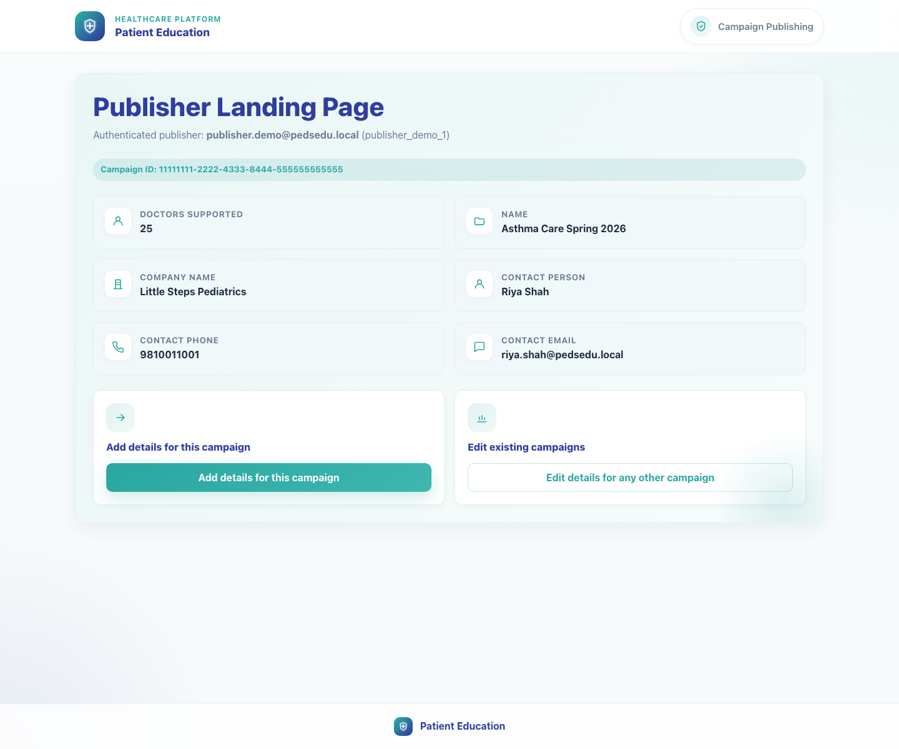
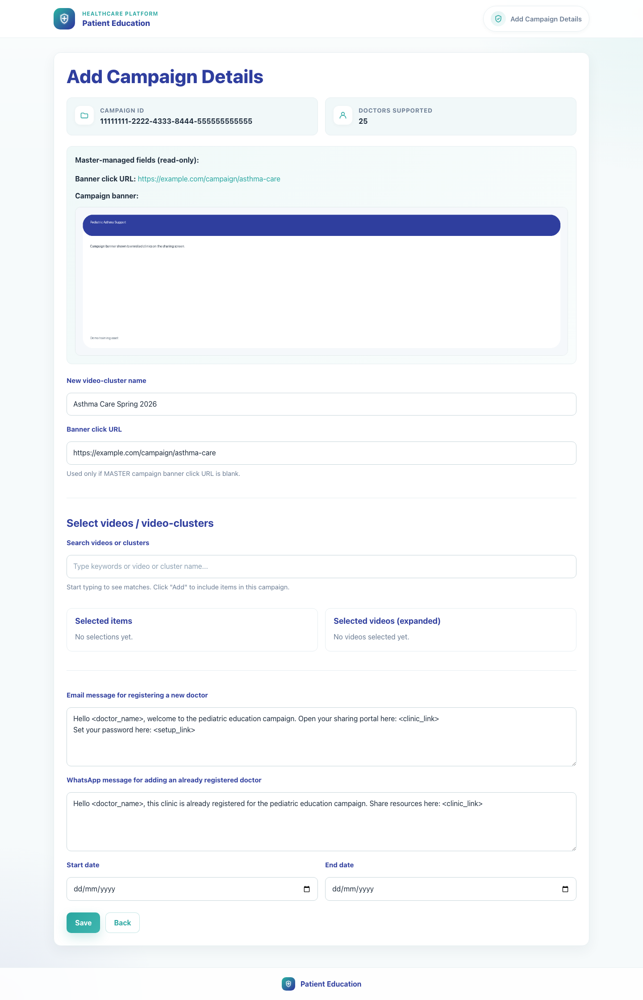
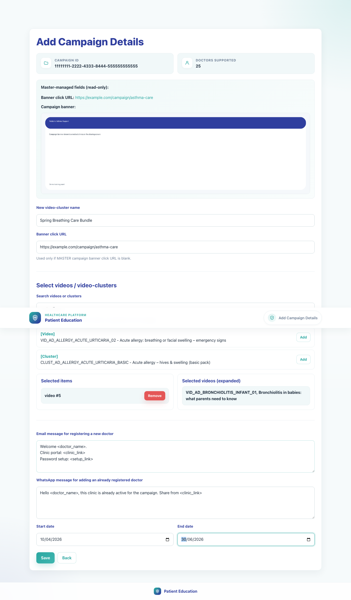
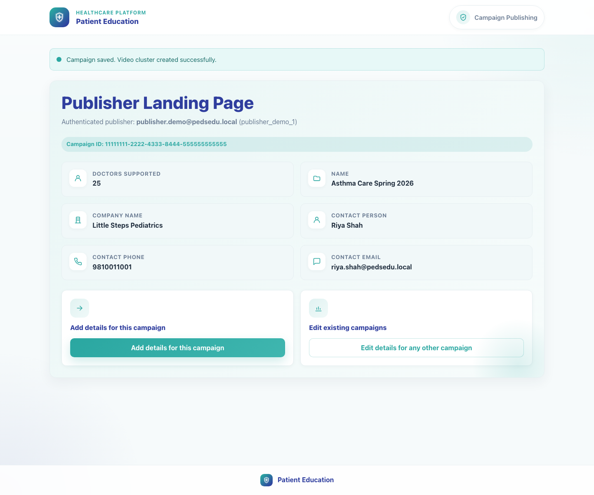
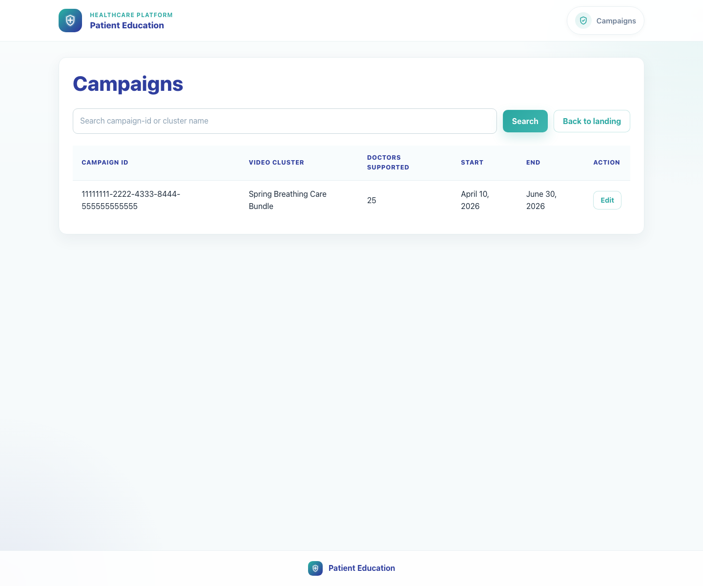

# 02. Publisher Campaign Setup

## 1. Title

Publisher Campaign Setup

## 2. Document Purpose

Show a publisher how to open a campaign from an SSO link, select campaign content, configure templates, and save the campaign record.

## 3. Primary User

Publisher or brand manager using the campaign-specific SSO link

## 4. Entry Point

Publisher SSO entry link such as `/publisher-landing-page/?campaign-id=...&token=...`.

## 5. Workflow Summary

- The publisher lands on a campaign-aware page that carries campaign metadata from the upstream system.
- Add Campaign Details creates a local campaign record, a new campaign bundle, and the outbound registration templates used downstream.
- The campaign list is the operational place to confirm that a record exists and to re-open it for editing.

### Decision Points

- **New campaign detail set:** Use Add details for this campaign when the campaign has not yet been configured in this app. Outcome: The app creates a new campaign record and bundle mapping.
- **Existing campaign detail set:** If the campaign already exists, the product redirects the publisher into the edit flow. Outcome: The user updates the existing campaign instead of creating a duplicate.

## 6. Step-By-Step Instructions

### Step 1. Open the publisher landing page from the campaign link

**What the user does**

Opens the authenticated campaign link supplied by the upstream system or brand workflow.

**What the user sees**

Publisher Landing Page with the authenticated publisher identity, campaign ID, and campaign metadata such as company name and doctors supported.

**Why the step matters**

This page confirms the publisher is in the right campaign context before configuration begins.

**Expected result**

The publisher can verify the campaign context and proceed into Add details for this campaign.

**Common issues or trainer notes**

If no campaign ID is supplied, the landing page still opens but the add-details action is disabled.

**Screenshot Placeholder**

- Suggested file path: `assets/02-publisher-campaign-setup/01-publisher-landing.png`
- Screenshot caption: Publisher landing page with campaign metadata.
- What the screenshot should show: Campaign metadata cards and the two main actions: add details or edit existing campaigns.

### Step 2. Launch Add Campaign Details

**What the user does**

Selects Add details for this campaign to open the campaign form.

**What the user sees**

Add Campaign Details with read-only campaign data from the master system, including the campaign ID, supported doctor count, and banner data.

**Why the step matters**

The page separates master-managed fields from the fields the publisher is allowed to configure locally.

**Expected result**

The campaign form is open and ready for local configuration.

**Common issues or trainer notes**

The master-managed banner click URL and campaign banner are informational unless the local fallback banner URL field is needed.

**Screenshot Placeholder**

- Suggested file path: `assets/02-publisher-campaign-setup/02-add-campaign-details-empty.png`
- Screenshot caption: Blank Add Campaign Details form.
- What the screenshot should show: Read-only master fields, the new video-cluster name field, and the content search area.

### Step 3. Select the campaign videos and bundle inputs

**What the user does**

Names the campaign cluster, searches the catalog, and adds the required video or cluster items to the selected list.

**What the user sees**

Search results with Add actions, a Selected items panel, and an expanded Selected videos panel showing the final content set.

**Why the step matters**

Campaign visibility downstream depends on the content selected here.

**Expected result**

The selected-items list is populated and the expanded-videos panel confirms the final campaign content.

**Common issues or trainer notes**

The form will not save if no valid videos can be expanded from the selection.

**Screenshot Placeholder**

- Suggested file path: `assets/02-publisher-campaign-setup/03-add-campaign-details-complete.png`
- Screenshot caption: Campaign content selection completed.
- What the screenshot should show: Search results, selected items, and the expanded video list for the configured campaign.

### Step 4. Configure registration messaging and campaign dates

**What the user does**

Enters the registration email text, existing-doctor WhatsApp text, and campaign start and end dates.

**What the user sees**

Text areas with merge-token placeholders such as `<doctor_name>`, `<clinic_link>`, and `<setup_link>`, plus date pickers.

**Why the step matters**

These templates drive the onboarding experience for doctors recruited into the campaign.

**Expected result**

All required campaign communication fields and dates are ready to save.

**Common issues or trainer notes**

Local templates override missing master text and should be written in trainer-ready copy before launch.

**Screenshot Placeholder**

- Suggested file path: `assets/02-publisher-campaign-setup/03-add-campaign-details-complete.png`
- Screenshot caption: Messaging and date configuration.
- What the screenshot should show: Email registration message, WhatsApp addition message, and the campaign date controls.

### Step 5. Save the campaign and return to the landing page

**What the user does**

Clicks Save after validating the selected content and templates.

**What the user sees**

The publisher landing page again, now with the campaign detail set created in the app.

**Why the step matters**

Saving creates the local campaign record and associated bundle mapping used by later workflows.

**Expected result**

The app confirms the campaign was saved successfully.

**Common issues or trainer notes**

A duplicate campaign ID is blocked and redirected to the edit flow.

**Screenshot Placeholder**

- Suggested file path: `assets/02-publisher-campaign-setup/04-publisher-landing-after-save.png`
- Screenshot caption: Publisher landing page after saving the campaign.
- What the screenshot should show: Return state after the campaign record is created.

### Step 6. Review the campaign from the Campaigns list

**What the user does**

Opens the Campaigns list to confirm the record and use the Edit action when needed.

**What the user sees**

A searchable campaign table with campaign ID, cluster name, capacity, dates, and Edit.

**Why the step matters**

This is the operational page for verifying the saved record and managing future updates.

**Expected result**

The campaign appears in the list and can be re-opened for edits.

**Common issues or trainer notes**

Search supports campaign ID and cluster-name lookup.

**Screenshot Placeholder**

- Suggested file path: `assets/02-publisher-campaign-setup/05-campaign-list.png`
- Screenshot caption: Campaign list with edit actions.
- What the screenshot should show: The searchable campaigns table used for verification and maintenance.

## 7. Success Criteria

- The campaign record exists and appears on the Campaigns list.
- At least one valid video or cluster has been selected and expanded into campaign content.
- Registration email text, existing-doctor WhatsApp text, and campaign dates are saved.

### Trainer Tips and Common Issues

- **Expired or missing SSO context:** Without a valid campaign ID and token, the landing page cannot create a campaign detail set.
- **No selected videos:** The form saves only when the selected items expand into at least one valid video.
- **Duplicate cluster naming:** If the proposed campaign cluster name already exists, the user must choose a different name.

## 8. Related Documents

- [`01-platform-overview-and-role-map.md`](01-platform-overview-and-role-map.md)
- [`03-field-rep-doctor-recruitment.md`](03-field-rep-doctor-recruitment.md)
- [`../../publisher/campaign_views.py`](../../publisher/campaign_views.py)
- [`../../publisher/templates/publisher/add_campaign_details.html`](../../publisher/templates/publisher/add_campaign_details.html)

## 9. Status

Live-verified against the local demo environment and refreshed with real screenshots on 2026-04-23.
