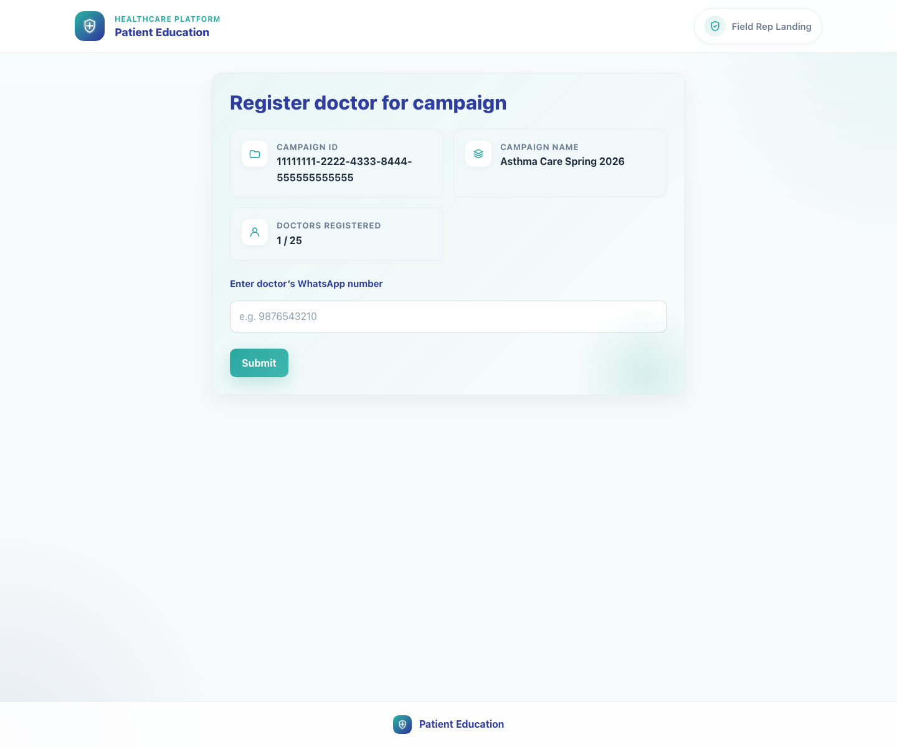
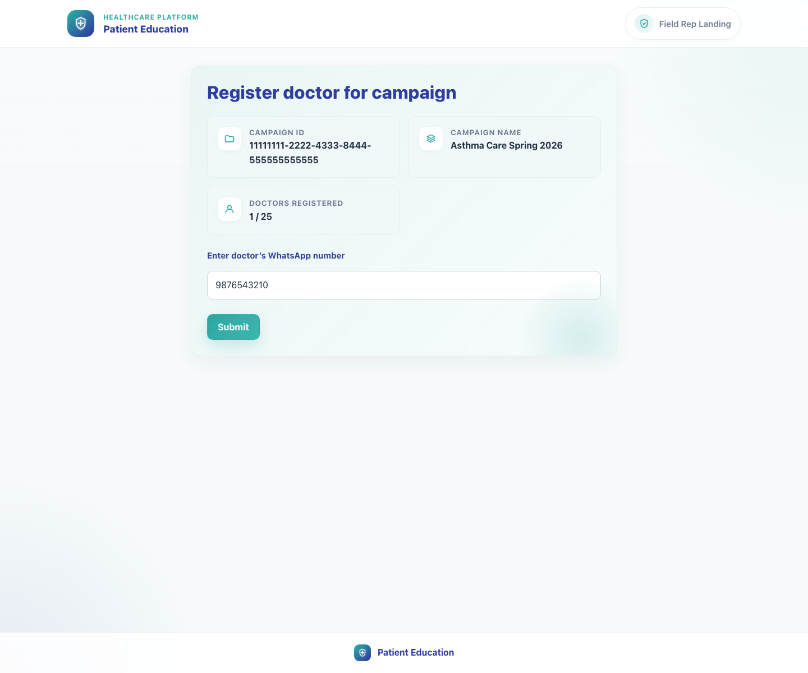
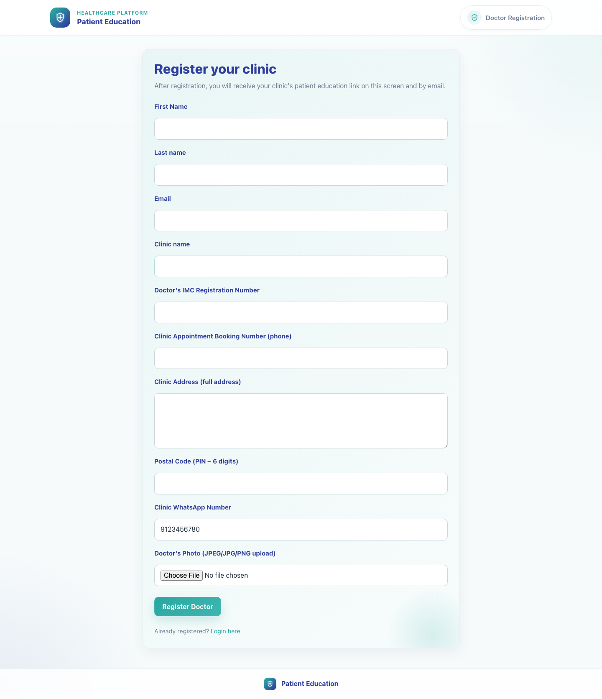
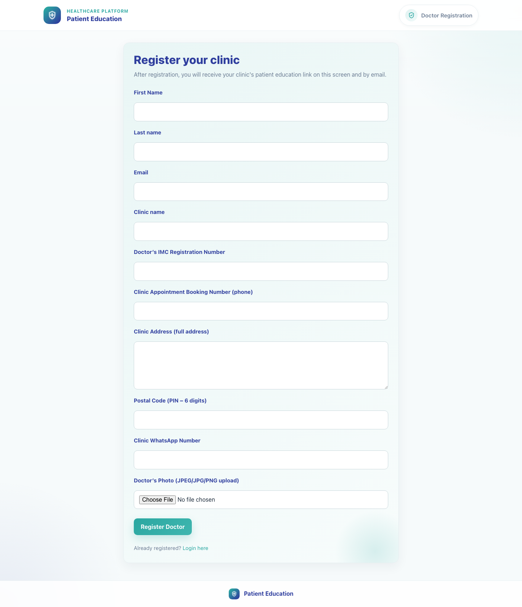

# 03. Field Rep Doctor Recruitment

## 1. Title

Field Rep Doctor Recruitment

## 2. Document Purpose

Show how a field rep uses the campaign link to recruit a clinic by checking a doctor's WhatsApp number and routing the clinic correctly.

## 3. Primary User

Field rep assigned to a campaign

## 4. Entry Point

Campaign recruitment link such as `/field-rep-landing-page/?campaign-id=...&field_rep_id=...`.

## 5. Workflow Summary

- The field rep page validates both the campaign and the field rep against the master database before allowing recruitment.
- Entering an existing doctor's WhatsApp number enrolls the clinic into the campaign and opens a WhatsApp deeplink with the clinic link.
- Entering a new doctor's WhatsApp number redirects into the doctor registration flow with campaign context preserved.

### Decision Points

- **Existing doctor match:** The entered WhatsApp number matches an existing doctor in the master database. Outcome: The system ensures campaign enrollment and opens a WhatsApp message containing the clinic share link.
- **New doctor:** No doctor record matches the WhatsApp number. Outcome: The system redirects to `/accounts/register/` with campaign and field rep context preserved.

## 6. Step-By-Step Instructions

### Step 1. Open the field rep campaign page

**What the user does**

Launches the campaign recruitment link supplied for the field rep.

**What the user sees**

Register doctor for campaign with the campaign ID, campaign name, and doctors registered count.

**Why the step matters**

This page confirms the field rep is working inside the correct campaign before recruitment begins.

**Expected result**

The field rep sees a valid campaign context and an input for doctor WhatsApp number.

**Common issues or trainer notes**

If the campaign license cap has been reached or the link is invalid, the page surfaces a blocking message instead of the form.

**Screenshot Placeholder**

- Suggested file path: `assets/03-field-rep-doctor-recruitment/01-field-rep-landing.png`
- Screenshot caption: Field rep campaign recruitment landing page.
- What the screenshot should show: Campaign context cards and the single WhatsApp input used to begin recruitment.

### Step 2. Enter the doctor's WhatsApp number

**What the user does**

Types the doctor's 10-digit WhatsApp number and prepares to submit the campaign registration check.

**What the user sees**

The WhatsApp number inside the campaign-bound form with the Submit action.

**Why the step matters**

The WhatsApp number is the matching key used to determine whether the clinic already exists.

**Expected result**

The form is ready to evaluate whether the clinic is already registered.

**Common issues or trainer notes**

Use the clinic's actual doctor WhatsApp number rather than a generic clinic front-desk number when possible.

**Screenshot Placeholder**

- Suggested file path: `assets/03-field-rep-doctor-recruitment/02-existing-doctor-number-entered.png`
- Screenshot caption: Field rep form with an existing doctor number entered.
- What the screenshot should show: The campaign registration form ready for submission.

### Step 3. Handle an existing doctor match

**What the user does**

Submits a WhatsApp number that already belongs to a doctor in the master database.

**What the user sees**

A backend-driven redirect into a WhatsApp deeplink rather than a visible intermediate success page.

**Why the step matters**

This path avoids duplicate registration and immediately gives the clinic the correct share link.

**Expected result**

The doctor is enrolled into the campaign and a WhatsApp message opens with the clinic share URL.

**Common issues or trainer notes**

The message uses the campaign's existing-doctor WhatsApp template when one is available.

**Screenshot Placeholder**

- Suggested file path: `assets/03-field-rep-doctor-recruitment/02-existing-doctor-number-entered.png`
- Screenshot caption: Existing doctor branch starts from the same recruitment form.
- What the screenshot should show: The page state before submission on the existing-doctor path.

### Step 4. Route a new doctor into registration

**What the user does**

Submits a WhatsApp number that is not yet present in the master database.

**What the user sees**

The public doctor registration page with campaign and field rep parameters carried into the URL.

**Why the step matters**

This handoff preserves campaign attribution and keeps recruitment operational without manual intervention.

**Expected result**

The doctor registration form opens with campaign context in place.

**Common issues or trainer notes**

The doctor WhatsApp number can be prefilled from the field rep page to reduce re-entry.

**Screenshot Placeholder**

- Suggested file path: `assets/03-field-rep-doctor-recruitment/03-new-doctor-redirected-to-registration.png`
- Screenshot caption: New doctor redirected to registration.
- What the screenshot should show: The doctor registration form opened from the field rep flow.

### Step 5. Hand off to clinic onboarding

**What the user does**

Explains to the clinic that the next step is completing registration and then logging into the clinic workspace.

**What the user sees**

A seamless transition from field rep recruitment into clinic onboarding.

**Why the step matters**

Successful recruitment is not complete until the clinic can actually log in and share content.

**Expected result**

The clinic understands the next step and moves into registration or login.

**Common issues or trainer notes**

Use the Doctor Registration and First Access deck immediately after this one in training sessions.

**Screenshot Placeholder**

- Suggested file path: `assets/04-doctor-registration-and-first-access/01-register-form.png`
- Screenshot caption: Clinic onboarding handoff.
- What the screenshot should show: The registration page that follows the new-doctor branch.

## 7. Success Criteria

- Existing clinics are enrolled without manual database work.
- New clinics are redirected to the registration form with campaign context and prefilling.
- The field rep can explain which path happened and why.

### Trainer Tips and Common Issues

- **Field rep not linked to the campaign:** The page blocks if the field rep identity is inactive or not authorized for the supplied campaign.
- **Campaign cap reached:** If doctors supported has been reached, recruitment is blocked until additional licenses are available.
- **Wrong WhatsApp number:** Using the wrong number can route an existing clinic into the new-doctor path or vice versa, so confirm the number before submission.

## 8. Related Documents

- [`01-platform-overview-and-role-map.md`](01-platform-overview-and-role-map.md)
- [`04-doctor-registration-and-first-access.md`](04-doctor-registration-and-first-access.md)
- [`../../publisher/campaign_views.py`](../../publisher/campaign_views.py)
- [`../../publisher/templates/publisher/field_rep_landing_page.html`](../../publisher/templates/publisher/field_rep_landing_page.html)

## 9. Status

Live-verified against the local demo environment and refreshed with real screenshots on 2026-04-23.
