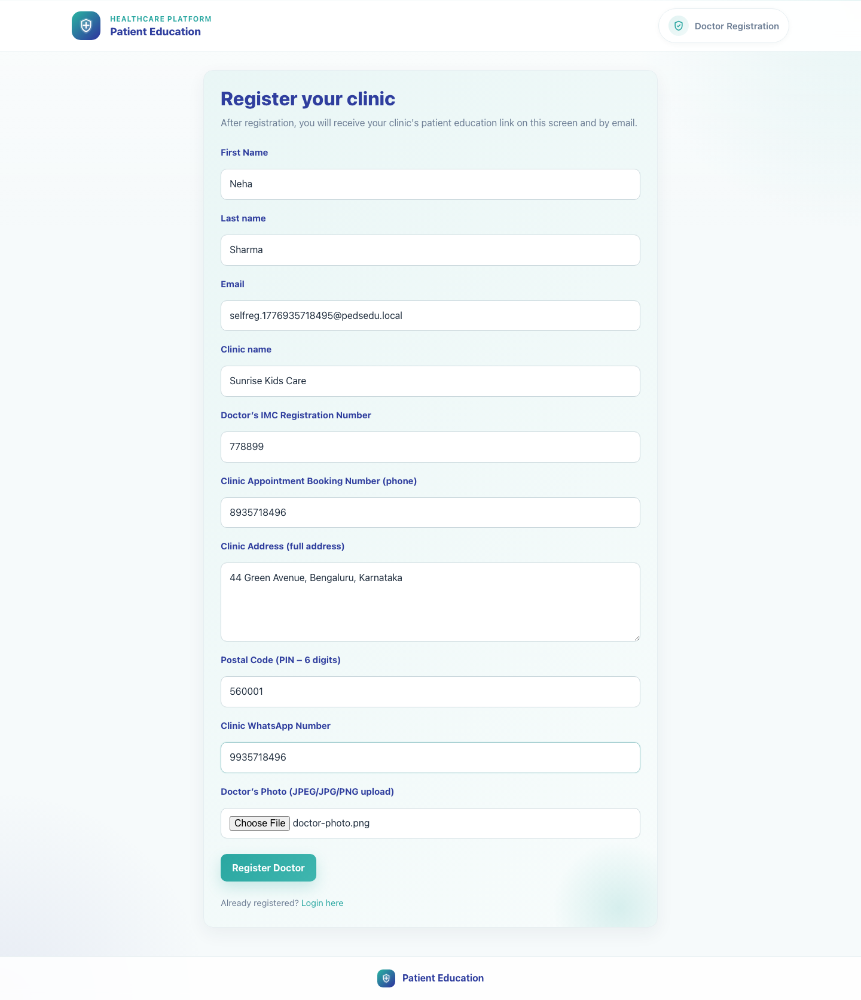
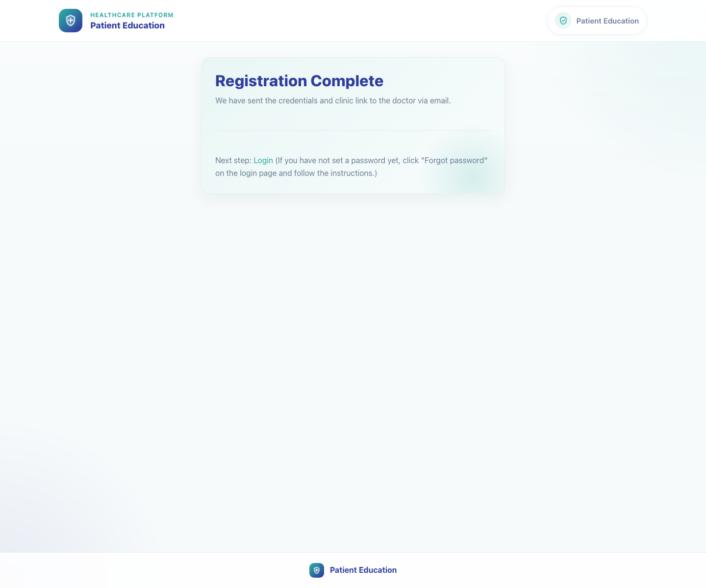

# 04. Doctor Registration and First Access

## 1. Title

Doctor Registration and First Access

## 2. Document Purpose

Show a new clinic how to complete doctor registration and understand the first-login handoff.

## 3. Primary User

New doctor or clinic representative completing the registration form

## 4. Entry Point

Public registration form at `/accounts/register/`.

## 5. Workflow Summary

- The registration form creates the doctor and clinic record and can carry campaign context from the field rep flow.
- The page collects doctor identity, clinic profile, address, WhatsApp, and a photo upload.
- After successful registration, the system instructs the clinic to log in or use Forgot password to set credentials if needed.

## 6. Step-By-Step Instructions

### Step 1. Open the registration form

**What the user does**

Starts from the public register page, either directly or from the field rep handoff.

**What the user sees**

Doctor Registration with the Register your clinic heading and a full onboarding form.

**Why the step matters**

This is the official entry point for clinics that do not already exist in the system.

**Expected result**

The clinic can see all required onboarding fields before data entry begins.

**Common issues or trainer notes**

If the clinic already exists, stop and use the login or password-reset route instead of registering again.

**Screenshot Placeholder**

- Suggested file path: `assets/04-doctor-registration-and-first-access/01-register-form.png`
- Screenshot caption: Blank doctor registration form.
- What the screenshot should show: The registration page before clinic details are entered.

### Step 2. Complete doctor and clinic details

**What the user does**

Enters the doctor's name, email, clinic name, registration number, phone numbers, address, postal code, WhatsApp number, and doctor photo.

**What the user sees**

A fully populated registration form with all required onboarding fields visible.

**Why the step matters**

Accurate clinic identity and contact details are required for both login support and caregiver communication.

**Expected result**

The form is complete and ready for submission.

**Common issues or trainer notes**

The same clinic WhatsApp number is used later in caregiver-facing contact sections.

**Screenshot Placeholder**

- Suggested file path: `assets/04-doctor-registration-and-first-access/02-register-form-completed.png`
- Screenshot caption: Completed doctor registration form.
- What the screenshot should show: Doctor profile, clinic profile, and photo upload fields filled in.

### Step 3. Submit the registration

**What the user does**

Clicks Register Doctor once all fields are complete.

**What the user sees**

The same page validates the input and sends the data into the registration workflow.

**Why the step matters**

Submission creates the clinic identity used for future login and sharing.

**Expected result**

The form submits successfully with no validation errors.

**Common issues or trainer notes**

If validation fails, correct the highlighted field and resubmit instead of refreshing the page.

**Screenshot Placeholder**

- Suggested file path: `assets/04-doctor-registration-and-first-access/02-register-form-completed.png`
- Screenshot caption: Registration ready for submission.
- What the screenshot should show: The Register Doctor action with the completed onboarding form.

### Step 4. Review the completion page and next-step instructions

**What the user does**

Reads the Registration Complete screen and follows the Login or Forgot password guidance.

**What the user sees**

A confirmation page stating that credentials and the clinic link were sent to the doctor by email.

**Why the step matters**

This page closes the onboarding loop and points the clinic toward first access.

**Expected result**

The clinic understands that login is next and knows how to request a password setup link if needed.

**Common issues or trainer notes**

Current product behavior uses the Forgot password action on the login page for first-time password setup when a password has not yet been set.

**Screenshot Placeholder**

- Suggested file path: `assets/04-doctor-registration-and-first-access/03-registration-complete.png`
- Screenshot caption: Registration Complete confirmation screen.
- What the screenshot should show: Confirmation copy, the Login link, and the first-access guidance.

## 7. Success Criteria

- The registration completes successfully and shows the confirmation page.
- The clinic receives login and clinic-link instructions by email.
- The clinic can proceed to login or password setup without manual admin help.

### Trainer Tips and Common Issues

- **Already registered clinic:** If the clinic already exists, use login or password reset instead of creating a duplicate registration.
- **Missing required fields:** The form requires a complete clinic profile, so blank clinic contact or address fields will block submission.
- **Password expectations:** The confirmation page points the user to login first and to Forgot password when a password setup link is needed.

## 8. Related Documents

- [`03-field-rep-doctor-recruitment.md`](03-field-rep-doctor-recruitment.md)
- [`05-doctor-share-single-video.md`](05-doctor-share-single-video.md)
- [`../../accounts/views.py`](../../accounts/views.py)
- [`../../templates/accounts/register.html`](../../templates/accounts/register.html)
- [`../../templates/accounts/register_success.html`](../../templates/accounts/register_success.html)

## 9. Status

Live-verified against the local demo environment and refreshed with real screenshots on 2026-04-23.
