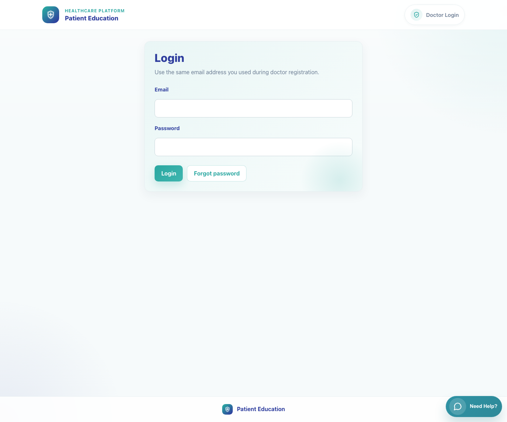
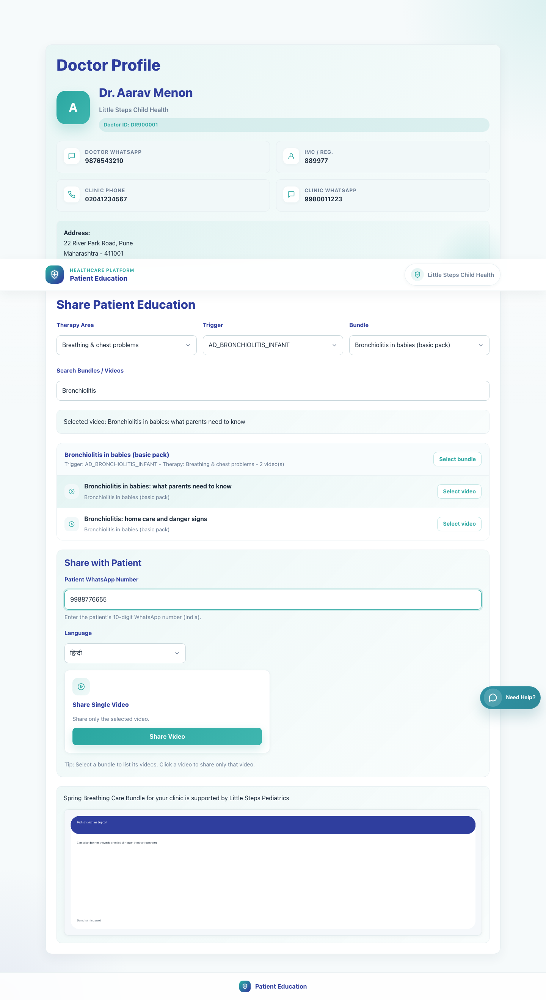
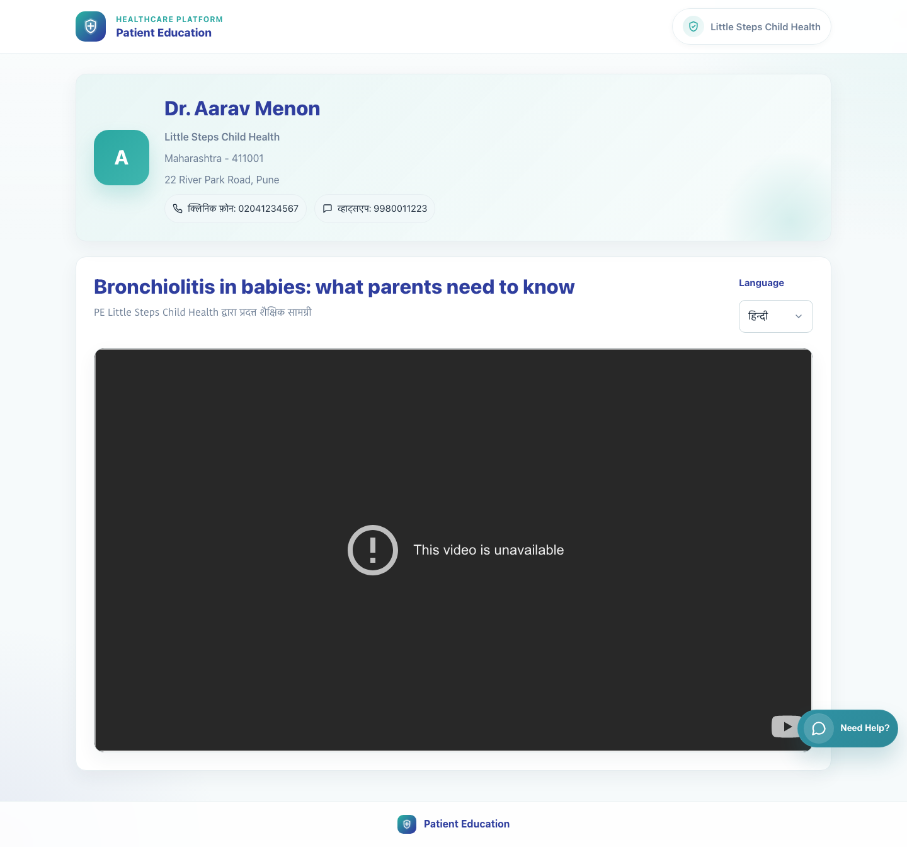

# 05. Doctor Share Single Video

## 1. Title

Doctor Share Single Video

## 2. Document Purpose

Show a doctor how to log in, search the catalog, select a single video, and share it to a caregiver through WhatsApp.

## 3. Primary User

Registered doctor using the clinic sharing workspace

## 4. Entry Point

Doctor login at `/accounts/login/`.

## 5. Workflow Summary

- The doctor logs into the clinic workspace and lands directly on the Share Patient Education page for the clinic.
- Selecting a video activates the Share Video action and generates a secure patient link in the chosen language.
- The caregiver receives a WhatsApp message containing the video title and the secure patient page link.

## 6. Step-By-Step Instructions

### Step 1. Log into the clinic sharing workspace

**What the user does**

Signs in with the registered doctor email address and password.

**What the user sees**

The shared Doctor Login page and, after sign-in, the clinic's Share Patient Education workspace.

**Why the step matters**

Clinic sharing is only available after a successful authenticated login.

**Expected result**

The doctor lands on the clinic share page for the correct doctor ID.

**Common issues or trainer notes**

The same login page is also used by clinic staff accounts tied to the same clinic.

**Screenshot Placeholder**

- Suggested file path: `assets/01-platform-overview-role-map/01-login-entry.png`
- Screenshot caption: Doctor login page.
- What the screenshot should show: The login form used before entering the sharing workspace.

### Step 2. Filter the catalog and select the target video

**What the user does**

Uses therapy, trigger, bundle, or search controls to narrow the catalog and then selects the required video.

**What the user sees**

A selected video state inside the clinic sharing page, with the active bundle and the matching video highlighted.

**Why the step matters**

Selecting the video is what enables the single-video share action.

**Expected result**

The correct video is active and ready to share.

**Common issues or trainer notes**

Clicking a bundle alone is not enough for this workflow; the doctor must click the specific video to activate Share Video.

**Screenshot Placeholder**

- Suggested file path: `assets/05-doctor-share-single-video/01-doctor-share-single-video.png`
- Screenshot caption: Doctor workspace with a selected video.
- What the screenshot should show: Catalog filters, selected bundle context, and the active video item.

### Step 3. Enter the caregiver WhatsApp number and choose language

**What the user does**

Types the caregiver's 10-digit WhatsApp number and selects the content language.

**What the user sees**

The Share with Patient panel containing the patient WhatsApp field and language selector.

**Why the step matters**

The share message is personalized to the caregiver number and the selected language.

**Expected result**

The share panel is complete and ready for action.

**Common issues or trainer notes**

The clinic workspace expects a 10-digit India-format WhatsApp number.

**Screenshot Placeholder**

- Suggested file path: `assets/05-doctor-share-single-video/01-doctor-share-single-video.png`
- Screenshot caption: Single-video share panel ready for use.
- What the screenshot should show: Patient WhatsApp input and language selection for the chosen video.

### Step 4. Share the single video through WhatsApp

**What the user does**

Clicks Share Video after the patient number, language, and selected video are all in place.

**What the user sees**

The Share Single Video action tile and a backend redirect into a WhatsApp deeplink.

**Why the step matters**

This is the moment the secure caregiver link is generated and delivered.

**Expected result**

WhatsApp opens with a prefilled message containing the video title and the secure link.

**Common issues or trainer notes**

If Share Video is not visible, confirm that a specific video rather than only a bundle is selected.

**Screenshot Placeholder**

- Suggested file path: `assets/05-doctor-share-single-video/01-doctor-share-single-video.png`
- Screenshot caption: Share Video action tile.
- What the screenshot should show: The active Share Single Video card and button.

### Step 5. Explain what the caregiver receives

**What the user does**

Reviews the caregiver-facing page to confirm the shared result.

**What the user sees**

A secure patient video page with clinic branding, contact details, the selected video, and a language chooser.

**Why the step matters**

Doctors are more confident sharing content when they know exactly what the caregiver will see.

**Expected result**

The doctor can describe the caregiver experience and confirm the share worked.

**Common issues or trainer notes**

The caregiver page does not require login. Language can be changed after the link is opened.

**Screenshot Placeholder**

- Suggested file path: `assets/07-caregiver-single-video-view/01-patient-video-hindi.png`
- Screenshot caption: Shared caregiver page for a single video.
- What the screenshot should show: Clinic branding, doctor context, and the linked educational video in the chosen language.

## 7. Success Criteria

- The doctor can find the correct video in the clinic workspace.
- A valid patient WhatsApp number and language are selected before sharing.
- WhatsApp opens with a prefilled message containing the secure single-video link.

### Trainer Tips and Common Issues

- **Share button not available:** Share Video appears only after a specific video is selected.
- **Invalid WhatsApp number:** The share form expects a 10-digit number and will not work correctly with partial or formatted values.
- **Wrong content level:** If the doctor wants the caregiver to receive a full collection rather than one item, switch to the bundle-sharing workflow instead.

## 8. Related Documents

- [`04-doctor-registration-and-first-access.md`](04-doctor-registration-and-first-access.md)
- [`07-caregiver-single-video-view.md`](07-caregiver-single-video-view.md)
- [`../../templates/accounts/login.html`](../../templates/accounts/login.html)
- [`../../templates/sharing/share.html`](../../templates/sharing/share.html)
- [`../../sharing/views.py`](../../sharing/views.py)

## 9. Status

Live-verified against the local demo environment and refreshed with real screenshots on 2026-04-23.
