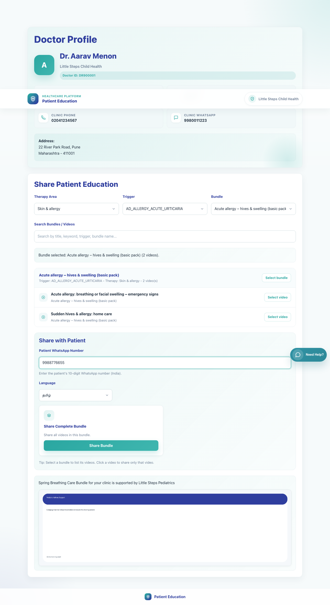

# 06. Clinic Staff Share Bundle

## 1. Title

Clinic Staff Share Bundle

## 2. Document Purpose

Show a clinic staff member how to log in to the same clinic workspace, choose a full bundle, and share it with a caregiver.

## 3. Primary User

Registered clinic staff user linked to an existing clinic

## 4. Entry Point

Clinic staff login at `/accounts/login/`.

## 5. Workflow Summary

- Clinic staff use the same clinic share workspace as doctors, but they often share complete bundles for repeated counseling.
- Selecting a bundle activates Share Bundle and produces a secure multi-video patient link.
- The caregiver receives a WhatsApp deeplink to a page that contains the full bundle in the chosen language.

### Decision Points

- **Share a single video:** Use when the caregiver needs one targeted item only. Outcome: Select the video and use Share Video.
- **Share a complete bundle:** Use when the caregiver should receive the full condition-specific sequence. Outcome: Select the bundle and use Share Bundle.

## 6. Step-By-Step Instructions

### Step 1. Log in with clinic staff credentials

**What the user does**

Signs in through the shared clinic login page with the clinic staff email and password.

**What the user sees**

The same clinic-sharing workspace used by doctors.

**Why the step matters**

Clinic staff do not need a separate app; they work inside the same operational share page.

**Expected result**

The clinic share workspace opens for the correct clinic.

**Common issues or trainer notes**

The page layout is role-aware only for access control and banners; the main sharing controls remain the same.

**Screenshot Placeholder**

- Suggested file path: `assets/01-platform-overview-role-map/01-login-entry.png`
- Screenshot caption: Shared clinic login page for staff and doctors.
- What the screenshot should show: The common login page used before entering the clinic share workspace.

### Step 2. Select the required bundle

**What the user does**

Uses the bundle selector and search tools to choose the correct caregiver education bundle.

**What the user sees**

The active bundle context with the videos listed beneath it.

**Why the step matters**

Bundle selection determines the collection of videos the caregiver will receive.

**Expected result**

The correct bundle is active and visible in the clinic workspace.

**Common issues or trainer notes**

For this workflow the staff user should stop at the bundle level instead of clicking down into a single video.

**Screenshot Placeholder**

- Suggested file path: `assets/06-clinic-staff-share-bundle/01-clinic-staff-share-bundle.png`
- Screenshot caption: Clinic staff workspace with a selected bundle.
- What the screenshot should show: Bundle selection, listed videos, and the context for sharing the full collection.

### Step 3. Enter the caregiver number and set language

**What the user does**

Types the caregiver WhatsApp number and selects the preferred language for the bundle link.

**What the user sees**

The Share with Patient panel containing the WhatsApp field and language picker.

**Why the step matters**

The caregiver's number and chosen language are required to build the correct WhatsApp message.

**Expected result**

The share panel is ready for the bundle action.

**Common issues or trainer notes**

Bundle shares are especially useful when the clinic wants caregivers to review a full set of counseling videos over time.

**Screenshot Placeholder**

- Suggested file path: `assets/06-clinic-staff-share-bundle/01-clinic-staff-share-bundle.png`
- Screenshot caption: Bundle share panel ready for action.
- What the screenshot should show: Patient WhatsApp input and language selection for the selected bundle.

### Step 4. Share the complete bundle

**What the user does**

Clicks Share Bundle once the patient number, language, and bundle are confirmed.

**What the user sees**

The Share Complete Bundle card with the Share Bundle button and a redirect into WhatsApp.

**Why the step matters**

This action creates a secure bundle page that preserves the clinic context and language choice.

**Expected result**

WhatsApp opens with a prefilled message containing the secure bundle link.

**Common issues or trainer notes**

If Share Bundle is hidden, confirm that the user selected the bundle instead of a single video.

**Screenshot Placeholder**

- Suggested file path: `assets/06-clinic-staff-share-bundle/01-clinic-staff-share-bundle.png`
- Screenshot caption: Share Bundle action tile.
- What the screenshot should show: The active Share Complete Bundle card and button.

### Step 5. Review the caregiver bundle page outcome

**What the user does**

Checks the recipient experience to make sure the caregiver receives the full collection.

**What the user sees**

A secure bundle page listing multiple videos under the selected bundle title.

**Why the step matters**

This confirms that the clinic sent a collection and not only a single item.

**Expected result**

The clinic staff user can describe how the caregiver will step through the bundle.

**Common issues or trainer notes**

Language changes happen on the patient page and refresh the bundle display.

**Screenshot Placeholder**

- Suggested file path: `assets/08-caregiver-bundle-view/02-patient-bundle-english.png`
- Screenshot caption: Caregiver bundle page in English.
- What the screenshot should show: Bundle title, multiple video items, and the language selector on the caregiver page.

## 7. Success Criteria

- The clinic staff user can log in to the correct clinic workspace.
- A full bundle is selected and the caregiver number and language are set.
- The WhatsApp deeplink contains the secure bundle page rather than a single-video link.

### Trainer Tips and Common Issues

- **Single-video selection by mistake:** If a staff user clicks a video, the UI switches toward Share Video. Return to the bundle selector to share the whole collection.
- **Incomplete caregiver number:** Bundle sharing expects the same 10-digit WhatsApp number format as single-video sharing.
- **Campaign visibility limits:** If the expected bundle does not appear, confirm that the current clinic is supported by the campaign that contains that bundle.

## 8. Related Documents

- [`05-doctor-share-single-video.md`](05-doctor-share-single-video.md)
- [`08-caregiver-bundle-view.md`](08-caregiver-bundle-view.md)
- [`../../templates/accounts/login.html`](../../templates/accounts/login.html)
- [`../../templates/sharing/share.html`](../../templates/sharing/share.html)
- [`../../sharing/views.py`](../../sharing/views.py)

## 9. Status

Live-verified against the local demo environment and refreshed with real screenshots on 2026-04-23.
