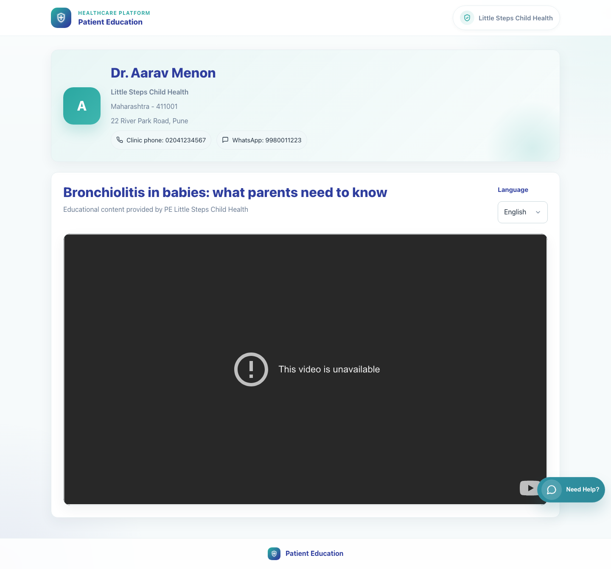

# 07. Caregiver Single Video View

## 1. Title

Caregiver Single Video View

## 2. Document Purpose

Show what a caregiver sees after opening a shared single-video link from WhatsApp.

## 3. Primary User

Caregiver receiving a single-video patient link

## 4. Entry Point

Secure patient link in WhatsApp such as `/p/<doctor_id>/v/<video_code>/?lang=<code>&d=<signed-payload>`.

## 5. Workflow Summary

- The caregiver does not log in and is taken directly to a patient page branded with the clinic and doctor context.
- The page exposes clinic phone and WhatsApp contact options, the selected video, and a language picker.
- Changing language reloads the page content in the chosen language while keeping the clinic context intact.

## 6. Step-By-Step Instructions

### Step 1. Open the secure patient link from WhatsApp

**What the user does**

Taps the shared clinic link in WhatsApp.

**What the user sees**

A branded patient page showing the doctor name, clinic name, address, contact options, and the selected educational video.

**Why the step matters**

The caregiver immediately knows which clinic sent the content and that no login is required.

**Expected result**

The patient page loads successfully in the default shared language.

**Common issues or trainer notes**

The link is signed and tied to the clinic context, so caregivers should use the original shared message rather than trying to rebuild the URL.

**Screenshot Placeholder**

- Suggested file path: `assets/07-caregiver-single-video-view/01-patient-video-hindi.png`
- Screenshot caption: Single-video caregiver page in Hindi.
- What the screenshot should show: Clinic branding, doctor context, contact pills, and the educational video title.

### Step 2. Review clinic contact information and context

**What the user does**

Checks the doctor identity, clinic name, address, phone, and WhatsApp contact chips before watching the content.

**What the user sees**

Doctor and clinic details at the top of the patient page.

**Why the step matters**

This reinforces trust and gives the caregiver clear return-contact options.

**Expected result**

The caregiver can identify the sending clinic and the available contact routes.

**Common issues or trainer notes**

Use this section during training to show where caregivers go if they need to call or message the clinic.

**Screenshot Placeholder**

- Suggested file path: `assets/07-caregiver-single-video-view/02-patient-video-english.png`
- Screenshot caption: Clinic context on the caregiver page.
- What the screenshot should show: Doctor name, clinic details, address, and clinic contact pills.

### Step 3. Watch the educational video

**What the user does**

Plays the embedded video or uses the fallback behavior if the source cannot be embedded.

**What the user sees**

A video player area underneath the title and language selector.

**Why the step matters**

The patient page keeps the clinic identity visible while the caregiver consumes the content.

**Expected result**

The caregiver can start the content from the same page without extra navigation.

**Common issues or trainer notes**

Some source videos may have external playback limitations. If that occurs, direct the caregiver to the fallback action shown by the page.

**Screenshot Placeholder**

- Suggested file path: `assets/07-caregiver-single-video-view/02-patient-video-english.png`
- Screenshot caption: Embedded single-video player.
- What the screenshot should show: The educational video area inside the patient page.

### Step 4. Switch language on the patient page

**What the user does**

Uses the Language selector to change from the originally shared language to another supported language.

**What the user sees**

A language dropdown on the top-right of the patient content card.

**Why the step matters**

The caregiver can self-serve into a more comfortable language without asking the clinic to resend the link.

**Expected result**

The page reloads with the selected language and retains the clinic context.

**Common issues or trainer notes**

Changing language reloads the content rather than opening a separate application.

**Screenshot Placeholder**

- Suggested file path: `assets/07-caregiver-single-video-view/02-patient-video-english.png`
- Screenshot caption: Language selector on the single-video page.
- What the screenshot should show: The Language control used to change the caregiver page language.

## 7. Success Criteria

- The caregiver can identify which clinic sent the content.
- The video page loads with the selected language and content title.
- The caregiver can switch language without re-requesting a new share link.

### Trainer Tips and Common Issues

- **Link opened outside the original message:** Caregivers should use the original shared link because it contains the signed context needed by the patient page.
- **Video source limitations:** If a source blocks inline playback, rely on the page's fallback behavior rather than assuming the clinic shared the wrong link.
- **Language expectations:** The shared link may open in a preset language, but the caregiver can change it from the page itself.

## 8. Related Documents

- [`05-doctor-share-single-video.md`](05-doctor-share-single-video.md)
- [`../../templates/sharing/patient_video.html`](../../templates/sharing/patient_video.html)
- [`../../sharing/views.py`](../../sharing/views.py)

## 9. Status

Live-verified against the local demo environment and refreshed with real screenshots on 2026-04-23.
