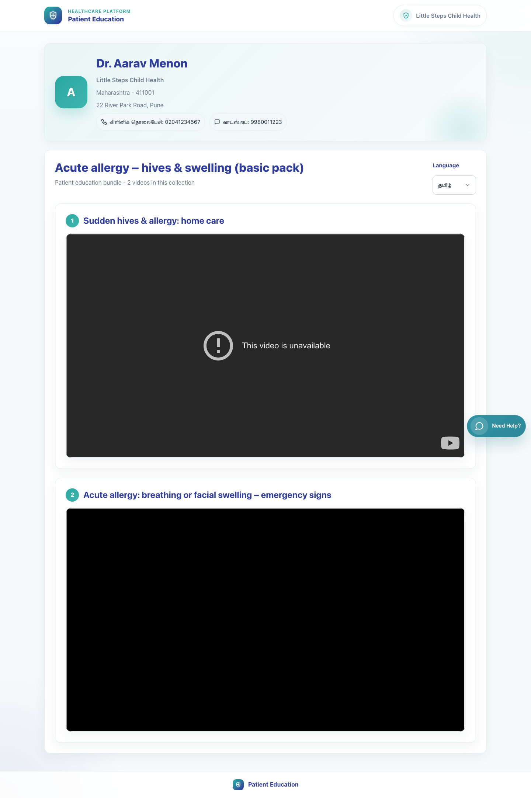
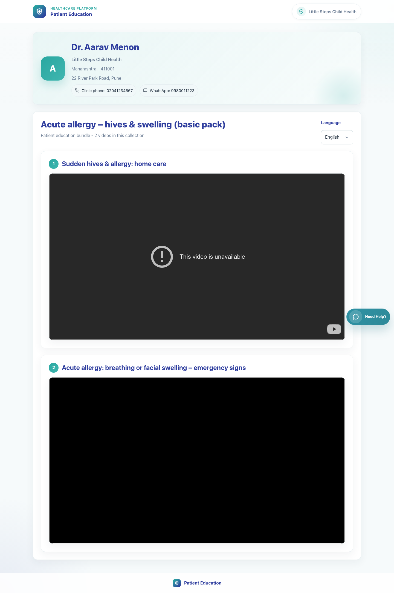

# 08. Caregiver Bundle View

## 1. Title

Caregiver Bundle View

## 2. Document Purpose

Show what a caregiver sees after receiving a bundle link that contains multiple educational videos.

## 3. Primary User

Caregiver receiving a bundle patient link

## 4. Entry Point

Secure bundle link in WhatsApp such as `/p/<doctor_id>/c/<cluster_code>/?lang=<code>&d=<signed-payload>`.

## 5. Workflow Summary

- The caregiver lands on a multi-video patient page that retains the same clinic context as the single-video flow.
- The bundle page presents the collection title, the number of videos, and each video in sequence on the same page.
- The caregiver can switch language directly on the bundle page to reload the collection in another language.

## 6. Step-By-Step Instructions

### Step 1. Open the secure bundle link

**What the user does**

Taps the WhatsApp link that was shared from the clinic.

**What the user sees**

A clinic-branded bundle page showing the doctor identity, clinic details, bundle title, and video count.

**Why the step matters**

The caregiver immediately knows this is a collection of related educational videos rather than a single item.

**Expected result**

The bundle page opens in the shared language and shows the correct clinic context.

**Common issues or trainer notes**

The bundle page keeps the same trust signals as the single-video page: doctor, clinic, address, and contact options.

**Screenshot Placeholder**

- Suggested file path: `assets/08-caregiver-bundle-view/01-patient-bundle-tamil.png`
- Screenshot caption: Bundle page in Tamil.
- What the screenshot should show: Clinic branding, doctor context, and the bundle title with video count.

### Step 2. Review the bundle title and listed videos

**What the user does**

Scrolls through the bundle to understand the sequence of educational videos provided by the clinic.

**What the user sees**

Multiple video cards stacked under the bundle heading.

**Why the step matters**

The caregiver can consume the collection as a guided set rather than looking for separate links.

**Expected result**

The caregiver can identify how many videos are included and where each video begins.

**Common issues or trainer notes**

During training, show caregivers how to continue scrolling after the first video rather than assuming the page stops there.

**Screenshot Placeholder**

- Suggested file path: `assets/08-caregiver-bundle-view/02-patient-bundle-english.png`
- Screenshot caption: Bundle page showing multiple video entries.
- What the screenshot should show: The bundle title and the stacked list of included videos.

### Step 3. Play the videos in sequence

**What the user does**

Starts with the first item and continues through the remaining content in the bundle.

**What the user sees**

Each video embedded inside its own content card on the same patient page.

**Why the step matters**

The bundle workflow is designed for structured counseling or follow-up, not one-off playback.

**Expected result**

The caregiver can navigate the sequence without needing more links.

**Common issues or trainer notes**

Some sources may show video-availability limitations from the provider. That is a source behavior, not a clinic-sharing failure.

**Screenshot Placeholder**

- Suggested file path: `assets/08-caregiver-bundle-view/01-patient-bundle-tamil.png`
- Screenshot caption: Embedded videos inside the bundle page.
- What the screenshot should show: The first and second bundle videos displayed on the same page.

### Step 4. Change language for the full bundle

**What the user does**

Uses the Language dropdown to switch the bundle page into another supported language.

**What the user sees**

A single language control that refreshes the full bundle page.

**Why the step matters**

The caregiver does not need the clinic to send a second bundle link for another language.

**Expected result**

The bundle page reloads in the chosen language while keeping the clinic context and video sequence.

**Common issues or trainer notes**

Show caregivers that the language control lives in the bundle header area and applies across the whole page.

**Screenshot Placeholder**

- Suggested file path: `assets/08-caregiver-bundle-view/02-patient-bundle-english.png`
- Screenshot caption: Language selector on the bundle page.
- What the screenshot should show: The top-right language control used to refresh the bundle in a new language.

## 7. Success Criteria

- The caregiver can see that the page contains a full collection rather than one video.
- The page shows the clinic identity and the selected bundle title clearly.
- Language can be changed on the same page without needing a new message from the clinic.

### Trainer Tips and Common Issues

- **Bundle versus single-video expectation:** Caregivers should expect a scrollable sequence of videos on this page, not a single embedded item only.
- **Video source restrictions:** When a provider blocks embedded playback, the issue is with the source content rather than the clinic share action.
- **Language confusion:** The selected language applies to the bundle page itself, so remind caregivers to use the top-right selector if the default language is not ideal.

## 8. Related Documents

- [`06-clinic-staff-share-bundle.md`](06-clinic-staff-share-bundle.md)
- [`../../templates/sharing/patient_cluster.html`](../../templates/sharing/patient_cluster.html)
- [`../../sharing/views.py`](../../sharing/views.py)

## 9. Status

Live-verified against the local demo environment and refreshed with real screenshots on 2026-04-23.
