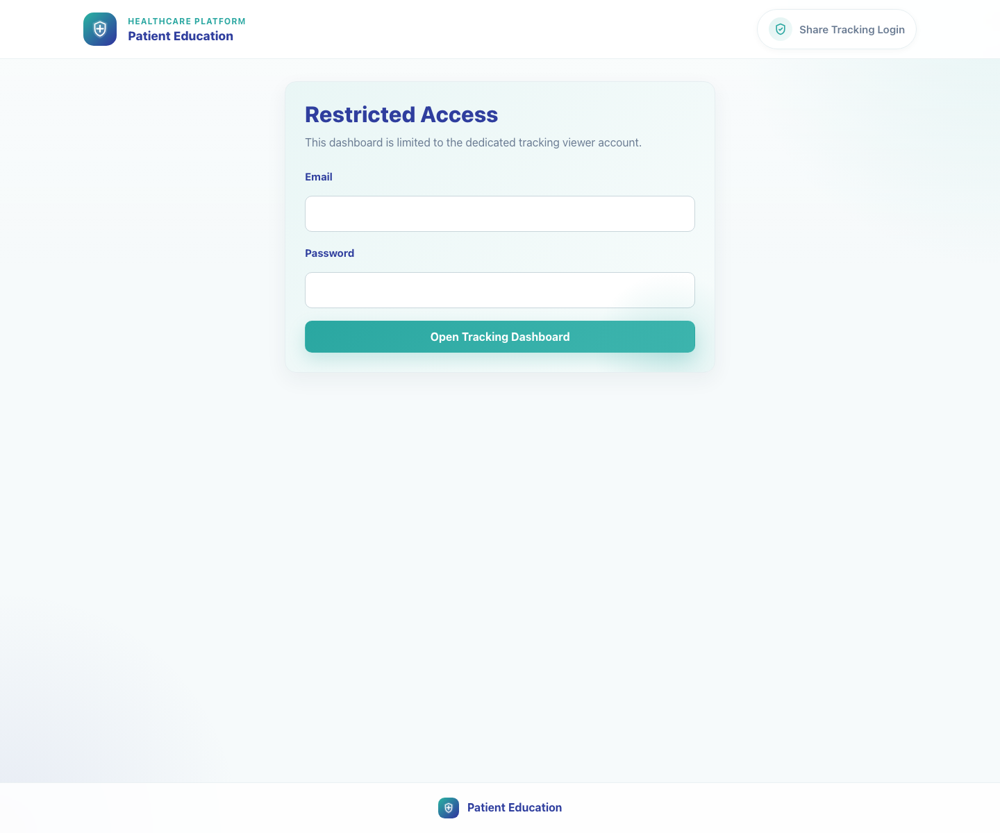
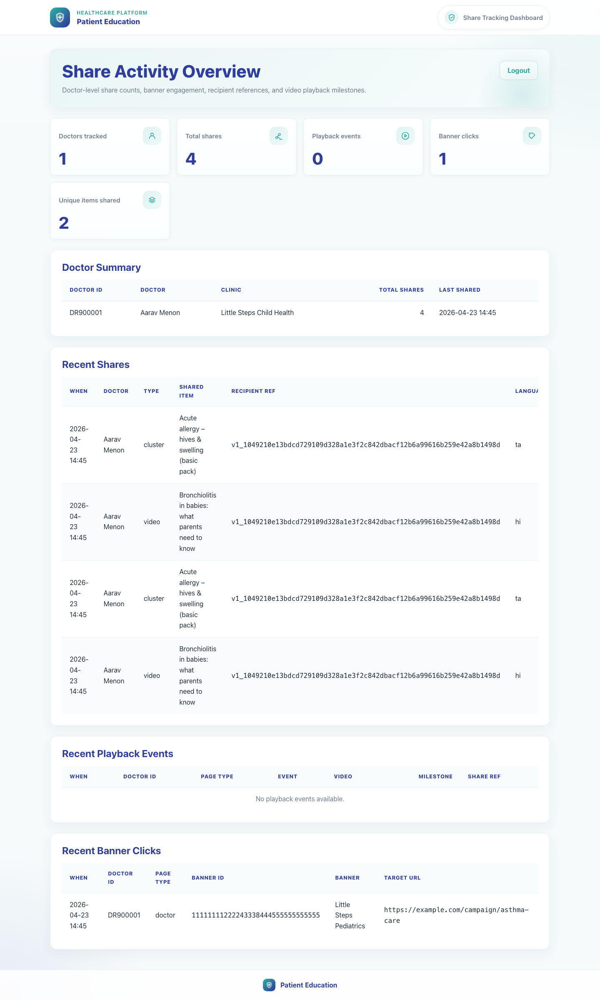

# 10. Share Tracking Dashboard

## 1. Title

Share Tracking Dashboard

## 2. Document Purpose

Show internal superusers how to open the share tracking dashboard and review doctor shares, playback milestones, and banner engagement.

## 3. Primary User

Internal analytics, audit, or operations user with superuser access

## 4. Entry Point

Tracking login at `/tracking/login/`.

## 5. Workflow Summary

- The tracking flow starts from a dedicated login page that is limited to superusers.
- The dashboard summarizes doctor-level sharing activity, playback events, and banner clicks in one place.
- Recent activity tables help trainers or operations teams confirm that clinic sharing is flowing into analytics correctly.

## 6. Step-By-Step Instructions

### Step 1. Open the tracking login page

**What the user does**

Navigates to the dedicated tracking login route and enters the approved superuser credentials.

**What the user sees**

A restricted-access login page with email and password fields plus the Open Tracking Dashboard action.

**Why the step matters**

The tracking dashboard is isolated from the clinic workflow so only authorized internal users can review share analytics.

**Expected result**

The user can submit valid credentials and continue to the dashboard.

**Common issues or trainer notes**

Only a superuser can enter this flow. Clinic credentials do not work here.

**Screenshot Placeholder**

- Suggested file path: `assets/10-share-tracking-dashboard/01-tracking-login.png`
- Screenshot caption: Tracking login page.
- What the screenshot should show: The restricted-access login form and the Open Tracking Dashboard button.

### Step 2. Review the activity overview cards

**What the user does**

Signs in and reviews the top summary cards before drilling into the detail tables.

**What the user sees**

Share Activity Overview with counts for doctors tracked, total shares, playback events, banner clicks, and unique items shared.

**Why the step matters**

The summary cards give trainers and operations users an immediate health check of adoption and content engagement.

**Expected result**

The user can confirm that share counts and downstream activity totals are being recorded, even if playback remains at zero before a video starts.

**Common issues or trainer notes**

If counts are unexpectedly zero, verify that live share activity was created. Playback remains at zero until the embedded player actually starts.

**Screenshot Placeholder**

- Suggested file path: `assets/10-share-tracking-dashboard/02-tracking-dashboard.png`
- Screenshot caption: Share tracking dashboard overview.
- What the screenshot should show: The dashboard header and top summary cards.

### Step 3. Inspect doctor summary and recent shares

**What the user does**

Scrolls through the Doctor Summary and Recent Shares sections to see which clinics are sharing which items.

**What the user sees**

Tables for doctor-level totals, recent share timestamps, item names, anonymized recipient references, and language codes.

**Why the step matters**

These tables are the fastest route to confirm who shared content and whether the correct videos or bundles were used.

**Expected result**

The user can identify the doctor, shared item, language, and share timing for recent activity.

**Common issues or trainer notes**

Recipient references are anonymized hashes, so trainers should not expect to see raw caregiver phone numbers here.

**Screenshot Placeholder**

- Suggested file path: `assets/10-share-tracking-dashboard/02-tracking-dashboard.png`
- Screenshot caption: Doctor summary and recent share tables.
- What the screenshot should show: The Doctor Summary and Recent Shares sections.

### Step 4. Inspect playback and banner events

**What the user does**

Reviews the playback milestones and banner click tables to confirm downstream caregiver engagement.

**What the user sees**

Recent Playback Events and Recent Banner Clicks tables with doctor IDs, event types, milestone percentages, and banner targets.

**Why the step matters**

These tables show whether a share translated into viewing behavior and whether campaign banners were interacted with.

**Expected result**

The user can confirm whether playback data is present yet and can still review any recorded banner activity.

**Common issues or trainer notes**

Playback rows appear only after the caregiver starts a video. Bundle shares can generate multiple playback rows because each embedded video logs play and progress milestones separately.

**Screenshot Placeholder**

- Suggested file path: `assets/10-share-tracking-dashboard/02-tracking-dashboard.png`
- Screenshot caption: Playback and banner event tables.
- What the screenshot should show: The Recent Playback Events and Recent Banner Clicks sections.

## 7. Success Criteria

- The user can open the tracking login page and authenticate successfully.
- The dashboard summary cards and recent activity tables are visible.
- The user can identify where to audit doctor share volume, playback milestones, and banner click activity.

### Trainer Tips and Common Issues

- **Wrong account type:** The tracking dashboard only allows a superuser account, so clinic or publisher credentials will be rejected.
- **No recent activity:** If the tables are empty, confirm that a doctor or clinic staff member completed a share and that the caregiver page was opened afterward.
- **Recipient privacy:** Recipient references are intentionally anonymized. Use doctor, item, and timestamp context for troubleshooting instead of expecting raw phone numbers.

## 8. Related Documents

- [`01-platform-overview-and-role-map.md`](01-platform-overview-and-role-map.md)
- [`05-doctor-share-single-video.md`](05-doctor-share-single-video.md)
- [`06-clinic-staff-share-bundle.md`](06-clinic-staff-share-bundle.md)
- [`07-caregiver-single-video-view.md`](07-caregiver-single-video-view.md)
- [`08-caregiver-bundle-view.md`](08-caregiver-bundle-view.md)
- [`../../templates/sharing/tracking_login.html`](../../templates/sharing/tracking_login.html)
- [`../../templates/sharing/tracking_dashboard.html`](../../templates/sharing/tracking_dashboard.html)
- [`../../sharing/views.py`](../../sharing/views.py)

## 9. Status

Live-verified against the local demo environment and refreshed with real screenshots on 2026-04-23.
