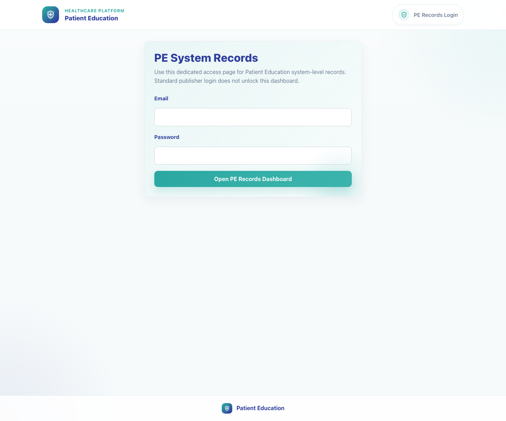
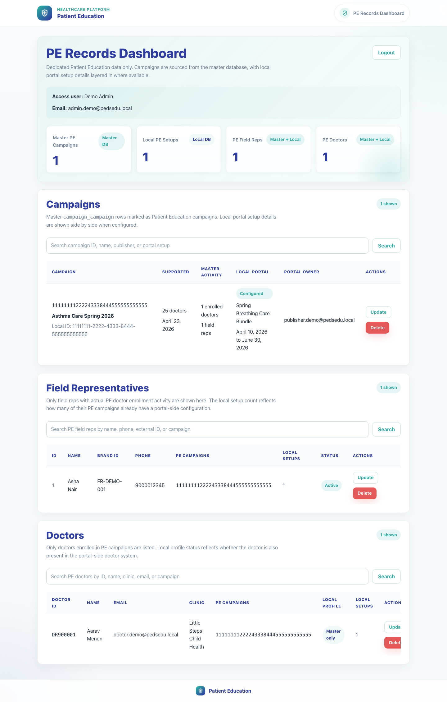
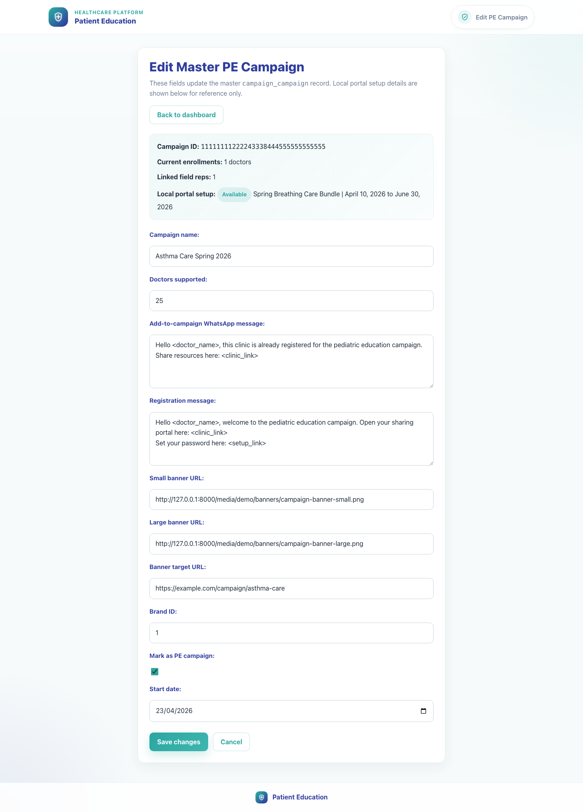
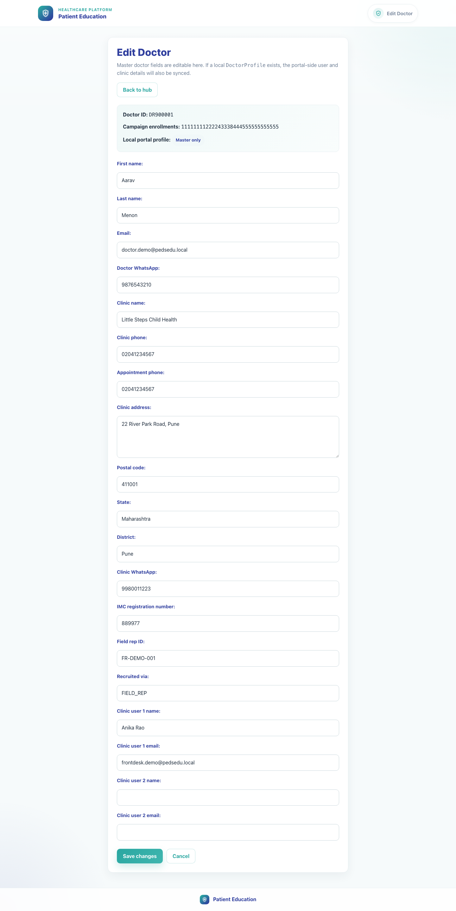

# 11. PE Records Dashboard

## 1. Title

PE Records Dashboard

## 2. Document Purpose

Show internal superusers how to open the PE-only records dashboard and manage campaign, field-rep, and doctor records scoped to Patient Education campaigns.

## 3. Primary User

System superuser responsible for PE-only record governance

## 4. Entry Point

Dedicated PE records login at `/publisher/pe-system/login/`.

## 5. Workflow Summary

- The PE Records Dashboard uses its own superuser session and only surfaces campaigns marked as Patient Education campaigns.
- Campaign rows merge master campaign data with local portal setup status so teams can see whether PE campaigns are configured downstream.
- Field rep and doctor sections only show PE-linked records, with direct update and delete actions for operational cleanup.

## 6. Step-By-Step Instructions

### Step 1. Open the PE records login

**What the user does**

Navigates to the PE records login page and signs in with a local superuser account.

**What the user sees**

PE System Records login with a dedicated email and password form.

**Why the step matters**

This dashboard keeps PE-only record governance separate from the broader publisher dashboard and other superuser tools.

**Expected result**

The PE records session opens and redirects to the dashboard.

**Common issues or trainer notes**

This flow creates a separate PE records session, so it is different from the standard `/admin/` login redirect into `/publisher/`.

**Screenshot Placeholder**

- Suggested file path: `assets/11-pe-records-dashboard/01-pe-records-login.png`
- Screenshot caption: PE records login page.
- What the screenshot should show: The PE System Records login form.

### Step 2. Review the PE records dashboard

**What the user does**

Scans the dashboard cards and campaign table to compare master PE campaigns with local portal setup coverage.

**What the user sees**

PE Records Dashboard with summary cards for master campaigns, local PE setups, PE field reps, and PE doctors, followed by searchable tables.

**Why the step matters**

This page is the operational command center for understanding which PE campaigns are configured and which related records exist.

**Expected result**

The user can identify configured versus unconfigured PE campaigns and the volume of related field reps and doctors.

**Common issues or trainer notes**

The Local PE Setups count comes from the portal-side `publisher_campaign` data layered onto the master PE campaign list.

**Screenshot Placeholder**

- Suggested file path: `assets/11-pe-records-dashboard/02-pe-records-dashboard.png`
- Screenshot caption: PE records dashboard overview.
- What the screenshot should show: The dashboard heading, summary cards, and the top of the Campaigns table.

### Step 3. Update a PE campaign record

**What the user does**

Opens Update from a campaign row to edit master PE campaign details such as doctor limits, templates, banner URLs, and dates.

**What the user sees**

A PE campaign edit form populated from the master campaign record, with linked local setup context shown alongside it.

**Why the step matters**

Campaign metadata drives field-rep onboarding, campaign messaging, and banner behavior, so PE campaign records need a dedicated update path.

**Expected result**

The user can edit a master PE campaign without leaving the PE records flow.

**Common issues or trainer notes**

Deleting from this flow removes both the master PE campaign record and any linked local portal setup, so confirm scope before using Delete.

**Screenshot Placeholder**

- Suggested file path: `assets/11-pe-records-dashboard/03-pe-campaign-edit.png`
- Screenshot caption: Master PE campaign edit form.
- What the screenshot should show: The PE campaign update form with campaign metadata and linked local setup context.

### Step 4. Review a PE-linked doctor record

**What the user does**

Opens Update from the Doctors table to review and edit a PE-linked doctor record.

**What the user sees**

A doctor record form showing master identity fields, clinic details, field rep context, and whether a local profile is also present.

**Why the step matters**

PE doctors often need cleanup or alignment when field-rep recruitment and clinic registration intersect.

**Expected result**

The user can review or update a PE-linked doctor from the PE-specific governance flow.

**Common issues or trainer notes**

If a local portal profile exists, the system attempts to sync that local profile after a successful master-record update.

**Screenshot Placeholder**

- Suggested file path: `assets/11-pe-records-dashboard/04-pe-doctor-edit.png`
- Screenshot caption: PE-linked doctor edit form.
- What the screenshot should show: The doctor record form with clinic details, recruiter fields, and local-profile context.

## 7. Success Criteria

- The user can authenticate into the PE records session and open the dashboard.
- PE campaign, field rep, and doctor sections are visible and searchable.
- The user can open an edit form for a PE campaign or PE-linked doctor and understand the scope of those changes.

### Trainer Tips and Common Issues

- **Session confusion:** The PE records dashboard uses its own session. Logging into `/admin/` alone does not automatically open this PE-only tool.
- **Scope confusion:** This dashboard only shows Patient Education-linked campaigns, field reps, and doctors. Broader record maintenance belongs in the System Records Hub.
- **Delete impact:** Deleting from the PE campaign section can remove both master and linked local setup data, so confirm scope before proceeding.

## 8. Related Documents

- [`01-platform-overview-and-role-map.md`](01-platform-overview-and-role-map.md)
- [`02-publisher-campaign-setup.md`](02-publisher-campaign-setup.md)
- [`03-field-rep-doctor-recruitment.md`](03-field-rep-doctor-recruitment.md)
- [`../../publisher/templates/publisher/pe_records_login.html`](../../publisher/templates/publisher/pe_records_login.html)
- [`../../publisher/templates/publisher/pe_records_dashboard.html`](../../publisher/templates/publisher/pe_records_dashboard.html)
- [`../../publisher/templates/publisher/pe_master_campaign_form.html`](../../publisher/templates/publisher/pe_master_campaign_form.html)
- [`../../publisher/templates/publisher/doctor_record_form.html`](../../publisher/templates/publisher/doctor_record_form.html)
- [`../../publisher/views.py`](../../publisher/views.py)

## 9. Status

Live-verified against the local demo environment and refreshed with real screenshots on 2026-04-23.
