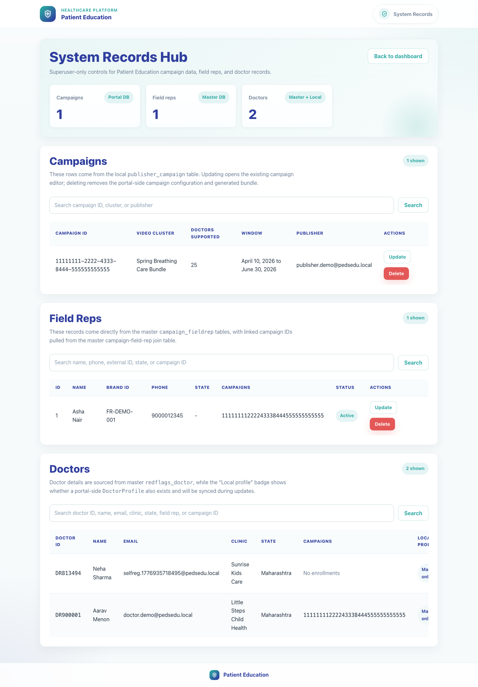
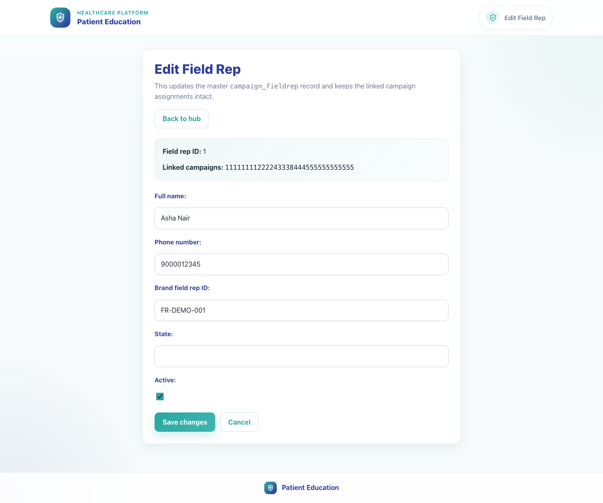
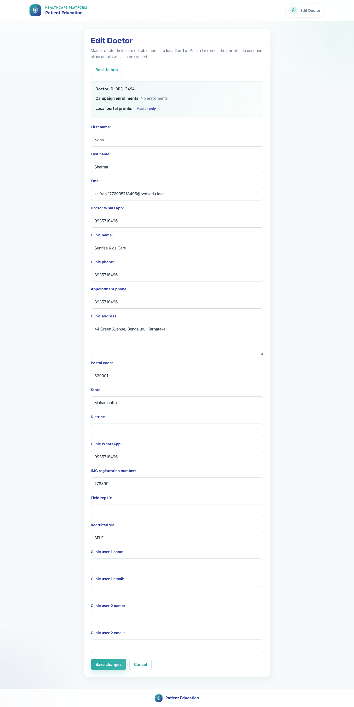

# 12. System Records Hub

## 1. Title

System Records Hub

## 2. Document Purpose

Show local superusers how to use the broader System Records Hub to review local campaign configurations and maintain master field-rep and doctor records.

## 3. Primary User

Local superuser responsible for system-wide campaign, field-rep, and doctor record maintenance

## 4. Entry Point

Superuser route at `/publisher/system-records/` after logging in through `/admin/login/`.

## 5. Workflow Summary

- The System Records Hub combines local `publisher_campaign` rows with master field-rep and doctor records in one superuser-only view.
- Campaign rows update through the existing campaign editor, while field-rep and doctor rows open dedicated maintenance forms.
- Doctor rows show whether a local portal profile exists, which helps operators understand whether master edits will also sync local data.

## 6. Step-By-Step Instructions

### Step 1. Open the System Records Hub

**What the user does**

Signs in as a local superuser and navigates to the System Records Hub.

**What the user sees**

A superuser-only dashboard with summary cards for campaigns, field reps, and doctors plus searchable maintenance sections.

**Why the step matters**

This hub is the broadest record-maintenance surface in the product and is separate from day-to-day content editing.

**Expected result**

The superuser can access the full System Records Hub.

**Common issues or trainer notes**

This route is part of the internal publisher area and requires a normal local superuser session, not the dedicated PE records login.

**Screenshot Placeholder**

- Suggested file path: `assets/12-system-records-hub/01-system-records-hub.png`
- Screenshot caption: System Records Hub overview.
- What the screenshot should show: The System Records Hub heading, summary cards, and top of the Campaigns section.

### Step 2. Review local campaign configurations

**What the user does**

Uses the Campaigns section to search for a local `publisher_campaign` row and open the linked update path.

**What the user sees**

Local campaign rows with campaign ID, generated bundle name, supported doctor count, active window, and publisher owner.

**Why the step matters**

This is the fastest route to confirm or clean up portal-side PE campaign configuration records.

**Expected result**

The superuser can find the correct local campaign row and reach the update or delete action.

**Common issues or trainer notes**

Deleting from this section removes the local campaign configuration and the generated bundle, but it does not edit the upstream master campaign record.

**Screenshot Placeholder**

- Suggested file path: `assets/12-system-records-hub/02-system-campaigns.png`
- Screenshot caption: System records campaign table.
- What the screenshot should show: The Campaigns section showing local portal campaign configuration rows.

### Step 3. Update a field rep record

**What the user does**

Opens Update from the Field Reps section to maintain a master field-rep record and its campaign links.

**What the user sees**

A field rep edit form with full name, phone number, external brand ID, state, and active status.

**Why the step matters**

Field rep accuracy is essential because campaign onboarding links and doctor recruitment depend on these master records.

**Expected result**

The superuser can edit or delete a field rep record from the broader system hub.

**Common issues or trainer notes**

This form edits master DB-backed data, so the impact can extend across campaigns.

**Screenshot Placeholder**

- Suggested file path: `assets/12-system-records-hub/03-system-field-rep-edit.png`
- Screenshot caption: System field-rep edit form.
- What the screenshot should show: The field rep maintenance form with identity, phone, and active-status fields.

### Step 4. Review doctor sync state and update the doctor record

**What the user does**

Uses the Doctors section to inspect whether a doctor is master-only or also synced to a local portal profile, then opens the update form.

**What the user sees**

A doctor edit form with identity, clinic details, recruiter fields, clinic user emails, and local-profile context.

**Why the step matters**

The local-profile badge helps operations teams understand whether a master update should also cascade into the local portal record.

**Expected result**

The superuser can update a doctor with clear awareness of local-sync implications.

**Common issues or trainer notes**

If a doctor has a local profile, updates attempt to sync both the master row and the local portal profile. Delete actions may also remove the local profile.

**Screenshot Placeholder**

- Suggested file path: `assets/12-system-records-hub/04-system-doctor-edit.png`
- Screenshot caption: System doctor edit form.
- What the screenshot should show: The doctor maintenance form with clinic fields, recruiter fields, and clinic user email fields.

## 7. Success Criteria

- The superuser can open the System Records Hub from the internal admin session.
- Campaign, field-rep, and doctor sections are visible and searchable.
- The superuser can open the field-rep and doctor maintenance forms and understand the local-versus-master scope.

### Trainer Tips and Common Issues

- **PE versus system scope:** Use this hub for broader record cleanup. Use the PE Records Dashboard when the task is specific to PE-linked campaigns, reps, or doctors only.
- **Local versus master impact:** Campaign rows here are local portal records, while field-rep and doctor rows are master records. The scope is different depending on which section you edit.
- **Local profile sync:** When a doctor has a local portal profile, master updates can also affect the local profile. Trainers should call out that badge before editing.

## 8. Related Documents

- [`01-platform-overview-and-role-map.md`](01-platform-overview-and-role-map.md)
- [`02-publisher-campaign-setup.md`](02-publisher-campaign-setup.md)
- [`09-admin-content-management.md`](09-admin-content-management.md)
- [`../../publisher/templates/publisher/system_records.html`](../../publisher/templates/publisher/system_records.html)
- [`../../publisher/templates/publisher/field_rep_record_form.html`](../../publisher/templates/publisher/field_rep_record_form.html)
- [`../../publisher/templates/publisher/doctor_record_form.html`](../../publisher/templates/publisher/doctor_record_form.html)
- [`../../publisher/views.py`](../../publisher/views.py)

## 9. Status

Live-verified against the local demo environment and refreshed with real screenshots on 2026-04-23.
